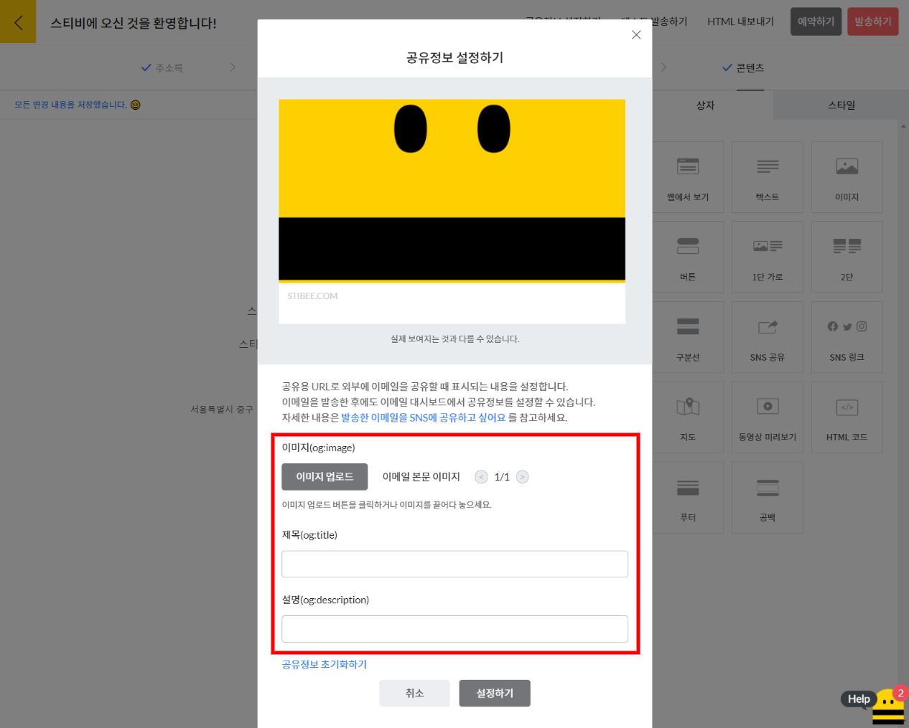
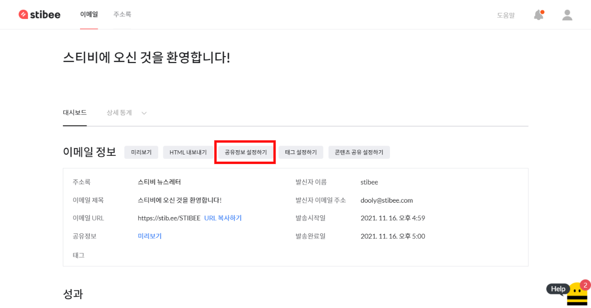
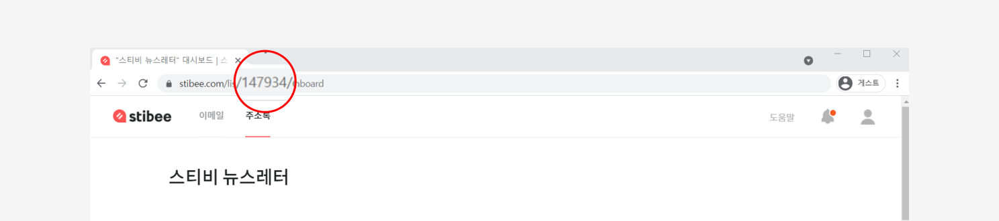
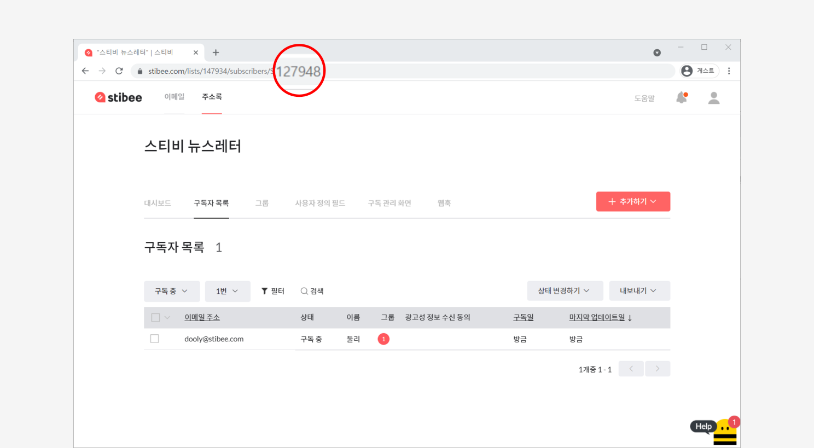
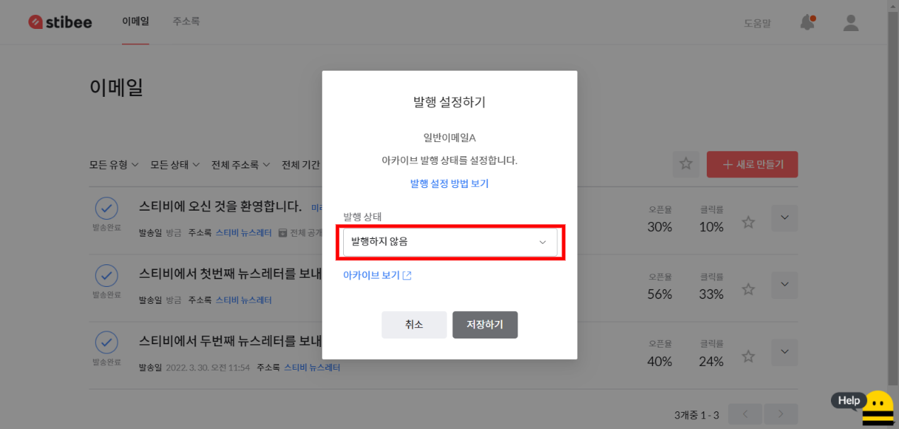

---
layout:
  title:
    visible: true
  description:
    visible: false
  tableOfContents:
    visible: true
  outline:
    visible: true
  pagination:
    visible: true
---

# 주소록 API

💬이 내용은 **스탠다드, 프로, 엔터프라이즈 요금제**에 해당하는 도움말입니다.

## 이 글에서는 <a href="#h_01hrp9h7hbxw06bj9p21fev150" id="h_01hrp9h7hbxw06bj9p21fev150"></a>

주소록 API를 활용해서 스티비 주소록과 가지고 있는 회원 정보를 연동하는 방법을 알아봅니다.&#x20;

***

주소록 API를 사용하면 스티비의 주소록과 내 서비스의 회원 정보를 연동하여 사용할 수 있습니다. 내 서비스에 새로 가입하는 회원 정보를 연동된 스티비 주소록에 자동으로 추가하거나, 기존 회원의 정보가 변경됐을 때 자동으로 주소록의 정보도 업데이트하는 등 확장된 기능을 경험할 수 있습니다.&#x20;

_주소록 API와_ [_주소록 웹훅_](list-webhook.md)_을 함께 사용하면 내 서비스의 회원 정보와 스티비 주소록을 완전히 동기화해서 사용할 수 있습니다._


## 주소록 API 사용하기


주소록 API에 대한 요청 및 응답 방법은 [스티비 API 문서](https://api.stibee.com/docs/)에서 확인하고 테스트할 수 있습니다.


#### API 키 만들기 <a href="#id-1-api" id="id-1-api"></a>

주소록 API를 사용하기 위해서는 스티비에서 API 키를 만들어야 합니다. API는 워크스페이스 단위로 관리되므로 \[워크스페이스 이름 → 워크스페이스 설정 → API 키]에서 API 키를 생성할 수 있습니다.

<figure><figcaption></figcaption></figure>

#### API 키 사용하기 <a href="#id-1-api" id="id-1-api"></a>

\[새로 만들기]를 클릭해 API 키를 생성한 뒤 \[복사하기]를 클릭하면 API 키를 복사할 수 있습니다. 이 키는 API 요청 시 토큰으로 사용됩니다. API 키는 최대 10개까지 생성할 수 있습니다.

**\*주의:** API 키가 노출되면 워크스페이스 보안에 치명적인 문제가 생길 수 있습니다. 만약, 노출이 의심되면 해당 키를 비활성화하거나 삭제한 뒤 새로운 키를 만들어서 사용해 주세요.

<figure><figcaption></figcaption></figure>


## API에서 제공하는 기능

주소록 API를 통해 활용할 수 있는 기능은 다음과 같습니다.

* 구독: 주소록에 구독자를 추가합니다.
* 수신거부: 구독자를 수신거부 상태로 변경합니다.
* 완전 삭제: 구독자를 완전 삭제합니다. 구독자 정보와 활동 기록이 모두 삭제됩니다. 삭제된 구독자 정보와 활동 기록은 복구할 수 없습니다.
* 그룹 할당: 구독자를 주소록의 특정 그룹에 추가합니다.
* 그룹 해제: 구독자를 주소록의 특정 그룹에서 삭제합니다.
* (준비 중) 주소록 조회: 워크스페이스에 생성된 주소록 목록을 조회합니다.
* (준비 중) 그룹 조회: 주소록에 생성된 그룹 목록을 조회합니다.
* (준비 중) 구독자 숫자 조회: 주소록의 구독 상태별 구독자 수를 조회합니다.
* (준비 중) 구독자 목록 조회: 주소록의 구독자 목록을 조회합니다.

API로 제공되는 기능은 계속 추가될 예정입니다.


## API 요청 및 응답 모델 <a href="#id-3-api" id="id-3-api"></a>


API에 대한 요청 및 응답 방법은 [스티비 API 문서](https://api.stibee.com/docs)에서 확인하고 테스트할 수 있습니다.


API 요청에 대한 정책은 아래와 같이 운영하고 있습니다.

* API 요청 및 응답은 JSON 형식을 따릅니다.
* API 요청은 1초당 3회로 제한합니다.
* API 요청은 1회당 256KB로 제한합니다. 이는 구독자 추가 시 약 2,000명을 한 번에 추가할 수 있는 크기지만, '[사용자 정의 필드](../list/adding-managing-subscriber/understanding-subscriber-info.md#h\_01gw45zrwcjd1eg1cam4vhw25m)' 값에 따라 달라질 수 있습니다.

### 공통 <a href="#h_979f141299" id="h_979f141299"></a>

#### **Header**

* AccessToken: API 키
* Content-Type: application/json

### 구독 <a href="#h_5c2983c86c" id="h_5c2983c86c"></a>

* HTTP Methods: POST
* Endpoint URL: https://api.stibee.com/v1/lists/{listid}/subscribers

listId(주소록에 할당된 고유 아이디)는 아래 방법으로 확인할 수 있습니다.

1. 주소록 목록에서 주소록 이름을 클릭하여 \[주소록 대시보드]로 이동
2. 브라우저에 표시되는 URL에서 'lists' 뒤의 숫자를 확인

<figure><figcaption></figcaption></figure>

#### **Request Body**

* eventOccurredBy: 구독자 추가 방법을 구분합니다.
  * "MANUAL": 관리자에 의해 추가한 것으로 기록합니다. (기본값)
  * "SUBSCRIBER": 구독자가 직접 구독한 것으로 기록합니다.
* confirmEmailYN: 구독 확인 이메일 발송 여부를 구분합니다.
  * "Y": 구독자에게 구독 확인 이메일을 발송하고, 구독자가 이 메일을 통해 구독 확인을 해야 구독자로 추가됩니다. 이때, 한 번에 추가하는 구독자가 10명을 초과하면 추가되지 않습니다.
  * "N": 구독 확인 과정 없이 바로 구독자로 추가됩니다. (기본값)
* groupIds: 그룹에 할당된 고유의 아이디(groupId)입니다. 해당 그룹에 구독자를 할당하여 추가합니다. (기본값: 할당 안 함)
* subscribers: 구독자 정보를 담고 있습니다. Key-Value 배열 형식으로 구성됩니다. 주소록 사용자 정의 필드에 정의된 내용을 따릅니다.
  * Key: Key: 사용자 정의 필드의 태그(email, name 등)
  * Value: Key에 해당하는 값
* Key에 "$ad\_agreed" 필드를 사용해 광고성 정보 수신 동의 여부를 구분한다.
  * "Y": 광고성 정보 수신 여부를 '동의함'으로 추가합니다.
  * "N": 광고성 정보 수신 여부를 '동의하지 않음'(빈값)으로 추가합니다.
  * "$ad\_agreed" 필드를 사용하지 않거나 잘못된 값이 입력된 경우 ‘동의하지 않음’(빈값)으로 추가합니다. 이때 이미 등록된 구독자의 광고성 정보 수신 동의 여부는 업데이트하지 않습니다.


주소록에 이미 존재하는 구독자를 추가 요청한 경우, eventOccurredBy 값과 구독자의 구독 상태에 따라 아래와 같이 처리됩니다.

**\*주의:** 구독자의 이메일 주소는 변경되지 않습니다.

* eventOccurredBy가 MANUAL일 때: 이름, 전화번호 등 구독자 정보를 업데이트 합니다.&#x20;
* eventOccurredBy가 SUBSCRIBER일 때: 구독자의 구독 상태에 따라 다르게 처리됩니다.
  * 구독 중 상태일 때: 구독자 정보를 업데이트하지 않습니다. 기존 정보가 그대로 유지됩니다.
  * 수신거부 또는 자동 삭제 상태일 때: 구독자의 구독 상태를 '구독 중으로 변경하고 이름, 전화번호 등의 구독자 정보를 업데이트합니다.

_주소록 웹훅으로  '구독' 이벤트 알림을 받기로 한 경우, "confirmEmailYN"이 "Y"라면, 구독 확인까지 완료됐을 때 이벤트 알림을 받을 수 있습니다._


groupId(그룹에 할당된 고유의 아이디)는 아래 방법으로 확인할 수 있습니다.

1. 주소록 목록에서 주소록 이름을 클릭하여 \[주소록 대시보드]로 이동
2. \[그룹]을 클릭하여 그룹 목록으로 이동
3. 그룹 이름을 클릭하여 그룹 필터링이 적용된 구독자 목록으로 이동
4. 브라우저에 표시되는 URL에서 'S' 뒤의 숫자를 확인

<figure><figcaption></figcaption></figure>

이에 대한 응답은 다음과 같습니다.

* Ok: 요청에 대한 성공/실패 여부를 구분합니다. (true: 성공, false: 실패)
* Error: 요청 실패 원인이 표시됩니다. 에러 코드와 에러 메시지가 표시됩니다.
  * code: 에러 코드
  * message: 에러 메세지
* Value: 요청 성공 결과가 표시됩니다. 결과 유형별로 Key-Value 배열 형식으로 표시됩니다.
  * Key: 결과 유형
  * success: 구독자 추가 성공
  * update: 상태 외 정보 업데이트
  * failNoEmail: 구독자 추가 실패 - 이메일 주소 없음
  * failExistEmail: 구독자 추가 실패 - 이미 구독 중인 이메일 주소
  * failExistPhone: 구독자 추가 실패 - 이미 구독 중인 전화번호
  * failWrongEmail: 구독자 추가 실패 - 이메일 주소 형식 오류
  * failWrongPhone: 구독자 추가 실패 - 전화번호 형식 오류
  * failDuplicatedEmail: 구독자 추가 실패 - 이메일 주소 중복 요청
  * failDuplicatedPhone: 구독자 추가 실패 - 전화번호 중복 요청
  * failUnknown: 구독자 추가 실패 - 알 수 없는 오류
  * Value: Key에 해당하는 구독자 정보가 Key-Value 배열 형식으로 표시됩니다. \[주소록] \[사용자 정의 필드]에 정의된 내용을 참조합니다.
  * Key: 사용자 정의 필드의 태그(email, name 등)
  * Value: Key에 해당하는 값


### 완전 삭제 <a href="#h_bb2bbf9138" id="h_bb2bbf9138"></a>

* HTTP Methods: DELETE
* Endpoint URL: https://api.stibee.com/v1/lists/{listid}/subscribers

listId(주소록에 할당된 고유의 아이디)는 아래 방법으로 확인할 수 있습니다.

1. 주소록 목록에서 주소록 이름을 클릭하여 \[주소록 대시보드]로 이동
2. 브라우저에 표시되는 URL에서 'lists' 뒤의 숫자를 확인

<figure><figcaption></figcaption></figure>

#### **Request Body**

* 구독자의 이메일 주소를 배열 형식으로 입력합니다. (예: \["user1@domain.com", "user2@domain.com"])

이에 대한 응답은 다음과 같습니다.

* Ok: 요청에 대한 성공/실패 여부를 구분합니다. (true: 성공, false: 실패)
* Error: 요청 실패 원인이 표시됩니다. 에러 코드와 에러 메시지가 표시됩니다.
* Value: 요청 성공 결과가 표시됩니다. 결과 유형별로 Key-Value 배열 형식으로 표시됩니다.
  * "success": 구독자 완전 삭제 성공 리스트
  * "fail": 구독자 완전 삭제 실패 리스트


### 수신거부 <a href="#h_19b8abd69b" id="h_19b8abd69b"></a>

* HTTP Methods: PUT
* Endpoint URL: https://api.stibee.com/v1/lists/{listid}/subscribers/unsubscribe

listId(주소록에 할당된 고유의 아이디)는 아래 방법으로 확인할 수 있습니다.

* 주소록 목록에서 주소록 이름을 클릭하여 “주소록 대시보드"로 이동
* 브라우저에 표시되는 URL에서 "lists" 뒤의 숫자를 확인

<figure><figcaption></figcaption></figure>

#### **Request Body**

* 구독자의 이메일 주소를 배열 형식으로 입력합니다. (예: \["user1@domain.com", "user2@domain.com"])

이에 대한 응답은 다음과 같습니다.

* Ok: 요청에 대한 성공/실패 여부를 구분합니다. (true: 성공, false: 실패)
* Error: 요청 실패 원인이 표시됩니다. 에러 코드와 에러 메시지가 표시됩니다.
* Value: 요청 성공 결과가 표시됩니다. 결과 유형별로 Key-Value 배열 형식으로 표시됩니다.
  * "success": 구독자 수신거부 성공 리스트
  * "failOrAlreadyUnsubscribe": 구독자 실패 또는 이미 수신거부 중 리스트


### 그룹 할당 <a href="#undefined" id="undefined"></a>

* HTTP Methods: POST
* Endpoint URL: https://api.stibee.com/v1/lists/{listid}/groups/{groupId}/subscribers/assign

listId(주소록에 할당된 고유의 아이디)는 아래 방법으로 확인할 수 있습니다.

* 주소록 목록에서 주소록 이름을 클릭하여 “주소록 대시보드"로 이동
* 브라우저에 표시되는 URL에서 "lists" 뒤의 숫자를 확인

<figure><figcaption></figcaption></figure>

groupId(그룹에 할당된 고유의 아이디)는 아래 방법으로 확인할 수 있습니다.

1. 주소록 목록에서 주소록 이름을 클릭하여 \[주소록 대시보드]로 이동
2. \[그룹]을 클릭하여 그룹 목록으로 이동
3. 그룹 이름을 클릭하여 그룹 필터링이 적용된 구독자 목록으로 이동
4. 브라우저에 표시되는 URL에서 'S' 뒤의 숫자를 확인

<figure><figcaption></figcaption></figure>

#### **Request Body**

* 구독자의 이메일 주소를 배열 형식으로 입력합니다. (예: \["user1@domain.com", "user2@domain.com"])&#x20;

이에 대한 응답은 다음과 같습니다.

* Ok: 요청에 대한 성공/실패 여부를 구분합니다. (true: 성공, false: 실패)
* Error: 요청 실패 원인이 표시됩니다. 에러 코드와 에러 메시지가 표시됩니다.

&#x20;

### 그룹 해제 <a href="#h_01gnrj2avs1qjyd12m26fc47v7" id="h_01gnrj2avs1qjyd12m26fc47v7"></a>

* HTTP Methods: POST
* Endpoint URL: https://api.stibee.com/v1/lists/{listid}/groups/{groupId}/subscribers/release

listId(주소록에 할당된 고유의 아이디)는 아래 방법으로 확인할 수 있습니다.

1. 주소록 목록에서 주소록 이름을 클릭하여 “주소록 대시보드"로 이동
2. 브라우저에 표시되는 URL에서 "lists" 뒤의 숫자를 확인

<figure><figcaption></figcaption></figure>

groupId(그룹에 할당된 고유의 아이디)는 아래 방법으로 확인할 수 있습니다.

1. 주소록 목록에서 주소록 이름을 클릭하여 \[주소록 대시보드]로 이동
2. \[그룹]을 클릭하여 그룹 목록으로 이동
3. 그룹 이름을 클릭하여 그룹 필터링이 적용된 구독자 목록으로 이동
4. 브라우저에 표시되는 URL에서 'S' 뒤의 숫자를 확인

<figure><figcaption></figcaption></figure>

#### **Request Body**

* 구독자의 이메일 주소를 배열 형식으로 입력합니다. (예: \["user1@domain.com", "user2@domain.com"])&#x20;

이에 대한 응답은 다음과 같습니다.

* Ok: 요청에 대한 성공/실패 여부를 구분합니다. (true: 성공, false: 실패)
* Error: 요청 실패 원인이 표시됩니다. 에러 코드와 에러 메시지가 표시됩니다.


## API 요청 및 응답 예제

### 구독자 추가 API 요청 및 응답 예제

“gildong.go@stibee.com”, “dooly@stibee.com”을 구독 확인 과정 없이 추가할 경우, 아래와 같이 요청합니다.

```json
POST https://api.stibee.com/v1/lists/{listId}/subscribers
  {
    "eventOccurredBy": "SUBSCRIBER",
    "confirmEmailYN": "N",
    "groupIds": [
      "1234", "5123"
    ],
    "subscribers": [
      {
        "email": "gildong.go@stibee.com",
        "name": "고길동"
      },
      {
        "email": "dooly@stibee.com",
        "name": "둘리"
      }
    ]
  }
```


“gildong.go@stibee.com”은 정상적으로 추가됐고, “dooly@stibee.com”은 수신거부 상태여서 추가되지 않았다면, 이에 대한 응답은 아래와 같습니다.

```json
{
  "Ok": true,
  "Error": null,
  "Value": {
    "failDeny": [
      {
        "email": "gildong.go@stibee.com",
        "name": "고길동"
      }
    ],
    "failUnknown": [],
    "failWrongEmail": [],
    "success": [
      {
        "email": "dooly@stibee.com",
        "name": "둘리"
      }
    ],
    "update": []
  }
}
```


이미 추가된 "dooly@stibee.com"의 정보를 변경하려면, "eventOccurredBy"를 "MANUAL"로 설정하여, 아래와 같이 요청합니다.

```json
POST https://api.stibee.com/v1/lists/{listId}/subscribers
  {
    "eventOccurredBy": "MANUAL",
    "confirmEmailYN": "N",
    "groupIds": [
      "{groupId}"
    ],
    "subscribers": [
      {
        "email": "dooly@stibee.com",
        "name": "둘리"
      }
    ]
  }
```


이미 추가된 '구독 중' 상태인 구독자를 "eventOccurredBy"="SUBSCRIBER"로 설정해서 추가 요청하면 추가가 되지 않습니다. 이에 대한 응답은 아래와 같습니다.

```json
{
  "Ok": false,
  "Error": {
    "Code": "LIST_ALREADY_SUBSCRIBED",
    "HttpStatusCode": 0,
    "Message": "이미 구독 중인 이메일 주소입니다."
  },
  "Value": null
}
```
