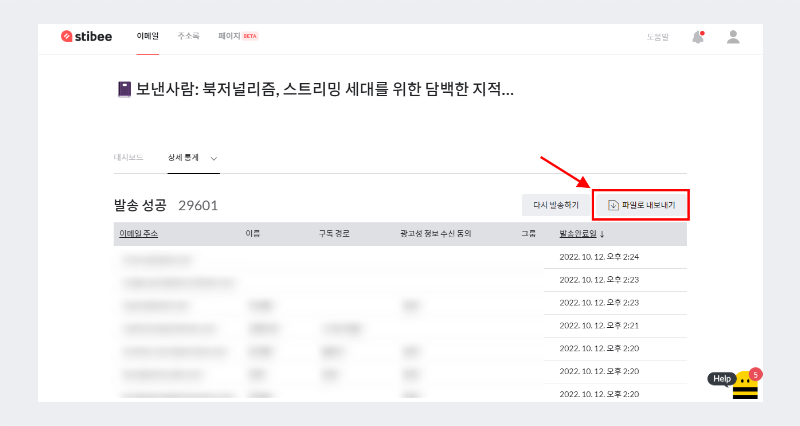

---
layout:
  title:
    visible: true
  description:
    visible: false
  tableOfContents:
    visible: true
  outline:
    visible: true
  pagination:
    visible: true
---

# 이메일 상세 통계

## 이 글에서는

스티비에서 확인할 수 있는 상세통계에 대해서 알아봅니다.

***

## 상세 통계 종류 

스티비에서는 발송, 오픈, 클릭 관련한 상세 통계 정보를 제공합니다. 상세통계를 통해 구체적으로 누가 이메일을 열어봤고 어떤 링크를 클릭했는지. 그리고 발송에 성공했는지 실패했는지 여부 등을 파악할 수 있습니다.&#x20;

* 발송성공: 발송이 성공한 구독자 입니다.
* 발송실패: 발송이 실패한 구독자입니다.
* 오픈: 이메일을 열어본 구독자입니다.&#x20;
* 오픈안함: 이메일을 열어보지 않은 구독자입니다.
* 클릭: 이메일의 링크를 클릭한 구독자입니다.&#x20;
* 클릭안함: 이메일의 링크를 클릭하지 않은 구독자입니다.
* 링크별클릭: 이메일의 링크별 클릭 수와각 링크별 어떤 구독자가 클릭했는지 확인할 수 있습니다.

## 발송 성공 통계 확인하기 

스티비에서는 이메일의 발송 성공 여부를 구독자가 사용하는 이메일 서비스의 서버에서 스티비로 어떤 신호를 회신했는지 여부를 기준으로 판단합니다. 이메일 서비스에서 스티비로 '발송성공' 신호를 회신한 경우에는 통계에서도 '발송성공'으로 기록됩니다.

1. \[발송 성공]통계를 확인하고 싶은 이메일을 클릭하여 \[[이메일 대시보드](email-statistics-dashboard.md)]로 이동합니다.
2. 대시보드 옆 \[상세통계 ∨]를 클릭하고 \[발송 성공]을 클릭합니다.
3. \[발송 성공]을 클릭하면 이메일 발송이 성공한 구독자 명단을 확인할 수 있습니다.
4. \[이메일 주소]와 \[발송 완료일]을 클릭해 정렬을 변경하여 확인할 수 있습니다.

<figure><figcaption></figcaption></figure>

## 발송 실패 통계 확인하기 

스티비에서 보낸 이메일 발송 요청에 대해 종종 구독자가 사용하는 이메일 수신 서비스에서 발송실패 응답을 보내는 경우가 있습니다. 이런 경우 구독자에게 보낸 이메일은 '발송실패'로 기록됩니다.  이메일이 발송 실패되는 경우를 '반송, 바운스(Bounce)'라고 합니다. 발송실패는 이유에 따라 다시 '소프트바운스(Soft bounce)'와 '하드바운스(Hard bounce)'로 나뉩니다.&#x20;

1. \[발송 실패]통계를 확인하고 싶은 이메일을 클릭하여 \[[이메일 대시보드](email-statistics-dashboard.md)]로 이동합니다.
2. 대시보드 옆 \[상세통계 ∨]를 클릭하고 \[발송 실패]를 클릭합니다.
3. \[발송 실패]를 클릭하면 이메일 발송이 실패한 구독자 명단을 확인할 수 있습니다. 발송 실패는 사유에 따라 하드바운스와 소프트바운스로 분류됩니다.
4. \[이메일 주소]와 \[발송 완료일]을 클릭해 정렬을 변경하여 확인할 수 있습니다.

_\*발송 실패 비율이 높다면 발송 속도에도 영향이 있을 수 있어요. 발송 속도가 고민된다면 발송 실패 구독자 명단 정제 작업으로 발송이 완료되는 속도를 개선하는 효과도 기대할 수 있습니다._

<figure><figcaption></figcaption></figure>

### 소프트바운스 

소프트바운스는 이메일을 '일시적으로 전달할 수 없는 경우'입니다. 소프트바운스는 보통 일시적인 문제일 가능성이 높기 때문에 여러 차례 다시 시도하면 해결됩니다. 다만 다시 발송을 여러 차례 시도했음에도 불구하고 계속해서 발송이 실패하는 경우, 구독자의 상태가 이메일 수신이 불가능한 상태일 수 있습니다. 이런 경우에는 구독자를 별도의 \[그룹]으로 분류하여 관리하거나 \[주소록]에서 삭제하는 것이 좋습니다.

_\*소프트바운스로 발송 실패한 구독자에게 이메일을 재발송하는 방법이 궁금하다면 여기를 참고해주세요._&#x20;

소프트바운스는 상세 사유에 따라 몇가지로 구분될 수 있습니다.&#x20;

* 소프트바운스: 일시적인 문제로 이메일 발송에 실패했습니다.&#x20;
* 소프트바운스(응답지연): 이메일 수신 서비스에서 발송 결과를 스티비로 회신하지 않았습니다. 수신 서비스의 이메일 처리에 문제가 있는 상황일 수 있기 때문에 구독자 측의 이메일 서비스 담당자 또는 고객센터로 문의해보면 정확한 원인 파악이 가능합니다.
* 소프트바운스(메일함 용량 부족): 구독자의 메일함 용량이 꽉차 발송에 실패했습니다.
* 소프트바운스(알 수 없음): 이메일 발송에 실패했으나 정확한 사유를 확인하기 어렵습니다. '소프트바운스(알 수 없음)'으로 분류되는 비율을 줄이기 위해 판단 기준은 계속해서 업데이트하고 있습니다. &#x20;

### 하드바운스 

하드바운스는 구독자의 이메일 계정 상태가 이메일을 영구적으로 수신할 수 없는 경우(예: 탈퇴한 이메일 계정, 유효하지 않은 이메일 주소 등)를 말합니다. 하드바운스로 발송 실패한 이메일 주소는 유효하지 않은 주소이기 때문에 \[주소록]에서 삭제하거나 따로 분류하는 것이 좋습니다.&#x20;

하드바운스는 다시 실패 사유에 따라 몇 가지로 구분될 수 있습니다.&#x20;

* 하드바운스: 구독자가 현재 영구적으로 이메일을 수신할 수 없는 상태입니다.
* 하드바운스(이메일 주소 없음): 이메일 주소가 잘못됐거나 존재하지 않는 주소입니다.
* 하드바운스(스팸처리됨): 수신자가 이메일을 스팸 메일로 처리했습니다.

스티비는 하드바운스 된 이메일 주소를 '자동삭제'로 분류하여 이후의 발송 대상에서 제외합니다. 이렇게 하면 발송성공률이 개선되고 비정상적인 발송을 피할 수 있기 때문에 스팸으로 분류될 확률도 줄어듭니다.

만약, 하드바운스된 이메일 주소가 자동삭제로 자동 분류되는 것을 원하지 않는다면 \[주소록 → 수정하기 → 자동삭제 기능 사용 유무]를 '아니요'로 선택하면 됩니다. 주소록을 수정하는 자세한 방법에 대한 내용은 [여기](https://help.stibee.com/hc/ko/articles/5659543793551-%EC%A3%BC%EC%86%8C%EB%A1%9D-%EC%82%AC%EC%9A%A9%ED%95%98%EA%B8%B0#h\_01GF88JFX86W5EWKKK27BDP48J)를 참고해주세요.

## 오픈 통계 확인하기 

1. \[오픈]통계를 확인하고 싶은 이메일을 클릭하여 \[[이메일 대시보드](email-statistics-dashboard.md)]로 이동합니다.
2. 대시보드 옆 \[상세통계 ∨]를 클릭하고 \[오픈]을 클릭합니다.
3. \[발송 성공]을 클릭하면 이메일을 열어본 구독자의 명단을 확인할 수 있습니다.
4. \[이메일 주소]와 \[오픈 수], \[마지막 오픈일]을 클릭해 정렬을 변경하여 확인할 수 있습니다.

\[오픈]은 구독자가 이메일을 열어보는 경우에만 기록되고, 구독자가 이메일을 열어볼 때마다 중복으로 기록됩니다. 수신 서비스(예: G메일, 네이버 등)에서 제공하는 '읽은 것으로 표시'하기 기능을 사용하는 경우는 실제로 이메일을 열어본 것이 아니기 때문에 오픈으로 기록되지 않습니다. \
\
이메일을 중복으로 열어본 경우, '마지막 오픈일' 정보만 확인할 수 있지만 \[구독자 활동 기록]에서는 구독자 별로 언제 이메일을 오픈했는지 시간별로 자세히 확인하는 것도 가능합니다.&#x20;

<figure><figcaption></figcaption></figure>

## 오픈 안 함 통계 확인하기 

1. \[오픈 안 함]통계를 확인하고 싶은 이메일을 클릭해 \[[이메일 대시보드](email-statistics-dashboard.md)]로 이동합니다.
2. 대시보드 옆 \[상세통계 ∨]를 클릭 클릭하고 \[오픈 안 함]을 클릭합니다.
3. \[오픈 안 함]을 클릭하면 이메일을 열어보지 않은 구독자 명단을 확인할 수 있습니다.
4. \[이메일 주소]와 \[발송완료일]을 클릭해 정렬을 변경하여 확인할 수 있습니다.

<figure><figcaption></figcaption></figure>

## 클릭 통계 확인하기 

1. \[클릭]통계를 확인하고 싶은 이메일을 클릭하여 \[[이메일 대시보드](email-statistics-dashboard.md)]로 이동합니다.
2. 대시보드 옆 \[상세통계 ∨]를 클릭하고 \[클릭]을 클릭합니다.
3. \[클릭]을 클릭하면 이메일의 링크를 클릭한 구독자 명단을 확인할 수 있습니다.
4. \[이메일 주소]와 \[클릭(중복 포함)], \[마지막 클릭일]을 클릭해 정렬을 변경하여 확인할 수 있습니다.

중복으로 링크를 클릭한 구독자의 경우 '마지막 클릭일' 정보만 기록됩니다. 이전 클릭이 언제 이루어졌는지 확인하고 싶은 경우에는 \[구독자 활동 기록]을 확인하면 됩니다.

<figure><figcaption></figcaption></figure>

## 클릭 안 함 통계 확인하기 

1. \[클릭 안 함]통계를 확인하고 싶은 이메일을 클릭해 \[[이메일 대시보드](email-statistics-dashboard.md)]로 이동합니다.
2. 대시보드 옆 \[상세통계 ∨]를 클릭하고 \[클릭 안 함]을 클릭합니다.
3. \[클릭 안 함]을 클릭하면 이메일의 링크를 클릭하지 않은 구독자 명단을 확인할 수 있습니다.
4. \[이메일 주소]와 \[발송완료일]을 클릭해 정렬을 변경하여 확인할 수 있습니다.

<figure><figcaption></figcaption></figure>

## 링크별 클릭 통계 확인하기 

1. \[링크별 클릭]통계를 확인하고 싶은 이메일을 클릭하여 \[[이메일 대시보드](email-statistics-dashboard.md)]로 이동합니다.
2. 대시보드 옆 \[상세통계 ∨]를 클릭하고 \[링크별 클릭]을 클릭합니다.
3. \[링크별 클릭]을 클릭하면 이메일의 링크별로 클릭이 얼마나 일어났는지를 확인할 수 있습니다.
4. 링크를 클릭하면 각 링크별로 어떤 구독자들이 클릭했는지 여부를 자세히 확인할 수 있습니다.

<figure><figcaption></figcaption></figure>

## 상세통계 내보내기 

#### 전체 상세통계 한번에 내보내기

1. 상세통계를 내보내기 싶은 이메일을 클릭해 \[이메일 대시보드]로 이동합니다.
2. 스크롤을 내려 '성과' 섹션으로 이동합니다.
3. 성과 섹션에 오른쪽 위에 있는 \[상세 통계 한번에 내보내기]를 클릭합니다.

<figure><figcaption></figcaption></figure>

#### 상세통계 별로 내보내기

1. 상세통계를 내보내고 싶은 이메일을 클릭해 \[이메일 대시보드]로 이동합니다.
2. 대시보드 옆 \[상세통계 ∨]를 클릭하고 내보내고 싶은 통계를 클릭합니다.
3. 통계 목록 오른쪽 위에 있는 \[파일로 내보내기]를 클릭해 상세통계를 파일로 내려받을 수 있습니다.

<figure><figcaption></figcaption></figure>
