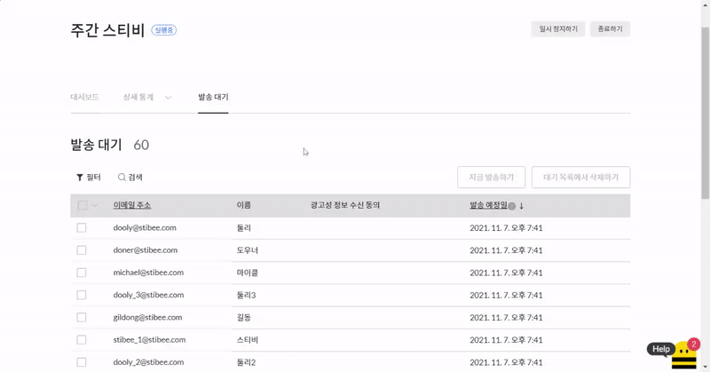

# 자동 이메일 발송하기

## 이 글에서는 

자동 이메일을 보내기 위해 실행하는 방법과 자동 이메일의 상태에 대해 알아봅니다.

***

## 자동 이메일 시작하기

### 바로 실행하기 

화면 오른쪽 위에 있는 \[시작하기] 버튼을 클릭하면 자동 이메일 발송을 시작할 수 있습니다.

자동 이메일이 '실행 중' 상태가 되면 이때부터 \[발송조건] 단계에서 설정한 조건을 만족하는 구독자가 존재하면 이메일이 자동으로 발송됩니다.

.png>)

\[시작하기] 버튼을 누르면 발송하기 전 마지막으로 각 단계에서 입력하거나 설정한 내용을 확인할 수 있습니다. 이때 자동 이메일의 '종료 시점'도 함께 설정할 수 있습니다.

종료 시점을 설정하면 스케줄에 따라 자동 이메일 발송이 종료됩니다. 종료 시점을 설정하지 않으면 자동 이메일을 직접 종료하기 전까지 계속해서 발송됩니다. 모든 설정을 확인한 뒤 화면 아래쪽에 있는 \[지금 시작하기]를 클릭하면 자동 이메일 발송이 시작됩니다.

**\*주의:** 종료된 자동 이메일은 다시 시작할 수 없습니다.

<figure><figcaption></figcaption></figure>

### 실행 예약하기 

화면 오른쪽 위에 있는 \[예약하기] 버튼을 클릭하면 자동 이메일 실행을 예약할 수 있습니다. 자동 이메일 발송을 바로 시작하지 않고, 시작할 시점을 설정할 수 있습니다.

자동 이메일이 '예약 중' 상태인 경우 발송 조건을 만족하는 구독자가 존재하더라도 자동 이메일이 발송되지 않습니다.

<figure><figcaption></figcaption></figure>

\[예약하기] 버튼을 누르면 발송하기 전 마지막으로 각 단계에서 입력하거나 설정한 내용을 확인할 수 있으며, 발송 시작 및 종료 시점을 선택할 수 있습니다.

종료 시점을 설정하면 스케줄에 따라 자동 이메일 발송이 종료됩니다. 종료 시점을 설정하지 않으면 자동 이메일을 직접 종료하기 전까지 계속해서 발송됩니다. 모든 설정을 확인한 뒤 화면 아래쪽에 있는 \[지금 시작하기]를 클릭하면 자동 이메일 발송이 시작됩니다.

**\*주의:** 종료된 자동 이메일은 다시 시작할 수 없습니다.

모든 설정을 확인한 뒤 화면 아래쪽에 있는 \[예약하기] 버튼을 클릭하면 자동 이메일이 '예약중' 상태로 변경됩니다. 예약한 시간이 다가오면 자동 이메일은 '예약 중'에서 '실행 중' 상태로 변경되며, 이때부터 발송 조건을 만족할 때마다 이메일이 자동 발송됩니다.

<figure><figcaption></figcaption></figure>

## 발송 대기 목록

언제, 어떤 구독자에게 자동 이메일이 발송될지 궁금하다면 \[발송 대기] 목록을 참고하면 됩니다. 자동 이메일이 지연 발송되도록 설정한 경우, 반복 발송을 설정한 경우 등 바로 발송되지 않고 예약되어 있을 때 어떤 구독자에게 언제 이메일이 발송될 예정인지 목록을 확인할 수 있습니다.

발송 대기 상태인 구독자에게 지금 바로 이메일을 발송하거나 발송 대기 목록에서 구독자를 삭제하여 예약된 이메일이 나가지 않도록 하는 것도 가능합니다.


자동 이메일의 발송 대기 목록에는 '트리거 조건을 충족한 모든 구독자'가 추가됩니다. 이후 실제로 이메일이 발송되는 시점에 \[필터] 기준을 통과하는 구독자에게만 발송되는 구조입니다.

* 발송 대기 목록: 트리거 통과한 모든 구독자가 추가됨.
* 실제 발송 시: 필터 등의 기준 통과한 구독자에게만 발송됨.


### 발송 대기 목록 확인하기 

1. 이메일 목록에서 확인하고 싶은 자동 이메일을 클릭합니다.
2. 자동 이메일 대시보드에서 \[발송 대기]를 클릭합니다.

발송 대기 목록에는 수신거부, 자동삭제 상태인 구독자는 표시되지 않습니다. 만약 발송 대기 목록에서 구독자를 확인할 수 없는 경우 구독자가 수신거부, 자동삭제 상태가 아닌지 확인해 보세요. 구독자의 구독 상태를 확인하는 방법은 [여기](../../list/adding-managing-subscriber/search-subscriber.md#h_01gfaq4h8vrmg50z2a95mg2f9r)를 참고해 주세요.

<figure><figcaption></figcaption></figure>

### **발송 대기 목록에 지금 발송하기**

발송 대기 목록에 있는 구독자에게 지금 바로 이메일을 발송할 수 있는 기능입니다.

1. \[발송 대기] 목록에서 바로 발송하고 싶은 구독자를 선택합니다. 구독자를 선택하는 자세한 방법은 아래 도움말을 참고해 주세요.
2. \[지금 발송하기] 버튼을 눌러 지금 바로 이메일을 발송합니다.

발송 결과는 \[상세 통계 → 발송 성공, 발송 실패]에서 확인할 수 있으며, 자동 이메일 발송량에 따라 실제 발송이 완료되는 시점은 조금 늦어질 수 있습니다.

<figure><figcaption></figcaption></figure>

### **발송 대기 목록에서 삭제하기**

발송 대기 목록에 있는 구독자를 목록에서 삭제할 수 있는 기능입니다. 발송 대기 목록에서 구독자를 삭제하면 삭제된 구독자에게는 자동 이메일이 발송되지 않습니다.

1. \[발송 대기] 목록에서 삭제하고 싶은 구독자를 선택합니다. 구독자를 선택하는 자세한 방법은 아래 도움말을 참고해 주세요.
2. \[대기 목록에서 삭제하기 → 예]를 눌러 목록에서 구독자를 삭제합니다.

<figure><figcaption></figcaption></figure>

### 구독자 선택하기 

발송 대기 목록에 있는 구독자를 선택하여 지금 바로 자동 이메일을 발송하거나, 자동 이메일이 발송되지 않도록 처리할 수 있습니다.

#### 구독자 개별로 선택하기 

1. 확인하고자 하는 자동 이메일 제목을 클릭합니다.
2. \[발송 대기] 목록으로 이동합니다.
3. 구독자 명단 왼쪽에 있는 체크박스를 클릭하면 구독자를 개별 선택할 수 있습니다.

<figure><figcaption></figcaption></figure>

#### **현재 페이지에 있는 구독자 전체 선택하기**

1. 확인하고자 하는 자동 이메일 제목을 클릭합니다.
2. \[발송 대기] 목록으로 이동합니다.
3. 구독자 명단 가장 위에 있는 '이메일 제목' 필드 옆 체크박스를 선택합니다.
4. \[구독자 선택 옵션 화면 → 이 페이지 선택]을 클릭해 지금 페이지에 있는 전체 구독자를 한 번에 선택할 수 있습니다. _\* 페이지당 최대 20명의 구독자가 표시됩니다._

<figure><figcaption></figcaption></figure>

#### **발송 대기 목록에 있는 전체 구독자 선택하기**

1. 확인하고자 하는 자동 이메일 제목을 클릭합니다.
2. \[발송 대기] 목록으로 이동합니다.
3. 구독자 명단 가장 위에 있는 '이메일 제목' 필드 옆 체크박스를 선택합니다.
4. \[구독자 선택 옵션 화면 → 모든 페이지 선택]을 클릭해 전체 페이지에 있는 구독자를 한 번에 선택할 수 있습니다.

<figure><figcaption></figcaption></figure>

#### **전체 선택 취소하기**

1. 확인하고자 하는 자동 이메일 제목을 클릭합니다.
2. \[발송 대기] 목록으로 이동합니다.
3. 구독자 목록 가장 위에 있는 '이메일 제목' 필드 옆 체크박스를 선택합니다.
4. \[구독자 선택 옵션 화면 → 전체 선택 해제]를 클릭해 모든 구독자의 선택을 해제할 수 있습니다.

<figure><figcaption></figcaption></figure>

### 구독자 검색하기 

발송 대기 목록에서는 구독자를 검색할 수 있습니다. \[이메일 주소] 또는 \[사용자 정의 필드]에 있는 정보를 기준으로 원하는 조건의 구독자를 조회할 수 있습니다.

1. \[발송 대기] 목록으로 이동합니다.
2. \[검색] 버튼을 누른 뒤, 원하는 조건의 구독자를 검색합니다.

<figure><figcaption></figcaption></figure>

#### **발송 대기 시간 순으로 정렬 순서 변경하기** 

\[발송 예정일] 오른쪽에 있는 화살표를 클릭해 발송 예정일을 기준으로 '내림차순' 또는 '올림차순'으로 발송 대기 목록 정렬을 변경하여 조회할 수 있습니다.

<figure><figcaption></figcaption></figure>

## 자동 이메일 상태 

자동 이메일 상태는 '작성 중, 실행 중, 예약 중 일시정지, 종료' 5가지 유형으로 구분할 수 있습니다. 자동 이메일은 설정한 발송 조건을 만족할 때마다 자동으로 설정한 이메일이 발송되는 방식으로, 실행 중 상태에서만 발송됩니다.

**\*주의:** 발송완료, 오픈, 클릭 등 특정 이메일을 조건으로 트리거를 사용하는 경우, 조건이 되는 이메일이 발송되기 전에 미리 자동 이메일을 '실행 중' 상태로 만들어야 합니다.

### **작성 중**

자동 이메일을 작성 중입니다. 이메일에 필요한 정보(예: 발송 조건, 발송 정보, 콘텐츠 등)를 입력하거나 수정하는 상태입니다.

* 발송을 시작하지 않았기 때문에 오픈율, 클릭률 등 발송 성과에 대한 정보가 아직 없습니다.
* 작성 중인 이메일을 발송하면 '실행 중' 상태로 변경되고, 발송을 예약하면 '발송 예약' 상태로 변경됩니다.

### **발송 예약**

자동 이메일 발송이 예약되었습니다. 아직 발송 예약한 시간이 되지 않아 자동 이메일 발송을 시작하진 않은 상태입니다.

* 발송 예약 상태인 자동 이메일은 발송 조건이 만족되어도 발송되지 않습니다.
* 발송을 시작하지 않았기 때문에 오픈율, 클릭률 등 발송 성과에 대한 정보가 아직 없습니다.
* 예약한 시간이 되면 자동 이메일 발송이 시작되고, 상태가 '실행 중'으로 변경됩니다.
* 발송 예약 상태의 이메일을 수정하려면 발송 예약을 취소해야 합니다.

### **실행 중**

자동 이메일이 실행되고 있습니다. 발송 조건에 따라 자동 이메일이 발송됩니다.

* 이메일 대시보드에서 오픈율, 클릭률 등 발송 성과에 대한 정보를 확인할 수 있습니다.
* 실행 중 상태의 이메일은 일시정지 후 수정할 수 있습니다.
* 실행 중 상태의 이메일은 '일시정지', '종료' 상태에서만 삭제 가능합니다.

### **일시정지**

자동 이메일 발송이 일시 정지된 상태입니다.

* 일시정지 상태인 자동 이메일은 발송 조건이 만족되어도 발송되지 않으며, 일시정지 상태일 때 충족한 발송 조건은 소급 적용되지 않습니다.
* 이메일 대시보드에서 오픈율, 클릭률 등 발송 성과에 대한 정보를 확인할 수 있습니다.
* 자동 이메일 발송을 언제든지 다시 시작할 수 있습니다.

### **종료**

자동 이메일 발송이 종료됐습니다.

* 종료된 자동 이메일은 발송 조건이 만족되어도 발송되지 않습니다.
* 이메일 대시보드에서 오픈율, 클릭률 등 발송 성과에 대한 정보를 확인할 수 있습니다.

**\*주의:** 종료된 자동 이메일은 수정하거나 다시 시작할 수 없습니다.
