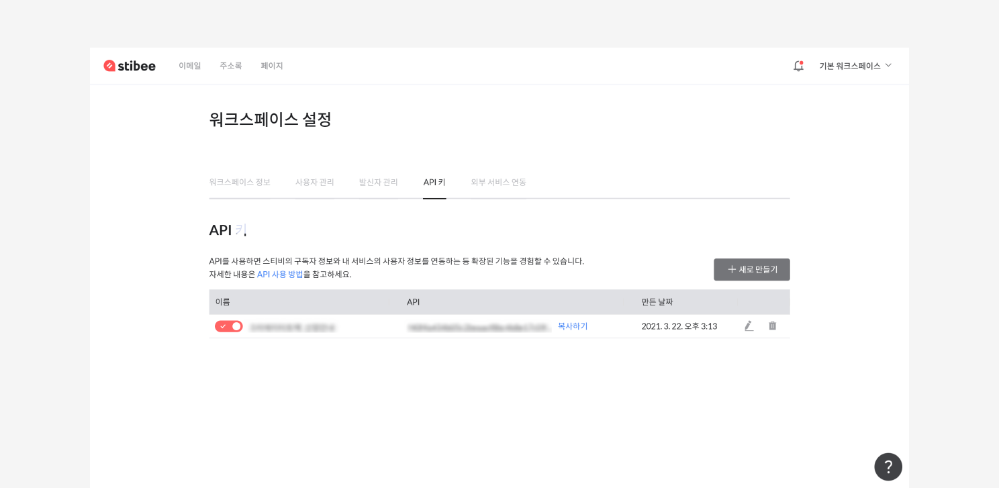
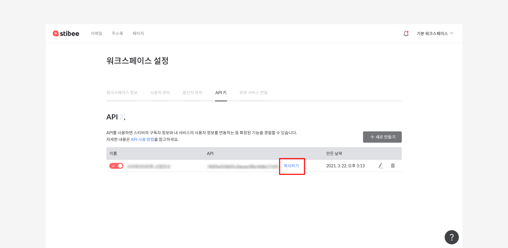
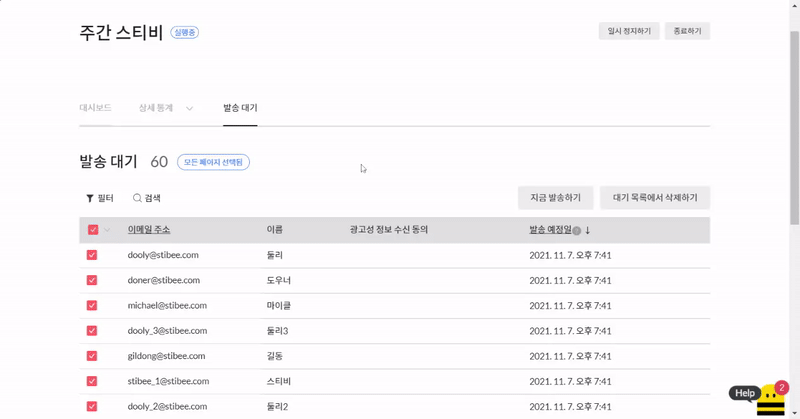

---
layout:
  title:
    visible: true
  description:
    visible: false
  tableOfContents:
    visible: true
  outline:
    visible: true
  pagination:
    visible: true
---

# 발송하기

## 이 글에서는 

자동 이메일을 보내기 위해 '실행' 하는법과 자동 이메일의 상태에 대해 알아봅니다.

***

## 자동 이메일 실행하기 

### 바로 실행하기 

모든 단계의 입력을 완료한 뒤 화면 오른쪽 위에 있는 \[시작하기]를 클릭해서 자동 이메일 발송을 시작할 수 있습니다. 자동 이메일이 '실행중' 상태가 되면 이때부터 \[발송조건] 단계에서 설정한 조건을 특정 구독자가 만족하는 경우 이메일이 자동으로 발송됩니다.

&#x20;

자동 이메일도 발송하기 전에 마지막으로 각 단계에서 입력하거나 설정한 내용을 확인할 수 있습니다. 이 때 자동 이메일의 '종료 시점'도 설정할 수 있습니다. 종료 시점을 설정하면 스케줄에 따라 자동 이메일 발송이 종료됩니다. 종료 시점을 설정하지 않으면 직접 종료하기 전까지 자동 이메일이 계속 발송됩니다.\
_\*종료된 자동 이메일은 재시작할 수 없습니다._\
\
모든 설정을 확인한 뒤 화면 아래쪽에 있는 \[지금 시작하기]를 클릭하면 자동 이메일 발송이 시작됩니다.

<figure><figcaption></figcaption></figure>

### 실행 예약하기 

화면 오른쪽 위에 있는 \[예약하기]를 클릭하면 자동 이메일 실행을 예약할 수 있습니다. 자동 이메일 발송을 바로 시작하지 않고, 시작할 시점을 설정할 수 있습니다. 자동 이메일이 '예약 중'인 경우에는 트리거를 만족하는 조건이 발생했다고 하여도 자동 이메일은 발송되지 않습니다.

<figure><figcaption></figcaption></figure>

자동 이메일도 발송하기 전에 마지막으로 각 단계에서 입력하거나 설정한 내용을 확인할 수 있습니다. 이 때 자동 이메일의 '종료 시점'도 설정할 수 있습니다. 종료 시점을 설정하면 스케줄에 따라 자동 이메일 발송이 종료됩니다. 종료 시점을 설정하지 않으면 직접 종료하기 전까지 자동 이메일이 계속 발송됩니다.\
\*종료된 자동 이메일은 재시작할 수 없습니다.\
\
모든 설정을 확인한 뒤 화면 아래쪽에 있는 \[예약하기]를 클릭하면 자동 이메일이 '예약중' 상태로 변경됩니다. 예약한 시간이 다가오면 자동 이메일은 '예약중'에서 '실행중' 상태로 변경되며 이때부터 트리거 조건을 만족할 때마다 이메일이 자동으로 발송됩니다.

<figure><figcaption></figcaption></figure>

## 발송 대기 명단 확인하기

자동 이메일이 어떤 구독자에게 언제 발송될 예정일지 여부를 각 자동 이메일 별로 확인할 수 있습니다.\
\
자동 이메일이 일정 시간이 지난 뒤에 발송 되도록 지연 발송을 걸어준 경우, 반복 발송을 설정하여 설정한 기간에 따라 자동으로 이메일 발송이 예약된 경우 등과 같이 자동 이메일이 바로 발송되지 않고 예약되어 있을 때 어떤 구독자에게 언제 이메일이 발송될 예정인지 목록을 확인할 수 있습니다.\
\
발송 대기 상태인 구독자에게 지금 바로 이메일을 발송하거나 발송 대기 목록에서 구독자를 삭제하여 예약된 이메일이 나가지 않도록 하는 것도 가능합니다.

&#x20;

### 명단 확인하기 

이메일 목록에서 확인하고 싶은 자동 이메일을 클릭합니다. 자동 이메일 대시보드에서 우측 상단의 '발송대기'를 클릭하여 명단을 확인합니다. 구독상태가 수신거부, 자동삭제인 구독자는 '발송대기' 명단에 표시되지 않습니다. 만약에 구독자 정보를 '발송대기' 명단에서 확인할 수 없는 경우에는 주소록의 '구독자 목록'에서 구독자가 '수신거부', '자동삭제'로 분류되어 있는 것은 아닌지 확인해보세요.

<figure><figcaption></figcaption></figure>

### 구독자 선택하기 

#### 구독자 개별로 선택하기 

발송 대기 목록의 구독자 명단 왼쪽에 있는 체크 박스를 클릭하면 구독자를 개별로 선택할 수 있습니다.

<figure><figcaption></figcaption></figure>

#### 현재 페이지에있는 구독자 전체 선택하기 

목록 좌측 상단의 '이메일 제목' 필드 옆의 체크 박스 모양에 마우스 커서를 올리면 구독자 선택 옵션 창을 확인할 수 있습니다. 여기서 '이 페이지 선택'을 클릭하면 지금 페이지에 있는 모든 구독자를 한번에 선택할 수 있습니다. 페이지당 최대 20명의 구독자가 표시됩니다.

<figure><figcaption></figcaption></figure>

&#x20;

#### 명단에 있는 전체구독자 선택하기 

구독자 선택 옵션 창에서 '모든 페이지 선택'을 클릭하면 지금 목록에 있는 모든 구독자를 한번에 선택할 수 있습니다.

<figure><figcaption></figcaption></figure>

#### 전체 선택 취소하기 

구독자 선택 옵션 창에서 '전체 선택 해제' 을 클릭하면 한번에 모든 구독자 선택을 해제할 수 있습니다.

<figure><figcaption></figcaption></figure>

#### 대기 명단에 지금 발송하기 

발송 대기 명단에 있는 구독자에게 지금 바로 이메일을 발송할 수 있는 기능입니다. 바로 발송하고 싶은 구독자를 선택한 뒤 \[지금 발송하기] 버튼을 눌러서 지금 바로 이메일을 발송할 수 있습니다.\
\
발송 결과는 '상세통계'의 '발송 성공' 또는 '발송 실패' 탭에서 확인할 수 있습니다. 자동 이메일 발송량에 따라 실제 발송이 완료되는 시점은 조금 늦어질 수 있습니다.

<figure><figcaption></figcaption></figure>

#### 대기 목록에서 삭제하기 

발송 대기 목록에 있는 구독자를 목록에서 삭제할 수 있는 기능입니다. 발송 대기 목록에서 구독자를 삭제하면 예약되었던 자동 이메일 발송이 취소됩니다.

<figure><figcaption></figcaption></figure>

#### 구독자 검색하기 

발송 대기 명단에서는 구독자를 검색할 수 있는 기능을 제공합니다. 이메일 주소 또는 사용자 정의 필드에 있는 정보를 기준으로 원하는 조건의 구독자를 조회할 수 있습니다.

<figure><figcaption></figcaption></figure>

#### 발송 대기 시간 순으로 정렬 순서 변경하기 

발송 예정일 필드의 우측에 있는 화살표를 클릭하면 발송 예정일을 기준으로 '내림차순' 또는 '올림차순'으로 발송 대기 명단의 정렬을 변경하여 조회할 수 있습니다. 예약된 자동 이메일이 발송되는 시점의 자동 이메일의 상태, 발송 대상이 되는 구독자의 구독 상태 등에 따라 발송 여부는 달라질 수 있습니다. 자세한 내용은 [여기](../../list/adding-managing-subscriber/understanding-subscriber-status.md) 링크를 참고해주세요.

<figure><figcaption></figcaption></figure>

## 자동 이메일의 상태 

\[자동 이메일]의 상태는 '작성중, 실행중, 예약중 일시정지, 종료'의 4가지로 구분할 수 있습니다. \[자동 이메일]은 \[트리거]로 설정한 조건을 만족할 때마다 자동으로 설정해둔 이메일이 발송되는 방식입니다. \[트리거]는 \[자동 이메일]이 '실행중'인 경우에만 동작합니다. 자동 이메일의 상태에 대해 더 자세한 내용이 궁금한 경우에는 [여기](https://help.stibee.com/hc/ko/articles/4756473085455)를 참고해주세요.

'작성중, 예약중'인 경우와 '일시정지, 종료' 상태인 경우, \[트리거]가 동작하지 않기 때문에 트리거에 만족하는 동작이 발생해도 자동 이메일은 발송되지 않습니다. 따라서 자동 이메일을 보내기 위해서는 이메일을 '실행중' 상태로 만들어야 합니다.

**\*주의:** 발송완료, 오픈, 클릭 등 특정 이메일을 조건으로 트리거를 사용하는 경우, 조건이 되는 이메일이 발송되기 전에 미리 \[자동 이메일]을 실행 중 상태로 만들어둬야 합니다.

### 작성 중 

아직 발송을 시작하지 않고, 발송 조건, 발송 정보, 콘텐츠 등 이메일에 필요한 정보를 입력하거나 수정하고 있는 상태입니다.

* 발송을 시작하지 않았기 때문에, 오픈율, 클릭률 등 발송 성과에 대한 정보가 아직 없습니다.
* 작성 중인 이메일을 발송하면 실행 중 상태로 변경되고, 발송을 예약하면 발송예약 상태로 변경됩니다.

### 발송 예약 

발송 예약을 했고 아직 발송예약한 시간이 되지 않아 자동 이메일 발송을 시작하진 않은 상태입니다.

* 발송을 시작하지 않았기 때문에, 오픈율, 클릭률 등 발송 성과에 대한 정보가 아직 없습니다.
* 예약한 시간이 되면 자동 이메일 발송을 시작하고 실행 중 상태로 변경됩니다.
* 발송 예약 상태의 이메일을 수정하려면 발송 예약을 취소해야 합니다.

### 실행 중 

발송 조건에 따라 자동 이메일이 발송되고 있는 상태입니다.

* 이메일 대시보드에서 오픈율, 클릭률 등 발송 성과에 대한 정보를 확인할 수 있습니다.
* 실행 중 상태의 이메일을 수정하려면 먼저 일시 정지해야 합니다.
* 실행 중 상태의 이메일을 삭제하려면 먼저 일시 정지하거나 종료해야 합니다.

### 일시 정지 

자동 이메일 발송을 일시 정지한 상태입니다.

* 이메일 대시보드에서 오픈율, 클릭률 등 발송 성과에 대한 정보를 확인할 수 있습니다.
* 자동 이메일이 '일시정지' 상태인 경우 예약된 자동 이메일은 발송되지 않습니다.
* 자동 이메일 발송을 언제든 재시작할 수 있습니다.

발송 조건을 만족했지만 발송 시간대가 아니어서 발송되지 않은 경우, 발송 시간대가 되면 발송 조건을 만족했던 구독자에게 이메일을 발송합니다. 일시 정지 상태에서는 발송 조건을 구성하는 구독자의 행동이나 API 요청을 확인하지 않기 때문에, 재시작돼도 발송 조건을 만족했던 구독자에게 이메일을 발송하지 않습니다.

자동 이메일이 '일시정지' 되어 예약된 자동 이메일이 발송되지 않은 경우 자동 이메일을 재시작해도 예약되었던 자동 이메일이 다시 발송되지 않습니다.

### 종료 

자동 이메일 발송을 종료한 상태입니다.

* 이메일 대시보드에서 오픈율, 클릭률 등 발송 성과에 대한 정보를 확인할 수 있습니다.
* 자동 이메일이 '종료' 상태인 경우 예약된 자동 이메일은 발송되지 않습니다.
* 종료 상태의 이메일은 수정하거나 재시작할 수 없습니다.

