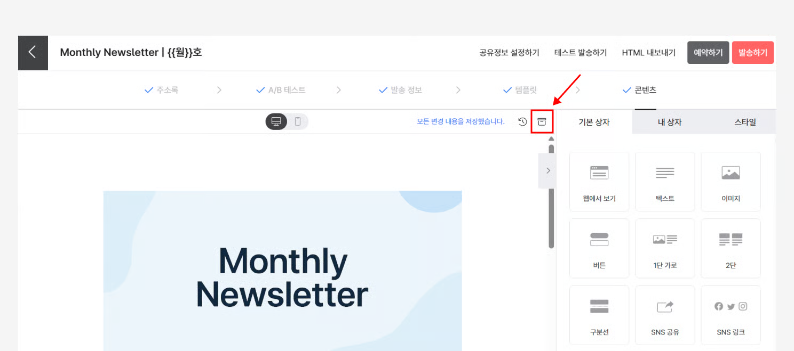

---
layout:
  title:
    visible: true
  description:
    visible: false
  tableOfContents:
    visible: true
  outline:
    visible: true
  pagination:
    visible: true
---

# 자동 이메일 사용하기

💬 이 내용은 **스탠다드, 프로, 엔터프라이즈 요금제**에 해당하는 도움말입니다.

## 이 글에서는 

스티비의 \[자동 이메일]을 사용하는 방법에 대해 알아봅니다.

***

## 들어가기 전에 

\[자동 이메일]의 발송은 구독자 한명 한명에게 정확히 보내는 구조에 최적화되어 있습니다. 따라서 자동 이메일로 한 번에 여러 명의 구독자에게 보내는 경우, \[[일반 이메일](broken-reference)]과 처리 방식이 달라 발송 완료까지 시간이 오래 걸릴 수 있습니다. 구독자 별로 보내는 것이 아니라 한 번에 여러 명에게 보내는 이메일(뉴스레터, 프로모션 메일 등 구독자의 참여를 유도하기 위해 대량 발송하는 이메일)이라면 일반 이메일을 사용해서 보내주세요.

## 자동 이메일의 동작 방식 

자동 이메일의 상태는 '작성중, 실행중, 예약중 일시정지, 종료' 4가지로 구분할 수 있습니다. 자동 이메일은 \[트리거]로 설정한 조건을 만족할 때마다 자동으로 설정해둔 이메일이 발송되는 방식입니다. 트리거는 자동 이메일이 '실행중'인 경우에만 동작합니다.&#x20;

자동 이메일의 상태에 대해 더 자세한 내용이 궁금한 경우에는 [여기](sending.md#h\_01gh88jd5svt98k9ww8swjzm83)를 참고해 주세요.


'작성중, 예약중'인 경우와 '일시정지, 종료' 상태인 경우 트리거가 동작하지 않기 때문에 트리거에 만족하는 동작이 발생해도 자동 이메일은 발송되지 않습니다. 따라서 자동 이메일을 보내기 위해서는 이메일을 '실행중' 상태로 만들어야 합니다.


<figure><figcaption></figcaption></figure>

## 자동 이메일 만들기 

자동 이메일은 \[일반 이메일]과 마찬가지로 이메일 목록에서 만들 수 있습니다.

1. 메인화면 가장 위에 있는 메뉴에서 \[이메일]을 클릭하여 이메일 목록으로 이동합니다.
2. 이메일 목록 오른쪽 위에 있는 \[+ 새로 만들기 → 자동 이메일]을 클릭합니다.
3. \[자동 이메일]이 만들어지고 이메일이 발송될 \[[주소록](broken-reference)]을 선택하는 단계로 이동합니다.

<figure><figcaption></figcaption></figure>

<figure><figcaption></figcaption></figure>

## 주소록 설정하기 

자동 이메일도 일반 이메일과 마찬가지로 주소록을 선택해야 합니다. 자동 이메일에서 선택한 \[주소록]은 발송 조건에 따라 자동 이메일이 발송될 수 있는 일종의 '발송 대상 후보'라고 볼 수 있습니다.\
\
\[일반 이메일]은 선택된 주소록에 등록된 구독자에게 '일괄 발송'되지만, \[자동 이메일]은 선택된 주소록에 등록된 구독자 중 발송 조건에 따라 '각기 다른 사람'에게, '각기 다른 시점'에 발송됩니다.

<figure><figcaption></figcaption></figure>

## 발송 조건 설정하기 

자동 이메일이 일반 이메일과 다른 점은 \[발송 조건]을 설정한다는 것입니다. 발송 조건은 자동 이메일을 발송하기 위한 조건으로 '트리거, 필터, 발송 시간대, 반복 발송 설정'으로 구분합니다.

<figure><figcaption></figcaption></figure>

### **트리거** 

트리거는 이메일을 발송할 기본 조건입니다. 이메일, 주소록에 대한 구독자의 행동이나 API 요청에 의해 실행됩니다. 트리거로 설정할 수 있는 구독자의 행동은 다음과 같습니다.

<figure><figcaption></figcaption></figure>

* **구독자  추가**
  * 주소록에 구독자가 추가됐을 때 자동 이메일을 발송합니다. '관리자가 직접 추가한 경우'를 포함하면, 구독 폼이 아니라 관리자가 직접 추가한 구독자에게도 자동 이메일을 보낼 수 있습니다.
    * 활용 예시: 뉴스레터를 새로 구독한 구독자에게 웰컴 이메일을 보내거나, 뉴스레터를 새로 구독한 사람에게 기존에 발송했던 뉴스레터를 다시 볼 수 있는 링크를 제공하는 이메일을 보낼 수 있어요.
* **구독자의 기념일**
  * 구독자의 '날짜' 형식 필드에 입력한 값을 기준으로 이메일을 발송합니다. 특정 날짜로 부터 1일전, 30일 전 등 기간을 설정해 자동으로 이메일이 발송되도록  수 있습니다.
    * 활용 예시: 구독자의 생일마다 자동으로 생일 축하 이메일을 보냅니다.
* **구독자 정보 업데이트(프로)**
  * 구독자의 사용자 정의 필드가 '특정 값'으로 업데이트 됐을 때 자동 이메일을 발송합니다.
    * 활용 예시: 구독자의 등급이 'VIP' 회원으로 업데이트 됐을 때 VIP 등급 혜택 안내 이메일을 보냅니다.
* **구독자 그룹 추가(프로)**
  * '특정 그룹'에 구독자가 추가됐을 때 자동 이메일을 발송합니다.
    * 활용 예시: 구독자가 '리마인드' 그룹에 추가되면, 리마인드 이메일을 보냅니다.
* **발송 성공**
  * '특정 이메일' 발송을 성공한 구독자에게 자동 이메일을 보냅니다. 어떤 이메일에 관한 발송 성공인지 선택할 수 있으며, 이미 발송 완료된 일반 이메일이나 종료된 자동 이메일은 선택할 수 없습니다.
    * 활용 예시: 신규 회원에게 서비스 가이드를 2회에 걸쳐 제공하기 위해, 첫 번째 이메일이 발송 성공한 뒤, 이어서 두 번째 이메일을 발송합니다.
* **발송 실패**
  * '특정 이메일'이 발송 실패한 구독자에게 자동 이메일을 보냅니다 '어떤 이메일'에 대한 발송 실패인지 선택할 수 있으며, 이미 발송 완료된 일반 이메일이나 종료된 자동 이메일은 선택할 수 없습니다.
    * 활용 예시: 꼭 받아야 하는 이메일이 발송이 실패한 경우 자동으로 다시 발송을 시도합니다.
* **오픈**
  * 특정 이메일을 오픈한 구독자에게 자동 이메일을 보냅니다. 이메일의 상태와 상관없이 모든 일반 이메일, 자동 이메일을 선택할 수 있습니다.
    * 활용 예시: 캠페인 참여를 요청하는 이메일을 발송합니다. 이 이메일을 오픈한 사람은 캠페인에 어느정도 관심있는 사람이라고 보고, 캠페인에 대한 추가 정보를 제공하는 이메일을 이어서 발송합니다.
* **오픈 안 함**
  * 특정 이메일을 발송한 뒤 일정 시간이 지날 때까지 그 이메일을 오픈하지 않은 구독자에게 자동 이메일을 보냅니다. 어떤 이메일에 대한 오픈인지, 언제까지 오픈하지 않았을 때 발송할지 선택할 수 있습니다. 이메일의 상태와 상관없이 모든 일반 이메일, 자동 이메일을 선택할 수 있습니다.
    * 활용 예시: 캠페인 참여를 요청하는 이메일을 발송한 뒤, 오픈하지 않은 사람에게 다시 이메일을 발송합니다.
* **링크 클릭**
  * 특정 이메일에 포함된 링크를 클릭한 구독자에게 자동 이메일을 보냅니다. 어떤 이메일에 대한 클릭인지, 그 이메일의 어떤 링크에 대한 클릭인지 선택할 수 있습니다. 이메일의 상태와 상관없이 모든 일반 이메일, 자동 이메일을 선택할 수 있습니다.
    * 활용 예시: 신제품을 소개하는 이메일을 발송합니다. 이 이메일에 포함된 신제품 소개 페이지 링크를 클릭한 사람은 구매 의사가 있는 사람이라고 보고, 구매를 유도할 수 있는 구체적인 상품 정보를 제공하는 이메일을 이어서 발송합니다.
* **링크 클릭 안 함**
  * 특정 이메일을 발송한 뒤 일정 시간이 지날 때까지 그 이메일에 포함된 링크를 클릭하지 않은 않은 구독자에게 자동 이메일을 보냅니다. 어떤 이메일에 대한 클릭인지, 그 이메일의 어떤 링크에 대한 클릭인지, 언제까지 클릭하지 않았을 때 발송할지 선택할 수 있습니다. 이메일의 상태와 상관없이 모든 일반 이메일, 자동 이메일을 선택할 수 있습니다.
    * 활용 예시: 신제품을 소개하는 이메일을 발송합니다. 이 이메일에 포함된 신제품 소개 페이지 링크를 클릭하지 않은 사람은 이 상품에 관심이 없는 사람이라고 보고, 다른 상품을 소개하는 이메일을 발송합니다.
* **API 직접 요청**
  * API로 직접 요청이 왔을 때 주소록 단계에서 선택한 주소록의 구독자에게 이메일을 발송합니다. [자동 이메일 API 사용 방법](../../api-webhook/auto-email-api.md)
    * 활용 예시: 내 웹사이트에 새로 가입한 회원에게 가입 환영 메일을 발송합니다.

#### **트리거 상세 조건 설정**

트리거는 1개만 설정할 수도 있고 2개 이상 설정할 수도 있습니다. 2개 이상 설정하는 경우 여러 개의 트리거를 모두 만족해야 하는지,  하나만 만족해도 되는지 설정할 수 있습니다.&#x20;

트리거를 만족했을 때 이메일을 바로 발송을 할 수도 있고 바로 발송하지 않고 몇 시간, 며칠, 몇 주, 몇 년 후에 발송할 수도 있습니다.

트리거는 기본적으로 '중복' 발생하는 요청에 대해서는 동작하지 않도록 설정되어 있습니다. 단, 필요에 따라 중복으로 발생한 트리거도 동작할 수 있도록 설정할 수 있습니다.&#x20;

<figure><figcaption></figcaption></figure>

#### 트리거  중복 허용하기 

자동 이메일 트리거는 기본적으로 중복 요청을 허용하지 않습니다. 예를 들어 '오픈함' 트리거를 사용하는 경우 A라는 구독자가 조건이 되는 이메일을 열어볼 때마다 트리거가 발생하게 되면 자동 이메일을 필요 이상으로 많이 받아보게 되는 문제가 발생할 수 있습니다. \
\
그러나 자동 이메일 API를 사용하는 경우 종종 트리거의 중복 요청을 허용해야 하는 경우가 발생할 수 있습니다. 예를 들어 스티비를 사용해 회원가입 시 발송되는 인증 메일을 구현하는 경우 회원이 인증 메일 발송을 여러번 요청하는 경우가 발생할 수 있습니다. 이때 트리거 중복 요청을 허용하지 않는다면 인증 메일을 회원의 요청때마다 보낼 수 없게 됩니다.

1. 자동 이메일의 \[발송 조건] 설정 단계로 이동합니다.
2. '트리거' 세션의 아래 쪽에 있는 \[트리거 중복 허용하기]를 활성화합니다.
3. 트리거 중복 요청 활성화를 허용하고 싶지 않은 경우에는 \[트리거 중복 허용하기]를 클릭해 비활성화합니다.

**\*주의:** \[발송 성공, 발송 실패, 오픈 안함, 클릭 안함] 트리거는 중복 요청 허용 옵션을 사용할 수 없습니다.

#### 중복 제한 시간 설정하기

트리거 중복 요청을 허용하는 제한 시간을 설정하는 것도 가능합니다. 예를 들어, '오픈함' 트리거를 사용하고 있고 중복 제한 시간을 1시간으로 설정했다면,

* A라는 구독자가 조건이 되는 이메일을 10:00에 열어봤다면 트리거 조건을 만족해 이메일이 발송됩니다.
* 이후에 다시 A 구독자가 이메일을 10:30분에 열어봤다면 중복 제한 시간 설정 때문에 이메일이 발송되지 않습니다.
* A 구독자가 이메일을 11:10분에 다시 열어봤다면 제한 시간으로 설정한 1시간이 지났기 때문에 트리거 중복 요청 설정에 따라 다시 이메일이 발송됩니다.

_\* 중복 요청 시간 제한을 두고 싶지 않다면 제한 시간을 0분으로 설정하면 됩니다._

<figure><figcaption></figcaption></figure>

### **필터** 

필터는 트리거의 조건을 만족하는 대상 중 일부에게만 이메일을 발송할 수 있게 하는 조건입니다. 주소록의 \[[그룹](../../list/classify-subscribers/how-to-use-groups.md)] 또는 \[[사용자 정의 필드](https://help.stibee.com/hc/ko/articles/5659525285007)]를 기준으로 설정합니다. 예를 들어 필터를 사용하면 신제품을 소개하는 이메일에 포함된 신제품 소개 페이지 링크를 클릭한 구독자 중, 최근 3개월 간 구매 이력이 있는 구독자 그룹에 포함된 구독자에게 이메일을 발송할 수 있습니다. 필터를 추가하면 트리거를 통해 발송 대상으로 추가될 때 필터 조건에 맞는 구독자만 발송 대상에 추가됩니다.

### **발송 시간대** 

발송 시간대는 자동 이메일의 발송을 허용하는 시간대입니다. 발송 시간대를 설정하면 트리거와 필터의 조건을 만족해도 특정 시간대에만 이메일을 발송하게 할 수 있습니다.\
\
발송 시간대가 아니어서 이메일이 발송되지 않은 경우, 발송 시간대가 돌아올 때까지 기다렸다가 이메일이 발송됩니다. 예를 들어 신제품을 소개하는 이메일에 포함된 신제품 소개 페이지 링크를 클릭한 구독자에게, 매주 일요일 오후 5시에서 7시 사이에 특별 할인 코드를 제공하는 이메일을 발송하도록 설정할 수 있습니다.&#x20;

<figure><figcaption></figcaption></figure>

#### 발송 시간대의 작동 방식 

설정한 자동 이메일을 특정 시간대에만 발송하도록 설정할 수 있습니다. 발송 시간대 설정을 잘 활용하면 주로 우리 구독자가 이메일을 자주 열어보는 시간에만 자동으로 이메일이 발송되도록 설정할 수 있습니다. 예를 들어 A라는 자동 이메일의  발송 시간대를 '월 \~ 금 오전 10:00 \~ 오후 5:00'로 설정했다면,

* A이메일은 월 \~ 금 오전 10:00 \~ 오후 5:00에만 발송됩니다.
* 설정한 발송 시간대가 아닌 시간에 발송 조건을 만족해도 A 이메일은 발송되지 않습니다.
* 발송 조건을 오후 12:00에 만족한 경우 설정한 발송 시간대 내에 해당하기 때문에 A 이메일이 발송됩니다.
* 발송 조건을 오후 6:00에 만족한 경우 설정한 발송 시간대 이후에 해당하기 때문에 A 이메일은 바로 발송되지 않고 가장 빠른 다음 발송시간대인 다음날 오전 10:00에 자동으로 발송이 이루어집니다.

발송 시간대 설정은 이메일 성과를 개선할 수 있는 편리한 설정이지만 경우에 따라 발송이 언제 어떻게 진행되는지 조금 헷갈리는 경우가 있습니다. 몇 가지 일반적이지 않은 상황에 대해 각각 발송이 언제 어떻게 진행되는지, 몇 가지 사례로 설명드리겠습니다.

**사례1. 발송 시간대의 시작 시간이 끝 시간보다 큰 경우**

B라는 이메일의 발송 시간대를 '매일 오후 3:00 \~ 오전 9:00'로 설정했다면,&#x20;

* B 이메일은 오후 3:00부터 발송되기 시작합니다.
* 다음날 오전 9:00 이후에는 트리거 조건을 만족하지 않기 때문에 B 이메일은 발송되지 않습니다.
* 즉, 오전 9:00 \~ 오후 3:00까지는 트리거 조건을 만족해도 B 이메일은 발송되지 않습니다.
* 만약에 B 이메일의 트리거를 오후 5:00에 만족한 경우 B 이메일은 바로 발송됩니다.
* 만약에 B 이메일의 트리거를 오전 10:00에 만족한 경우 B 이메일은 가장 빠른 다음 발송 시간대인 오후 3:00에 발송됩니다.

**사례2. 발송 시간대의 시작 시간이 끝 시간보다 크고, 요일이 제한되어있는 경우**

C라는 이메일의 발송 시간대를 '월요일 오후 3:00 \~ 오전 9:00'로 설정했다면,&#x20;

* C 이메일은 월요일 오후 3:00부터 발송되기 시작합니다.
* 화요일 오전 9:00 이후에는 트리거 조건을 만족하지 않기 때문에 C 이메일은 발송되지 않습니다.
* 화요일 오전 9:00 이후 부터 다음주 월요일 오후 3:00까지는 조건을 만족해도 C 이메일은 발송되지 않습니다.
* 만약에 C 이메일의 트리거를 월요일 오후 5:00에 만족한 경우 C 이메일은 바로 발송됩니다.
* 만약에 C 이메일의 트리거를 화요일 오전 10:00에 만족한 경우 B 이메일은 가장 빠른 다음 발송 시간대인 다음주 월요일 오후 3:00에 발송됩니다.

### **반복 발송 설정** 

설정한 주기에 따라 자동으로 이메일이 반복 발송되게 설정할 수 있습니다. 이 기능을 사용하면 2년에 한번씩 '광고성 정보 수신 동의'를 받는 이메일 등을 쉽게 설정할 수 있습니다.&#x20;

<figure><figcaption></figcaption></figure>

#### 반복 발송 주기 설정하기 

'첫 발송 후 반복 발송하기' 버튼을 클릭해서 설정을 ON 상태로 만들고 언제 이메일을 반복해서 발송할지 선택합니다. 반복 발송은 구독자에게 자동 이메일이 처음 발송된 날짜와 시간을 기준으로 설정한 주기에 따라 반복적으로 발송됩니다.\
\
예를 들어 반복 발송을 "매월"발송하도록 설정하였고 이 사용자에게 자동 이메일이 2021년 10월 21일 오후 2시에 처음 발송이 되었다면 다음 발송은 "2021년 11월 21일 오후 2시"에 발송되게 됩니다. 만약에 발송 주기를 '매주'로 설정한 경우에 다음 이메일은 '2021년 10월 17일 오후 2시'에 발송됩니다.

<figure><figcaption></figcaption></figure>

#### 반복 발송 사용 예시 

**구독자나 회원에게 2년마다 광고성 정보 수신 동의 확인 이메일 발송**

'광고성 정보' 수신 동의를 선택한 구독자에게는 정보통신망법 제50조 제8항에 의거 수신 동의를 받은 날부터 2년마다 수신 동의 여부를 확인해야 합니다.&#x20;

자동 이메일의 트리거를 '주소록에 추가됨'으로 설정하고 '2년 뒤에 발송' 하도록 설정해두면 구독자가 [구독 폼](../../list/gather-subscribers/form.md#undefined) 또는 [주소록 API](../../api-webhook/list-api.md)를 통해 주소록에 추가된 날을 기준으로 2년 뒤에 수신 동의 여부를 확인하는 안내 이메일이 자동으로 발송됩니다. 반복 발송 주기까지 '2년'으로 설정을 하게 되면 이후 계속해서 이 구독자가 주소록에 존재하고 있다면 2년마다 광고성 정보에 대한 수신 동의 여부를 확인하는 안내 이메일이 자동으로 발송되게 됩니다.

**회원에게 생일 축하 이메일 발송**

자동 이메일의 트리거를 '기념일'로 설정하고 반복 발송 주기를 '매년'으로 설정하면 매년 자동으로 회원의 생일에 자동으로 생일 축하 이메일이 발송됩니다.

**서비스 사용현황에 대한 월간 업데이트 이메일 발송**

자동 이메일의 트리거를 '주소록에 추가됨'으로 설정하고 '모든 조건을 만족하면 4주 후 발송' 되도록 설정합니다. 반복 발송 주기를 '매월'로 설정합니다. [주소록 API](https://help.stibee.com/hc/ko/articles/4756551371535)를 사용해 내 서비스에 회원가입을 한 경우 스티비 주소록에 자동으로 신규 회원의 정보가 추가되도록 설정합니다.

구독자가 회원가입을 하고 한달 뒤 첫번째 사용 현황 안내 이메일이 발송됩니다. 이후 매월 같은 날짜에 사용 현황 업데이트 이메일이 월 단위로 자동 발송됩니다.

**알아두면 좋을 내용**

반복 발송이 예약되는 기준은 가장 마지막에 트리거 조건이 충족된 날짜와 시간을 기준으로 결정됩니다.

예를 들어 A라는 자동 이메일을 "B라는 일반이메일이 오픈한 경우"에 해당하는 조건을 걸어 운영하고 있고 "매일" 반복 발송되도록 설정하여 운영하는 상황을 가정해보면 B 이메일을 받아본 구독자가 2021년 10월 10일 오전 10시에 이메일을 오픈한 경우 A 자동 이메일이 발송됩니다.

그리고 A 자동 이메일의 다음 반복 발송은 설정한 반복 주기(매일)에 따라 다음날인 2021년 10월 11일 오전 10시로 예약됩니다.

그런데 이 구독자가 다시 2021년 10월 10일 오전 11시에 이메일을 열어 트리거가 또 다시 발생을 하게 되면 다음 반복 발송은 기존에 설정된 2021년 10월 11일 오전 10시가 아닌 2021년 10월 11일 오전 11시로 수정됩니다.

## 자동 이메일 ↔ 일반 이메일 변환하기

자동 이메일은 언제든지 일반 이메일로 간단하게 변환할 수 있습니다. 반대로 일반 이메일도 필요한 경우 자동 이메일로 변환할 수 있습니다. 이메일 목록에서 \[더보기 v → 자동/일반 이메일로 변환하기]를 클릭해 이메일을 변환할 수 있습니다.

<figure><figcaption></figcaption></figure>

## 이메일 편집하기 

이 외의 발송정보, 템플릿, 콘텐츠 등 [이메일 편집](../undefined-1/) 단계는 \[일반 이메일]과 동일합니다. 발송정보 단계에서는 이메일 제목, 발신자 이름, 발신자 이메일 주소, 미리보기 텍스트를 입력합니다. 템플릿 단계에서는 콘텐츠 템플릿을 선택하고 콘텐츠 단계에서 직접 편집합니다. 단, 자동 이메일에서는 A/B 테스트를 할 수 없습니다.\
\
각 단계 제목 앞에 “V” 표시가 됐다면 모든 단계의 입력을 완료한 것이고, 이제 자동 이메일 발송을 시작할 수 있습니다. 자세한 설정 방법이 궁금하신 분은 아래 다음을 클릭해 자동 이메일 발송을 시작하는 방법에 대해 확인하세요.
