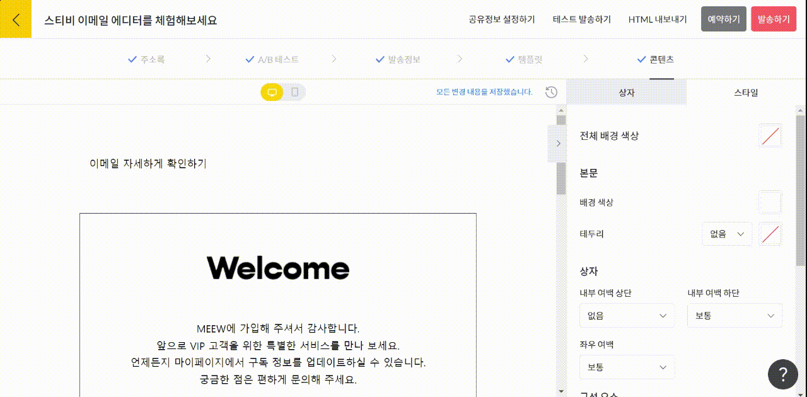
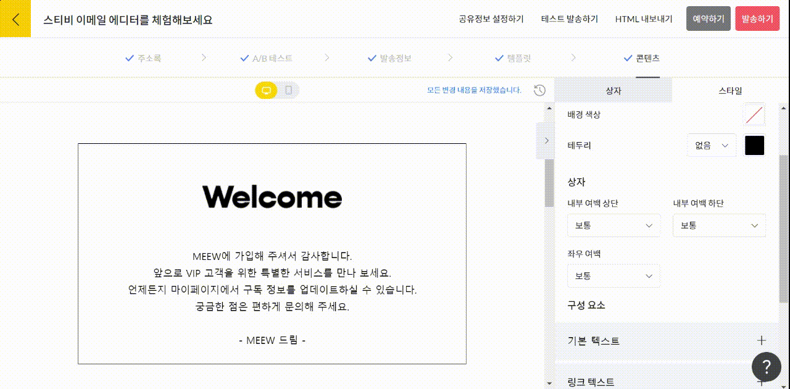

# 전체 스타일 설정하기

## 이 글에서는

스티비 에디터의 전체 스타일을 설정하는 방법에 관해 알아봅니다.

***

개별 \[편집 상자] 단위가 아닌 이메일 전체에 특정 스타일이 적용되도록 설정할 수 있습니다. 화면 오른쪽 \[스타일]에서 이메일 전체에 적용될 스타일을 설정해 보세요.

## 전체 배경 색상

전체 배경이란 이메일 본문 밖 배경을 의미합니다. \[스타일 → 전체 배경 색상]에서 전체 배경에 적용될 색상을 선택할 수 있습니다.

<figure><figcaption></figcaption></figure>

## 본문

\[스타일 → 본문]에서 이메일 본문에 적용될 전체 스타일을 설정할 수 있습니다. 배경 색상, 테두리 색상 및 굵기를 지정할 수 있습니다.

<figure><figcaption></figcaption></figure>

## 상자

\[스타일 → 상자]에서 모든 \[편집 상자]에 적용될 내부 여백 스타일을 설정할 수 있습니다.

* 넓게: 내부 여백을 넓게 설정합니다.&#x20;
* 보통: 내부 여백 스타일을 지정하지 않을 경우 설정되는 가장 기본적인 여백 스타일입니다.
* 좁게: 내부 여백을 좁게 설정합니다.
* 없음: 내부 여백이 없습니다.

## 구성요소

\[스타일 → 구성요소]에서 본문 전체에 적용될 텍스트, 버튼, 구분선 스타일을 설정할 수 있습니다.

* 기본 텍스트: 일반적인 텍스트를 작성할 때 적용될 '폰트, 폰트 사이즈, 텍스트 정렬, 폰트 색상'을 설정할 수 있습니다.
* 링크 텍스트: 링크 텍스트에 적용될 스타일을 설정할 수 있습니다.
* 버튼 스타일: 버튼 상자에 적용될 '테두리, 배경 색상, 폰트, 폰트 사이즈, 텍스트 정렬, 버튼 모양'을 설정할 수 있습니다.
* 구분선: 총 세 가지의 구분선 종류를 제공하며, 이외에 구분선 굵기와 색상을 설정할 수 있습니다.
