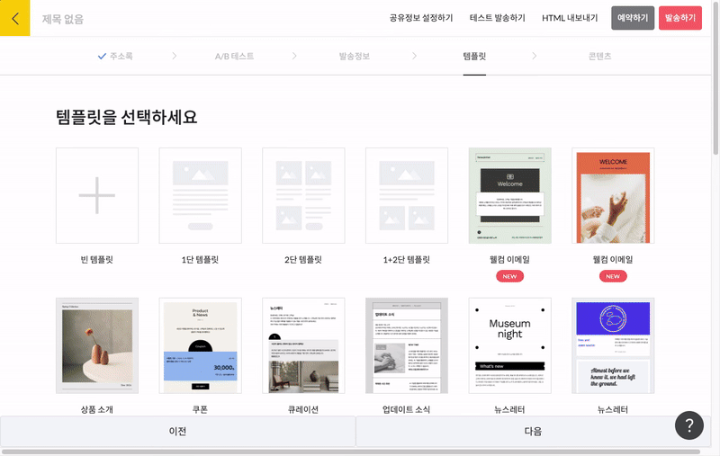

---
layout:
  title:
    visible: true
  description:
    visible: false
  tableOfContents:
    visible: true
  outline:
    visible: true
  pagination:
    visible: true
---

# 템플릿 선택하기

## 이 글에서는

스티비에서 사용할 수 있는 템플릿의 종류에 대해 알아봅니다.&#x20;

***

## 템플릿 이해하기

이메일 편집 단계 중 \[템플릿]에서는 다음 콘텐츠 단계에서 이메일을 편집할 때 활용할 템플릿을 선택할 수 있습니다. 기존에 스티비에서 제공하는 디자인 템플릿을 활용해 보내도 좋고 아무런 내용이 없는 '빈 화면' 상태에서 처음부터 콘텐츠를 만들어 보낼 수 있습니다.&#x20;

HTML코드로 만든 이메일 양식이 있다면 HTML 코드를 붙여 넣어 보내거나 별도의 디자인 없이 일반적인 이메일처럼 담백하게 텍스트만 입력해서 보내는 것도 가능합니다.

## 템플릿 종류

스티비에서 제공하는 템플릿은 크게 종류에 따라 3가지로 나눌 수 있습니다.

* 기본 템플릿: 가장 기본적으로 사용할 수 있는 템플릿입니다.
* 텍스트 템플릿: 뉴스레터나 소식지 형식이 아닌 일반적인 이메일 형식처럼 콘텐츠를 만들 수 있는 템플릿입니다.
* HTML 템플릿: HTML 코드로 이메일 전체를 편집할 수 있는 템플릿입니다.

### 기본 템플릿

스티비에서는 누구나 쉽게 이메일을 만들 수 있도록 디자인 템플릿을 제공합니다. '기본 템플릿'에서는 이메일의 목적, 종류에 따라 활용하면 좋을 여러 디자인 템플릿을 제공하고 있습니다. 기존에 제공하고 있는 템플릿을 활용해도 좋고 나만의 새로운 디자인을 만들고 싶은 경우 \[빈 템플릿] 또는 \[1단 템플릿] 등 원하는 레이아웃만 선택하고 처음부터 디자인을 해도 좋습니다. 스티비에서 활용할 수 있는 기본 템플릿의 종류가 궁금하다면 아래 링크에서 확인해보세요.

[뉴스레터 템플릿 보러가기](https://template.stibee.com/)

\[사진 - 템플릿 선택]

### 텍스트 템플릿

디자인된 이메일이 아닌 일반적으로 주고 받는 이메일과 같은 형식으로 콘텐츠를 만들고 싶다면 '텍스트 템플릿'을 이용하면 됩니다. 템플릿 선택 화면에서 스크롤을 아래로 내리면 \[텍스트 에디터로 만들기]를 클릭해 텍스트 템플릿으로 편집할 수 있습니다.

텍스트 템플릿에서는 이메일의 내용을 텍스트로만 편집해서 보낼 수 있습니다.  텍스트 템플릿을 활용하면 G메일, 네이버 메일을 활용해 이메일을 보내는 것처럼 내용을 구성해서 보낼 수 있습니다.

<figure><figcaption></figcaption></figure>

### HTML 템플릿

이미 가지고 있는 HTML 코드 형태의 이메일이 있거나 내가 직접 HTML 코드를 편집해 이메일을 보내고 싶다면 HTML 템플릿을 사용하면 됩니다. 템플릿 선택 화면에서 스크롤을 내린 뒤 \[HTML 에디터로 만들기]를 클릭해 HTML 템플릿을 선택할 수 있습니다.&#x20;

\[사진 - GIF]

HTML 템플릿으로 이메일을 만드는 경우 '미리보기 텍스트' 설정을 위해서는 별도 코드를 추가해야 합니다. 관련해서 자세한 설정은 '[미리보기 텍스트 HTML로 작성하기](../undefined-1/html.md#id-1-html)' 에서 참고하세요.

'기본 템플릿' 또는 '텍스트 템플릿'과 달리 다양한 이메일 환경을 고려해 이메일이 깨지지 않도록 주의하여 코드를 작성해야 합니다. HTML 템플릿의 자세한 설정 방법은 '[이메일 전체를 HTML 코드로 편집하기](../undefined-1/html.md#h\_183ecaf6df)'를 참고하세요. 이메일 환경을 고려한 HTML 코드 작성 방법이 궁금하다면 아래 링크의 글을 참고해봐도 좋습니다.

[스티비 HTML 상자를 사용할 때 기억할 다섯 가지!](https://blog.stibee.com/html-ec-83-81-ec-9e-90-eb-a5-bc-ec-82-ac-ec-9a-a9-ed-95-a0-eb-95-8c-ea-b8-b0-ec-96-b5-ed-95-a0-eb-8b-a4-ec-84-af-ea-b0-80-ec-a7-80-2/)

이메일을 '기본 템플릿'을 사용해 만드는 경우에는 편집 할 때 사용할 수 있는 여러 편집 상자를 제공합니다. 편집 상자를 사용해 이메일을 편집하는 방법이 궁금하다면 아래 \[편집 상자 사용하기]를 클릭해 자세한 내용을 확인해보세요.

