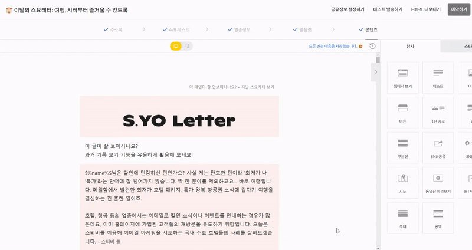

---
layout:
  title:
    visible: true
  description:
    visible: false
  tableOfContents:
    visible: true
  outline:
    visible: true
  pagination:
    visible: true
---

# 이전 편집 내용으로 되돌리기

💬 이 내용은 **스탠다드, 프로, 엔터프라이즈** 요금제에 해당하는 도움말입니다.

## 이 글에서는

버전 기록 기능을 에디터에서도 사용하는 방법을 알아봅니다.

***

\[과거 기록 보기]는 편집 중인 이메일을 체크하여 변경 사항이 있는 경우 새로운 버전으로 저장하고, 이전 버전으로 편집 상태를 되돌릴 수 있는 기능입니다.

* 스탠다드 요금제: 날짜를 기준으로 최대 7일까지 저장 가능
* 프로 요금제: 날짜를 기준으로 최대 30일까지 저장 가능
* 엔터프라이즈 요금제: 제한 없음

예를 들어, '스탠다드 요금제'를 사용한다면, 8월 8일 오전 11시에 \[과거 기록 보기]에 진입할 경우, 8월 1일 오전 11시 이후의 버전부터 목록에 표시됩니다.&#x20;

<figure><figcaption></figcaption></figure>
