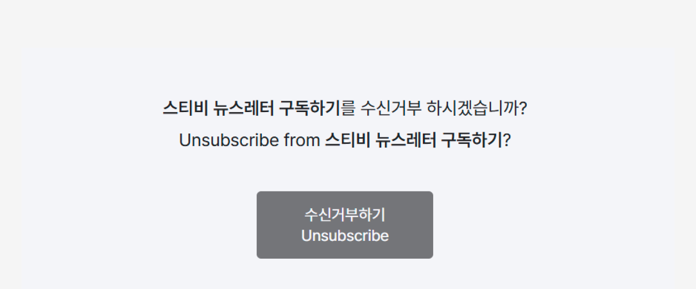
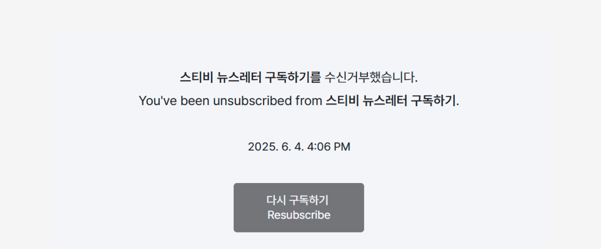
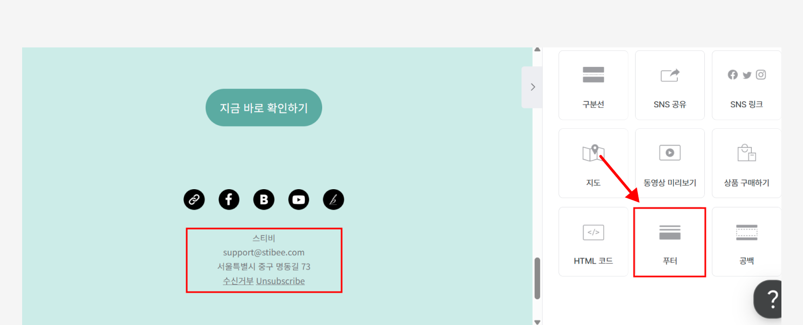
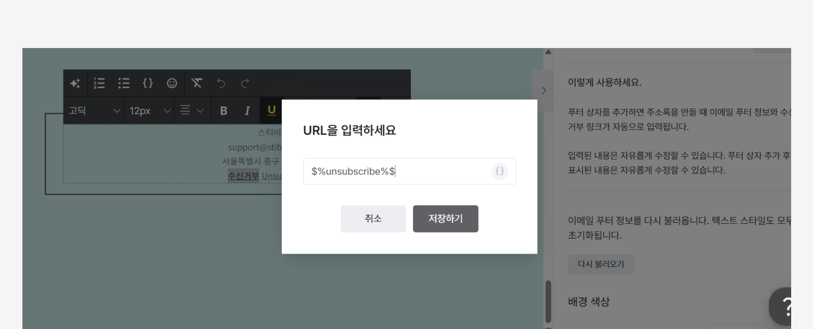
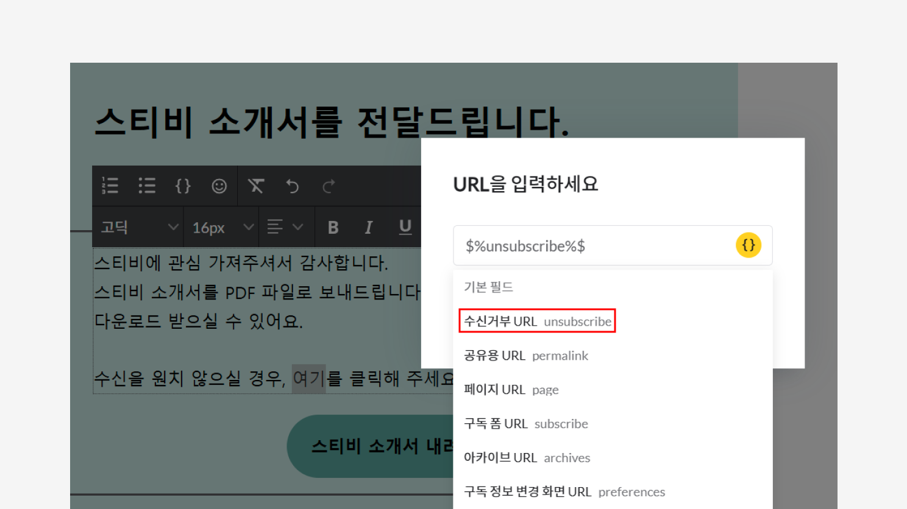

# 수신거부 링크 추가하기

## 이 글에서는

이메일 본문에 구독자가 직접 수신거부할 수 있는 링크를 추가하는 방법을 알아봅니다.

***

## 수신거부 기능이란?

스티비의 수신거부 기능을 사용하면,

* 구독자가 수신거부를 요청하면 '수신거부' 상태로 자동변경됩니다.
* 수신거부된 구독자는 이후 발송 대상에서 자동으로 제외됩니다.
* 수신거부된 구독자는 요금 구간 계산 기준에 포함되지 않습니다.

구독자는 이메일 본문 또는 구독 정보 변경 페이지에 있는 \[수신거부] 링크를 클릭해 수신거부 화면으로 이동합니다. 이후 \[수신거부하기] 버튼을 누르면 즉시 처리됩니다.

<figure><figcaption></figcaption></figure>

<figure><figcaption></figcaption></figure>

#### 수신거부 완료 시 표시되는 정보

수신거부 처리가 완료되면 아래 정보가 화면에 표시됩니다.

* 수신거부 처리 일시
* 수신거부된 주소록 이름
* 처리 결과 안내

필요한 경우, \[다시 구독하기]를 눌러 다시 구독 신청을 진행할 수 있습니다.

<figure><figcaption></figcaption></figure>

<figure><figcaption></figcaption></figure>

## 수신거부 링크 추가 방법


**\*주의:** 치환자 형태가 아닌 일반 URL을 입력하면 수신거부 기능이 작동하지 않습니다.


스티비의 수신거부 링크는 치환자($%unsubscribe%$) 형태로 제공됩니다. 이 치환자를 이메일에 넣으면 발송 시 구독자별 맞춤 수신거부 링크로 자동 변환되어 전달됩니다.

### 푸터 상자 추가하기

1. 화면오른쪽 편집 상자 목록에서 \[푸터] 상자를 추가합니다.
2. 기본 제공되는 \[수신거부, Unsubscribe] 문구에 수신거부 치환자가 이미 포함되어 있습니다.

<figure><figcaption></figcaption></figure>

<figure><figcaption></figcaption></figure>

### 직접 입력하기

텍스트, 이미지, 버튼 등 원하는 요소에 수신거부 링크를직접 추가할 수 있습니다.

1. 수신거부 링크를 넣을 요소를 선택합니다..
2. 툴바의 \[링크] 아이콘을 클릭합니다.
3. 링크 입력창 오른쪽의 \[중괄호 { }] 버튼을 클릭합니다.
4. \[수신거부 URL]을 선택하면, 수신거부 치환자가 자동으로삽입됩니다.

<figure><figcaption></figcaption></figure>

### HTML 코드에서 추가하기

HTML 코드를 사용해 이메일을 편집할 때도 $%unsubscribe%$ 치환자를 넣을 수 있습니다. 자세한 사용 방법은 [HTML에서 수신거부 기능 사용하기](../undefined-1/html.md#unsubscribe) 도움말을 참고해 주세요.

주소록에서는 수신거부 상태의 구독자 명단을 확인할 수 있습니다. 또한, 수신거부하는 구독자로부터 수신거부 이유도 입력 받을 수 있습니다. 자세한 내용은 [수신거부 관리하기](../../list/adding-managing-subscriber/manage-unsubscribe.md) 도움말에서 확인해 보세요.
