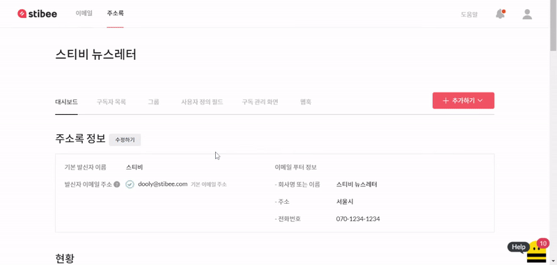

---
layout:
  title:
    visible: true
  description:
    visible: false
  tableOfContents:
    visible: true
  outline:
    visible: true
  pagination:
    visible: true
---

# 수신거부 링크 추가하기

## 이 글에서는

이메일을 받아본 구독자가 수신을 거부하고 싶은 경우 스티비의 '수신거부' 기능을 사용하면 자동으로 주소록에서 구독자의 상태가 '수신거부'로 변경되도록 설정할 수 있습니다. '수신거부' 상태인 구독자는 자동으로 이메일 발송 대상에서 제외되고 요금 구간 선택을 위한 구독자 수 계산에서도 제외됩니다. 이 도움말에서는 이메일에 구독자가 수신거부를 할 수 있는 링크를 넣는 방법에 대해 알아봅니다.

***

## 수신거부 기능 이해하기 

### 작동 방식 

이메일 본문이나 [구독 정보 변경 페이지](https://help.stibee.com/hc/ko/articles/4756469564047)에 있는 수신거부 링크를 클릭하는 경우 구독자는 아래와 같은 화면으로 이동합니다. 여기서 \[수신거부 하기] 버튼을 클릭하면 그 구독자는 '[구독 상태](../../list/adding-managing-subscriber/understanding-subscriber-status.md)'가 수신거부 상태로 변경되며 발송 대상에서 자동으로 제외됩니다.&#x20;

<figure><figcaption></figcaption></figure>

### &#x20;수신거부 목록 확인하기 

구독자가 이메일에서 수신거부하면 수신거부를 한 이메일이 발송된 주소록에 '수신거부' 상태로 분류됩니다. 수신거부 목록을 확인하고자 하는 주소록을 선택한 뒤 상단 메뉴의 구독자 목록을 클릭하고 구독 상태 필터를 클릭한 뒤 '수신거부'를 선택하면 수신거부 된 구독자 명단을 확인할 수 있습니다. 그리고 이메일 [상세통계](https://help.stibee.com/hc/ko/articles/4756494674319)에서 각 이메일별로 어떤 구독자가 수신거부를 했는지 명단을 확인할 수도 있습니다.

### 기능 사용 시 주의사항 

수신거부 기능은 '주소록' 단위로만 적용되고 '계정' 단위로는 각 주소록끼리 구독자의 수신거부 상태를 공유하지 않습니다. 예를 들어 어떤 구독자가 A,B 주소록에 모두 등록되어 있고 A 주소록에서 수신거부 상태로 변경되었다고 해도 이 정보가 B 주소록에도 반영되지는 않습니다. 특정 그룹별로 구독자의 수신거부 상태를 통일하여 관리하고 싶다면 주소록 내의 '[그룹](https://help.stibee.com/hc/ko/articles/4756567819791)' 기능을 사용해 구독자를 관리해주는 것이 좋습니다.

### &#x20;

## 수신거부 기능 사용하기 

### 콘텐츠 에디터에서 수신거부 링크 넣기 

이메일을 새로 만들거나 수정할 때 \[콘텐츠] 단계에서 \[푸터 상자]를 추가하면 수신거부 링크를 넣을 수 있습니다. 상자의 '수신거부, Unsubscribe'  텍스트에 자동으로 수신거부 링크가 추가되어있습니다. 수신거부 링크가 꼭 푸터 상자의 형태로 추가되어야 하는 것은 아닙니다. 다른 텍스트, 이미지, 버튼에도 수신거부 링크를 추가할 수 있습니다. 수신거부 링크를 추가할 텍스트, 이미지, 버튼을 선택하고 툴바에서 링크 아이콘을 클릭합니다. 링크 입력창 오른쪽에 있는 중괄호 ( { } ) 버튼을 클릭하고 \[수신거부]를 선택하면 자동으로 수신거부 치환자 링크($%unsbusbcribe%$)가 삽입됩니다.

\***주의**: 수신거부 치환자 링크가 아닌 다른 링크를 넣어 보내는 경우에는 수신거부 기능이 동작하지 않습니다.

<figure><figcaption></figcaption></figure>

HTML 코드로 편집할 때도 수신거부 기능은 사용할 수 있습니다. 자세한 사용 방법은 여기 링크에서 참고해보세요.

## 수신거부 이유 입력받기 

### 기능 설정하기

주소록 대시보드에서 '구독 관리 화면'을 클릭하고 스크롤을 아래로 내리면 '수신거부 화면'이라는 세션을 확인할 수 있습니다. 여기서 \[수신거부 이유 입력받기] 버튼을 클릭해서 기능을 ON, OFF 할 수 있습니다. '수신거부 이유 입력받기' 기능이 ON 상태인 경우 수신거부 화면에는 수신거부 이유를 입력받을 수 있는 창이 표시됩니다. 수신거부 이유 입력은 주관식(최대 50자까지 입력 가능)으로만 입력할 수 있습니다.

<figure><figcaption></figcaption></figure>

<figure><figcaption></figcaption></figure>

구독자가 입력한 수신거부 사유는 구독자별 \[활동]탭에서 확인할 수 있습니다. \[주소록 → 구독자 목록 → 구독자 선택]을 하면 구독자 대시보드로 이동합니다. 여기서 스크롤을 내리면 표시되는 '활동'에서 사유를 확인할 수 있습니다.  우측 \[내보내기] 버튼을 통해 구독자 목록 내보내기, [통계 내보내기](https://help.stibee.com/hc/ko/articles/4756459860111) 시에도 파일 내에서 수신거부 사유를 확인할 수 있습니다.

<figure><figcaption></figcaption></figure>

### 표시 언어 설정하기

수신거부 화면에 표시되는 언어는 기본적으로 '한글+영어'가 표시되도록 설정되어 있습니다. 표시되는 언어를 영어만 표시되도록 하려면 설정을 수정하면 됩니다. \[주소록 → 구독 화면 → 수신 거부 화면 → 언어]에서 설정에서 표시 언어를 수정할 수 있습니다.

<figure><figcaption></figcaption></figure>

<figure><figcaption></figcaption></figure>

<figure><figcaption></figcaption></figure>

