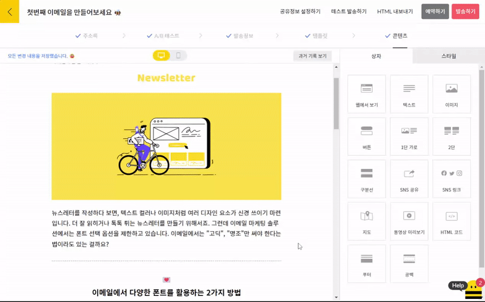
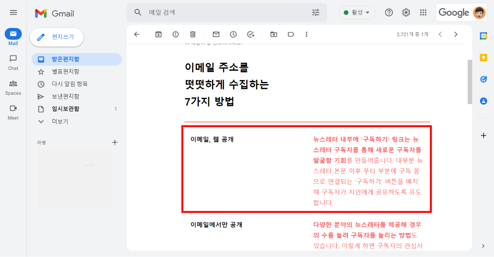
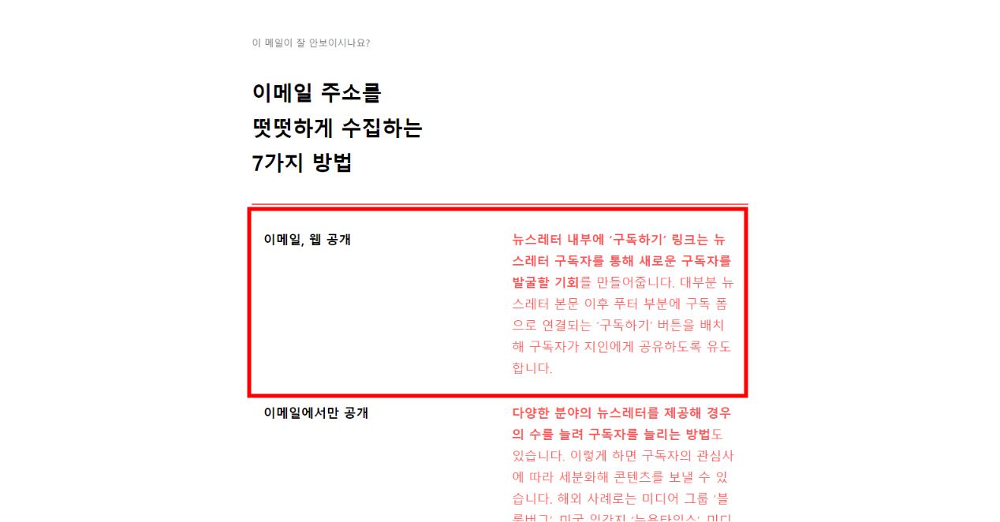
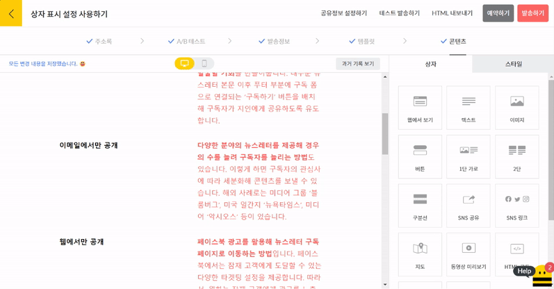
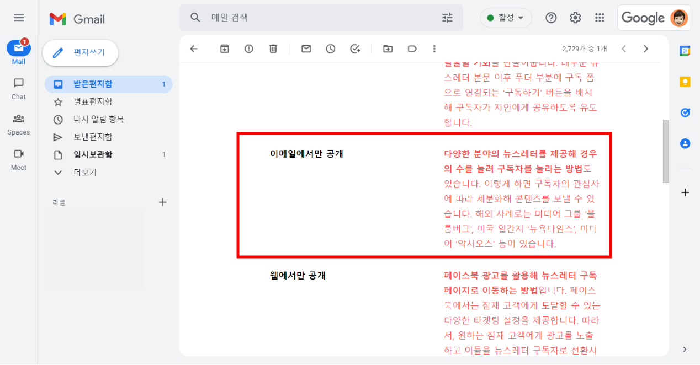
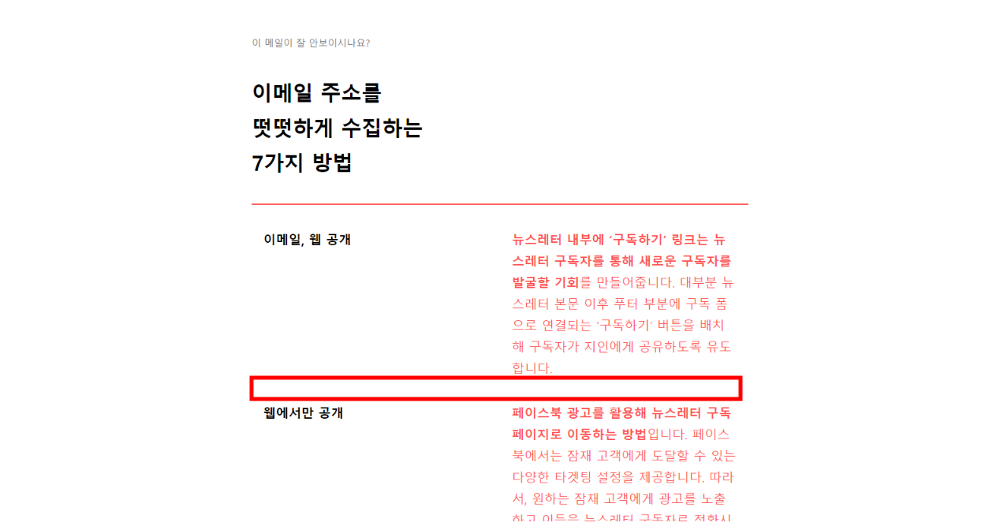
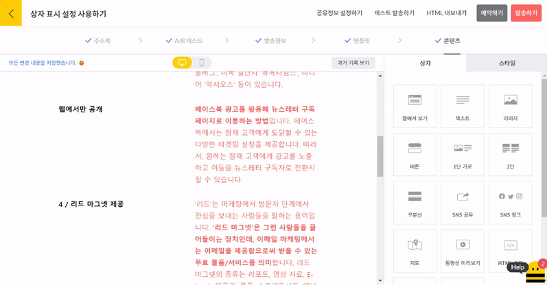
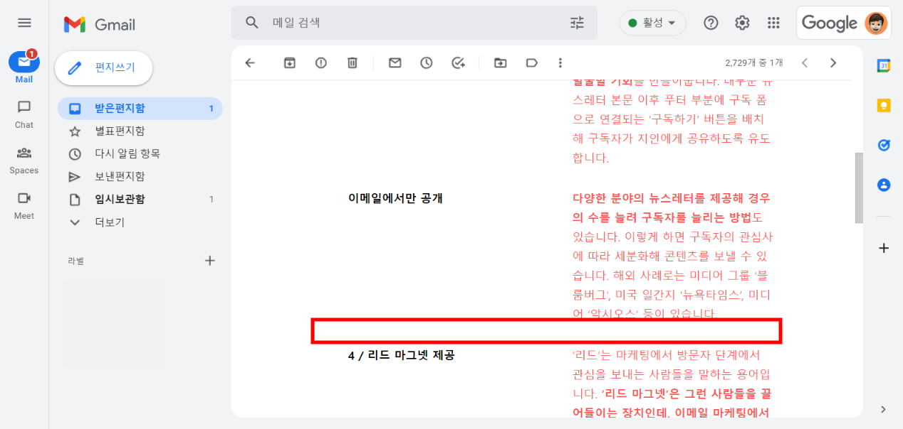

# 편집 상자 사용하기

## 이 글에서는

스티비 에디터의 편집 상자를 사용하기 위한 기본적인 개념에 대해서 알아봅니다.&#x20;

***

### 상자 추가하기 

에디터 화면은 크게 왼쪽의 \[편집 공간]과 오른쪽의 \[편집 상자 공간]으로 구성됩니다. \[편집 상자 공간]에서 넣고 싶은 상자를 클릭하여 왼쪽에 있는 \[편집 공간]에 끌어다 놓으면 됩니다.&#x20;

**\*주의:** 스티비의 \[편집 상자]는 드래그앤드롭 형식으로 동작합니다. 클릭이 아니라 끌어당겨야 하는 점을 참고해 주세요.

<figure><figcaption></figcaption></figure>

### 상자 구성 요소 

추가한 상자를 클릭하면 오른쪽 편집 상자 공간이 새롭게 추가한 상자를 편집할 수 있는 공간으로 변경됩니다. 편집 상자는 기본적으로 \[텍스트], \[이미지], \[버튼] 세 가지 요소로 구성됩니다. 하나의 편집 상자 안에 여러 구성 요소를 넣어 사용할 수 있고 구성 요소끼리 순서도 변경할 수 있습니다.

<figure><figcaption></figcaption></figure>

### 상자 이동하기 

상자에 마우스 커서를 올리면 왼쪽 윗부분에 상자를 이동할 수 있는 버튼\[↑], \[↓]이 나타납니다. 위, 아래 화살표 버튼을 클릭하여 상자를 이동할 수 있습니다.&#x20;

<figure><figcaption></figcaption></figure>

화살표 버튼 위 \[⁞⁞]버튼을 클릭한 상태로 직접 끌어서 이동할 수도 있습니다.&#x20;

 <figure><figcaption></figcaption></figure>

### 상자 복사, 삭제하기 

상자 위에 마우스 커서를 올리면 상자 오른쪽에 버튼\[+]이 표시됩니다. \[+]버튼을 클릭하면 똑같은 상자가 바로 아래에 복사됩니다.

<figure><figcaption></figcaption></figure>

\[+]버튼 위 휴지통 모양의 삭제하기 버튼을 클릭해 상자를 삭제할 수 있습니다.

<figure><figcaption></figcaption></figure>

### 상자 레이아웃 변경하기 

편집 상자의 레이아웃은 1단, 2단 두 가지 종류가 있습니다. 추가한 상자를 클릭하면 오른쪽에 상자 설정 화면이 표시됩니다. \[레이아웃]에서 \[1단], \[2단]을 클릭하여 상자의 레이아웃을 변경할 수 있습니다.&#x20;

<figure><figcaption></figcaption></figure>

### 2단 상자 좌우 위치 변경하기 

2단 레이아웃 상태인 상자를 클릭하면 가운데에 양쪽 화살표 버튼\[⇄]이 표시됩니다. 버튼\[⇄]을 클릭하면 양쪽 상자의 위치가 변경됩니다.

 <figure><figcaption></figcaption></figure>

### 상자 표시 설정 사용하기 

상자 표시 설정 기능을 사용하면 상자가 이메일 내에서만 표시되도록 혹은 웹에서 보기(공유용 URL)에서만 표시되도록 설정이 가능합니다.\
\
이메일을 수신하는 구독자에게만 제공하고 싶은 내용이 있거나 웹에서 보기에서는 표시되지 않아도 되는 수신거부 링크가 포함된 상자를 제외하는 등 여러 방법으로 사용이 가능합니다.

상자 표시 설정은 상자 클릭 후 우측 상자 설정에서 할 수 있으며, 이메일과 웹에서 보기 페이지에서 모두 내용을 공개할 수 있는 '이메일, 웹 공개', 이메일에서만 내용을 공개하는 '이메일에서만 공개', 웹에서 보기(공유용 URL)에서만 내용을 공개하는 '웹에서만 공개' 총 3가지 옵션을 사용할 수 있습니다.

<figure><figcaption></figcaption></figure>

### 이메일, 웹 공개

상자의 표시 설정을 '이메일, 웹 공개'로 설정하면 이메일과 웹에서 보기 페이지에서 상자를 모두 확인할 수 있습니다.

#### 에디터

<figure><figcaption></figcaption></figure>

#### 이메일

<figure><figcaption></figcaption></figure>

#### 웹에서 보기

<figure><figcaption></figcaption></figure>

### 이메일에서만 공개

상자의 표시 설정을 '이메일에서만 공개'로 설정하면 이메일에서만 상자를 확인할 수 있습니다.

#### 에디터

<figure><figcaption></figcaption></figure>

#### 이메일

<figure><figcaption></figcaption></figure>

#### 웹에서 보기

<figure><figcaption></figcaption></figure>

### 웹에서만 공개

상자의 표시 설정을 '웹에서만 공개'로 설정하면 웹에서 보기(공유용 URL)에서만 상자를 확인할 수 있습니다.

#### 에디터

<figure><figcaption></figcaption></figure>

#### 이메일

<figure><figcaption></figcaption></figure>

#### 웹에서 보기

<figure><figcaption></figcaption></figure>

### 주의 사항

* 웹에서 보기 상자의 초기 상자 표시 설정은 '이메일에서만 공개'입니다.
* 페이지, 아카이브에 상자가 표시되기 위해서는 '이메일, 웹 공개' 혹은 '웹에서만 공개'를 선택해야 합니다.

전반적인 편집 상자 사용 방법에 대해서 알아보았습니다. 편집 상자의 기능별 사용법과 특징이 궁금하다면 다음 버튼을 클릭해 하나씩 학습해 보세요.
