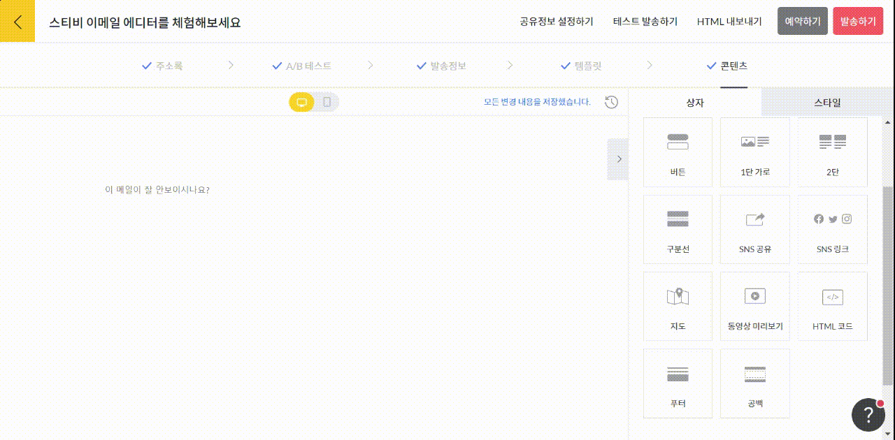

# 공백

## 이 글에서는

편집 상자 사이에 공백을 주고 싶다면, 공백 상자를 활용할 수 있습니다. 공백 상자를 추가하는 방법에 관해 알아봅니다.

***

## 공백 상자 추가하기

화면 오른쪽 편집 상자 화면에서 \[공백] 상자를 왼쪽 화면에 끌어당기면 됩니다.&#x20;

<figure><figcaption></figcaption></figure>

### 스타일 설정하기

화면 오른쪽 스타일 설정 항목에서 공백 상자의 스타일을 설정할 수 있습니다. 공백 상자의 사이즈, 배경 색상 및 테두리, 상자 표시 설정 여부 등을 지정할 수 있습니다.

* 공백 사이즈: 최소 10px \~ 최대 100px까지 사이즈를 지정할 수 있습니다.
* 배경 스타일: 배경 색상과 테두리를 설정할 수 있습니다.
* 상자 표시 설정: SNS 공유 상자가 표시 여부를 설정할 수 있습니다. 가장 기본 설정은 '이메일, 웹 공개' 입니다. 만약, 특정 페이지에서만 공개되도록 설정하고 싶다면 '이메일에서만 공개' 또는 '웹에서만 공개'를 선택해 주세요.
