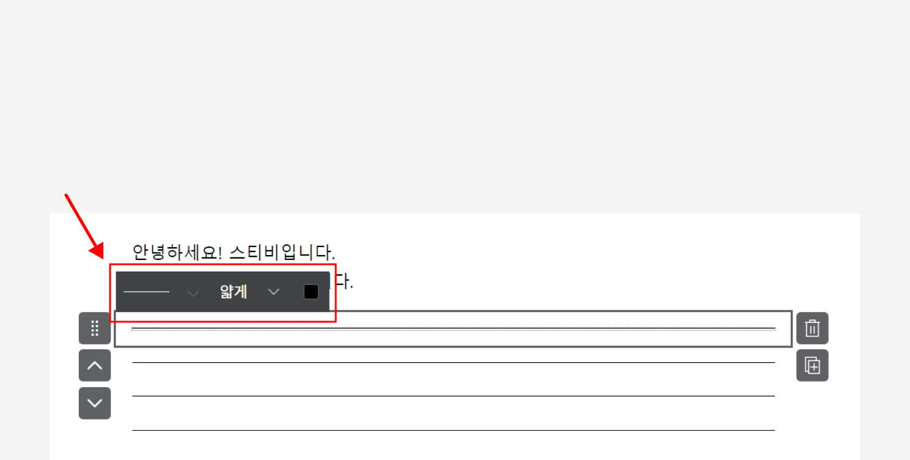

# 구분선

## 이 글에서는

에디터에서 구분선 추가하는 방법과 스타일을 설정하는 방법에 관해 설명합니다.

***

## 구분선 추가하기

화면 오른쪽 편집 상자 화면에서 \[구분선] 상자를 왼쪽 화면에 끌어당기면 편집 상자 사이를 구분할 수 있는 구분선이 추가됩니다.

<figure><figcaption></figcaption></figure>

## 스타일 설정하기

\[직선], \[일반 점선], \[촘촘한 점선] 이렇게 세 가지 스타일을 제공하며, 굵기와 색상도 설정할 수 있습니다. 구분선을 클릭하면 점선 스타일, 굵기, 색상을 설정할 수 있는 툴바가 표시됩니다. 이 툴바에서 원하는 스타일을 지정할 수 있습니다.

<figure><figcaption></figcaption></figure>

새롭게 추가하는 모든 구분선에 특정 스타일이 지정되도록 설정할 수도 있습니다. 자세한 내용은 [전체 스타일 설정하기](../style.md) 도움말을 참고해 주세요.
