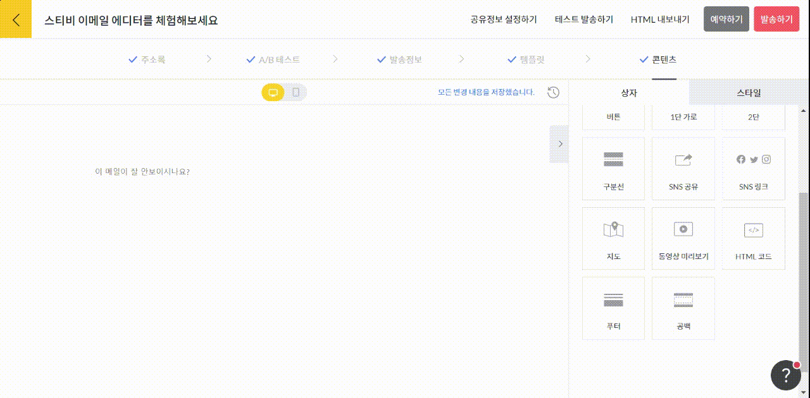

---
layout:
  title:
    visible: true
  description:
    visible: false
  tableOfContents:
    visible: true
  outline:
    visible: true
  pagination:
    visible: true
---

# 푸터

## 이 글에서는

발신자 정보를 한눈에 알아볼 수 있도록 입력하고 싶을 때, 푸터 상자를 활용할 수 있습니다. 푸터 상자를 추가하는 방법에 관해 알아봅니다.

***

### 푸터 상자 이해하기


푸터 상자 추가 여부는 자유롭게 선택할 수 있지만, 광고성 정보를 보내는 경우 정보통신망법에 따라 반드시 전송자 정보를 메일 내용에 포함해야 합니다.


일반적으로 푸터 상자에는 회사명 또는 이름, 주소, 전화번호, 발신자 이메일 주소가 포함됩니다. 푸터 상자에 자동으로 입력된 정보는 주소록에 등록된 정보에서 가져옵니다. 주소록에 등록된 정보를 수정하면 푸터 상자에 자동으로 입력되는 정보도 함께 변경됩니다.

<figure><figcaption></figcaption></figure>

### 푸터 상자 추가하기

화면 오른쪽 편집 상자 화면에서 \[푸터] 상자를 왼쪽 화면에 끌어당기면 됩니다.  주소록에 등록된 푸터 정보가 변경됐다면, \[다시 불러오기]를 눌러 정보를 다시 불러옵니다.

<figure><figcaption></figcaption></figure>

### 스타일 설정하기&#x20;

화면 오른쪽 스타일 설정 항목에서 푸터 상자의 스타일을 설정할 수 있습니다.&#x20;

* 배경 스타일: 배경 색상과 테두리를 설정해서 내가 원하는 브랜드 이미지를 구현할 수 있습니다.
* 상자 여백: SNS 공유 상자의 위, 아래, 좌우 여백을 설정할 수 있습니다. 가장 기본값은 '보통'입니다.&#x20;
* 상자 표시 설정: SNS 공유 상자가 표시 여부를 설정할 수 있습니다. 가장 기본 설정은 '이메일, 웹 공개' 입니다. 만약, 특정 페이지에서만 공개되도록 설정하고 싶다면 '이메일에서만 공개' 또는 '웹에서만 공개'를 선택해 주세요.


테스트 발송한 이메일과 미리보기 화면에서는 수신거부 기능이 동작하지 않습니다. 실제 발송 시에는 동작합니다.

