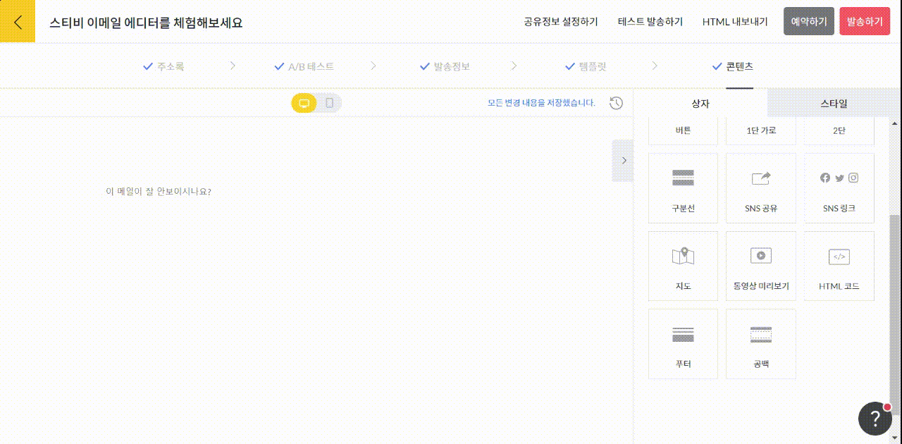

---
layout:
  title:
    visible: true
  description:
    visible: false
  tableOfContents:
    visible: true
  outline:
    visible: true
  pagination:
    visible: true
---

# HTML 코드

## 이 글에서는

이메일을 작성하면서 일부는 편집 상자가 아닌 HTML 코드를 사용해야 할 수 있습니다. 이때, HTML 코드 상자를 추가해 사용할 수 있습니다. HTML 코드 상자를 사용하는 방법에 관해 알아봅니다.

_이메일 전체를 HTML 코드로 작성하고 싶다면 HTML 템플릿을 선택해 주시면 됩니다. 자세한 내용은_ [_HTML 코드로 편집하기_](../../undefined-1/html.md) _도움말을 참고해 주세요._

***

### HTML 코드이해하기

이메일은 일반적인 웹 환경과 달라 사용할 수 없는 HTML 태그가 있습니다. 이메일에 호환되지 않는 코드가 섞여 문제가 발생하는 것을 방지하기 위해 에디터에서는 일부 HTML 코드를 사용 할 수 없도록 제한하고 있습니다.

사용할 수 없는 코드 정보는 아래와 같습니다.

```
<script>, <head>, <body>, <html>, <style>, <form>, <input>, 
<button>, <noscript>, <meta>, <iframe>
```


### HTML 코드 상자 추가하기

화면 오른쪽 편집 상자 화면에서 \[HTML 코드] 상자를 왼쪽 화면에 끌어당기면 됩니다. 화면 오른쪽에 코드를 입력할 수 있는 화면이 나타나며, 여기에서 코드를 추가하는 작업을 진행할 수 있습니다.

<figure><figcaption></figcaption></figure>
