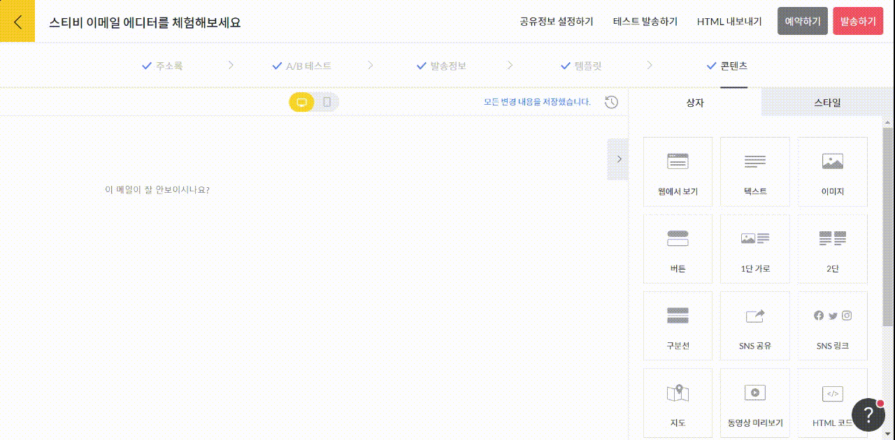

# 1단 가로

## 이 글에서는

한 쪽에는 이미지를 업로드하고, 나머지 한 쪽에는 텍스트나 버튼을 추가하고 싶다면 \[1단 가로] 상자를 활용할 수 있습니다. 에디터에서 1단 가로 상자를 추가하는 방법을 알아봅니다.

***

### 1단 가로 상자 추가하기

화면 오른쪽 편집 상자 화면에서 \[1단 가로] 상자를 왼쪽 화면에 끌어당깁니다.

왼쪽에는 이미지를 넣을 수 있는 '이미지' 상자가 있고, 오른쪽에는 '텍스트'와 '버튼' 상자가 생성됩니다. 화면 중앙의 스와이프\[↔] 버튼을 눌러 이미지와 텍스트, 버튼 상자의 위치를 변경할 수 있으며, 화면 오른쪽 \[구성 요소]에서 원치 않는 상자를 제거할 수도 있습니다.

<figure><figcaption></figcaption></figure>

개별 상자를 사용하는 방법은 [이미지](image.md), [텍스트](text.md), [버튼](button.md) 상자 도움말을 참고해 주세요.
