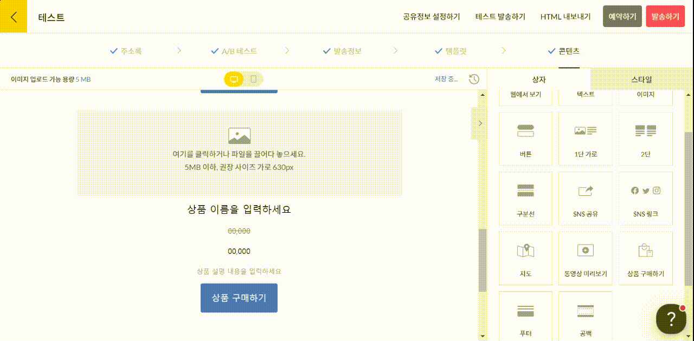
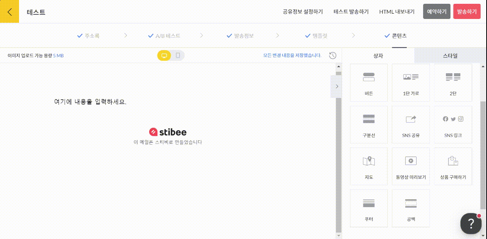

---
layout:
  title:
    visible: true
  description:
    visible: false
  tableOfContents:
    visible: true
  outline:
    visible: true
  pagination:
    visible: true
---

# 상품 구매하기

## 이 글에서는

\[상품 구매하기] 상자를 추가하고 활용하는 방법에 관해 설명합니다.

***

### 상품 구매하기 상자 추가하기

오른쪽의 상자 선택 화면에서 \[상품 구매하기] 상자를 본문에 끌어다 놓으면 상자가 추가됩니다. 카페24 연동 워크스페이스의 경우, 쇼핑몰의 상품 정보가 자동으로 연동됩니다. 일반 워크스페이스의 경우 상품 정보가 연동되지 않으므로 직접 편집해서 사용할 수 있습니다.

자세한 방법은 아래를 참고해 주세요.

### 상품 정보 직접 입력하기

쇼핑몰에서 상품 정보를 불러오지 않고, 직접 등록할 수도 있습니다. 상품 구매하기 상자를 추가한 뒤, 상자 안에서 이미지와 상품 이름, 가격, 설명 등의 정보를 직접 설정할 수 있습니다.

<figure><figcaption></figcaption></figure>

### 쇼핑몰 상품 정보 불러오기

💬 이 내용은 **카페24와 연동한 워크스페이스**에 해당하는 도움말입니다.

오른쪽 상자 선택 화면에서 \[상품 구매하기] 상자를 본문에 끌어다 놓으면 상자가 추가됩니다. 상자를 추가한 뒤, \[상품 설정하기]를 눌러 불러오고 싶은 상품 이름을 검색해서 클릭하면 상품의 정보(이미지, 이름, 가격 등)가 그대로 불러와집니다.

<figure><figcaption></figcaption></figure>
