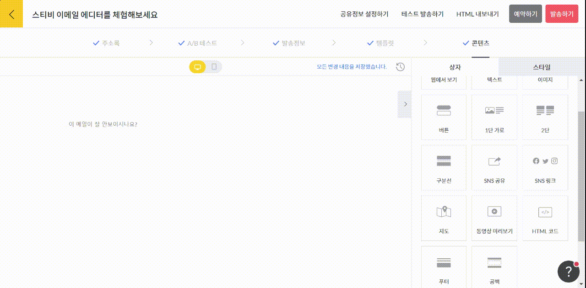

# SNS 링크

## 이 글에서는

내 SNS 계정을 구독자에게 홍보하고 싶다면 SNS 링크 상자를 추가하면 됩니다. 에디터에서 SNS 링크 상자를 추가하는 방법에 관해 설명합니다.&#x20;

_내가 작성한 이메일을 SNS로 공유하고 싶다면_ [_SNS 공유 상자_](social-media-share.md) _도움말을 참고해 주세요._

***

### SNS 링크 상자 추가하기

화면 오른쪽 편집 상자 화면에서 \[SNS 링크] 상자를 왼쪽 화면에 끌어당기면 됩니다. '웹사이트, 페이스북, 블로그, 유튜브, 브런치' 다섯 개의 SNS를 기본으로 제공하고 있으며, \[SNS 링크 추가하기]를 눌러 더 다양한 SNS 링크를 추가할 수 있습니다.

<figure><figcaption></figcaption></figure>

### 스타일 설정하기&#x20;

화면 오른쪽 스타일 설정 항목에서 SNS 링크 상자의 스타일을 설정할 수 있습니다.&#x20;

* 배경 스타일: 배경 색상과 테두리를 설정해서 내가 원하는 브랜드 이미지를 구현할 수 있습니다.
* 상자 여백: SNS 공유 상자의 위, 아래, 좌우 여백을 설정할 수 있습니다. 가장 기본값은 '보통'입니다.&#x20;
* 상자 표시 설정: SNS 공유 상자가 표시 여부를 설정할 수 있습니다. 가장 기본 설정은 '이메일, 웹 공개' 입니다. 만약, 특정 페이지에서만 공개되도록 설정하고 싶다면 '이메일에서만 공개' 또는 '웹에서만 공개'를 선택해 주세요.
