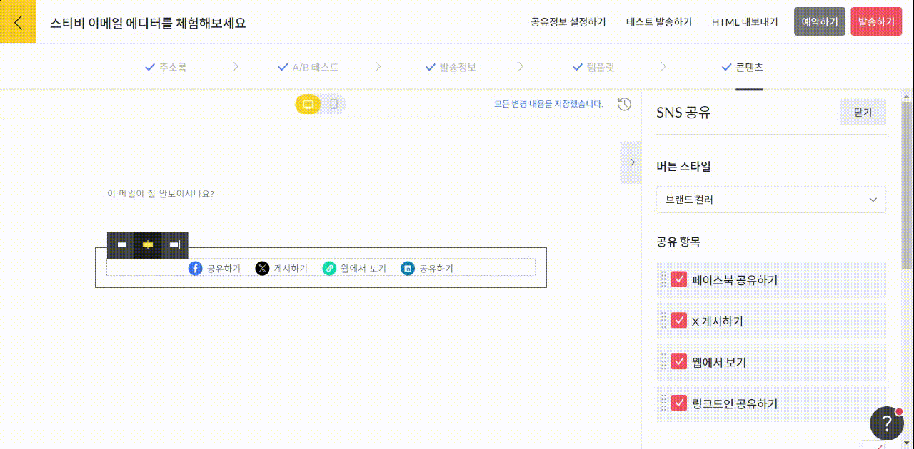

---
layout:
  title:
    visible: true
  description:
    visible: false
  tableOfContents:
    visible: true
  outline:
    visible: true
  pagination:
    visible: true
---

# SNS 공유

## 이 글에서는

SNS 공유 상자는 내가 발송한 이메일을 특정 SNS로 공유할 수 있는 기능입니다. 에디터에서 SNS 공유 상자를 추가하는 방법을 설명합니다.

_내 SNS 계정을 구독자에게 홍보하고 싶다면 SNS 링크 상자를 추가하면 됩니다._ [_SNS 링크 상자_](social-media-link.md) _도움말을 참고해 주세요._

***

### SNS 공유 상자 추가하기&#x20;

화면 오른쪽 편집 상자 화면에서 \[SNS 공유] 상자를 왼쪽 화면에 끌어당기면 됩니다. 현재는 \[페이스북], \[X(트위터)], \[링크드인] 이렇게 세 개의 SNS에 관해 공유 기능을 제공하고 있으며, \[웹에서 보기] 상자도 함께 추가할 수 있습니다.

<figure><figcaption></figcaption></figure>

### 스타일 설정하기

화면 오른쪽 스타일 설정 항목에서 SNS 공유 상자의 스타일을 설정할 수 있습니다.

* 버튼 스타일: 브랜드 컬러, 흰색, 검정색, 회색 네 가지 스타일을 제공합니다.
* 공유 항목: 페이스북, X, 웹에서 보기, 링크드인 네 개의 공유 항목을 제공합니다.
* 배경 스타일: 배경 색상과 테두리를 설정해서 내가 원하는 브랜드 이미지를 구현할 수 있습니다.
* 상자 여백: SNS 공유 상자의 위, 아래, 좌우 여백을 설정할 수 있습니다. 가장 기본값은 '보통'입니다.
* 상자 표시 설정: SNS 공유 상자가 표시 여부를 설정할 수 있습니다. 가장 기본 설정은 '이메일, 웹 공개' 입니다. 만약, 특정 페이지에서만 공개되도록 설정하고 싶다면 '이메일에서만 공개' 또는 '웹에서만 공개'를 선택해 주세요.

<figure><figcaption></figcaption></figure>
