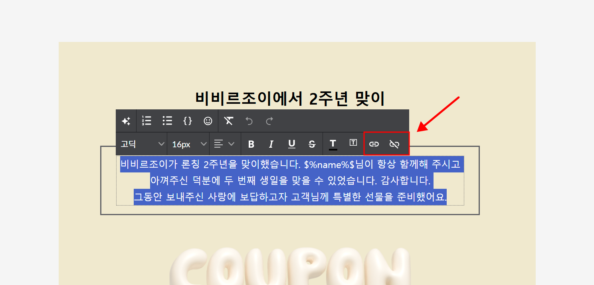

# 텍스트

## 이 글에서는

\[텍스트] 상자를 추가하면 이메일 본문에 글을 작성할 수 있습니다. 작성한 텍스트의 폰트, 색상, 배열 등 스타일을 설정할 수 있으며, 링크를 삽입할 수도 있습니다. 이메일 본문에 텍스트를 작성하고 스타일을 편집하는 방법에 관해 알아봅니다.

***

## 텍스트 상자 추가하기 

화면 오른쪽 상자 선택 화면에서 \[텍스트] 상자를 본문에 끌어다 놓습니다. 혹은 추가된 편집 상자를 클릭해 \[구성 요소 → 텍스트]를 선택해도 됩니다.

텍스트 상자가 추가되면 이메일 본문에 텍스트를 작성할 수 있습니다.

<figure><figcaption></figcaption></figure>

## 텍스트 편집하기 

텍스트 상자를 클릭하면 폰트, 크기, 정렬, 색상, 메일머지 등을 설정할 수 있는 \[툴바]가 표시됩니다. 숫자 리스트나 점 리스트를 사용해 작성한 내용을 목록화할 수도 있습니다.

### AI로 글쓰기 개선하기 

💬 이 내용은 **스탠다드, 프로, 엔터프라이즈 요금제**에 해당하는 도움말입니다.

작성한 텍스트를 다듬어주는 AI 기능이 베타 테스트 중입니다. 다듬고 싶은 텍스트 영역을 선택한 뒤, \[AI로 글쓰기 개선하기] 아이콘을 누르면 AI가 내용을 다듬어 줍니다. 오탈자, 잘못된 표현 등을 윤문할 수 있어요.

\[바로 적용하기]를 누르면 다듬어진 내용이 본문에 바로 적용됩니다. \[뒤에 추가하기]를 누르면 기존 내용 뒤에 추가되며, 기존 내용과 한눈에 비교해 볼 수 있어요. 다듬어진 내용이 마음에 들지 않는다면, \[다시 다듬기]를 눌러 새로 요청할 수 있습니다.


워크스페이스당 하루 최대 10회 사용할 수 있어요.


<figure><figcaption></figcaption></figure>

### 텍스트 스타일 설정하기 

폰트 종류, 크기, 정렬 방식 등 텍스트 스타일을 설정할 수 있습니다.

* 폰트: 스티비 에디터에서는 고딕, 명조 두 가지를 제공합니다.
  * 이메일 환경에서는 웹 폰트를 사용이 불가하여, 두 가지 폰트를 제공합니다. 자세한 내용은 [여기](https://blog.stibee.com/nyuseureteo-dijaineul-dowajuneun-saeroun-ponteu-sayongbeob/)를 참고해 주세요.
* 텍스트 크기: 최소 12px에서 최대 60px까지 설정할 수 있습니다.
* 텍스트 정렬 방식: 왼쪽, 오른쪽, 가운데, 양쪽 중 선택할 수 있습니다.
* 볼드, 이탤릭, 밑줄, 취소선 등의 스타일을 설정할 수 있습니다.
* 텍스트 색상이나 텍스트 배경색을 설정하는 것도 가능합니다.
* 목록 기능: 숫자 리스트, 점 리스트 중 하나를 선택할 수 있습니다.

### 텍스트에 링크 추가하고 삭제하기 

링크를 입력하고 싶은 텍스트를 선택한 뒤, 툴바의 \[링크 추가] 버튼을 클릭하면 URL을 입력할 수 있습니다. \[링크 제거] 버튼을 클릭하면 텍스트에 걸린 링크를 삭제할 수 있습니다.

> **\*주의:** URL 사용 시 두 가지 주의할 점이 있습니다.
>
> 1. 작은따옴표, 큰따옴표, 쉼표가 포함된 URL은 정상적으로 처리되지 않는다.
>
> 작은따옴표('), 큰따옴표("), 쉼표(,)가 포함된 URL을 스티비를 통해 발송하면 링크가 정상적으로 처리되지 않으며, 링크 접속이 불가합니다. 이러한 특수문자가 포함된 URL을 사용해야 하는 경우, URL 인코딩을 진행한 뒤 사용해 주세요. URL 인코딩은 [여기](https://www.urlencoder.org/)에서 진행할 수 있습니다.
>
> 2. 단축 URL 사용 시 스팸 이메일로 분류될 확률이 높아진다.
>
> 링크 단축 서비스를 사용해서 URL을 단축하는 경우, 해당 URL이 포함된 이메일은 스팸으로 분류될 확률이 높아집니다. 되도록 단축 URL 대신 원본 URL을 사용하는 것을 권장합니다.

<figure><figcaption></figcaption></figure>

### 텍스트에 메일머지 사용하기 

툴바의 \[메일머지{  }] 버튼을 클릭하면 '주소록 필드', '사용자 정의 필드' 값을 메일머지 형태로 추가할 수 있습니다. 주소록에 입력된 '회사/단체명, 주소, 연락처'를 텍스트 형태로 바로 불러올 수 있으며, 사용자 정의 필드에 입력된 구독자 정보(예: 이름, 별명, 구매 횟수 등)를 불러와 구독자별로 개인화된 이메일을 보낼 수도 있습니다.

메일머지 기능에 관한 자세한 내용은 [personalized-merge.md](../personalized-merge.md "mention") 도움말을 참고해 주세요.

<figure><figcaption></figcaption></figure>

### 텍스트 편집 시 주의 사항 


외부(예. 워드, 한글, PPT, 웹페이지, 메모장 등)에서 작업한 텍스트를 복사해서 붙여 넣게 되면 눈에는 보이지 않는 HTML 코드가 함께 복사되어 에디터에 붙여 넣어지게 됩니다. 이 경우 에디터에서 텍스트 편집이 올바르게 작동하지 않게 되거나 이메일이 발송됐을 때 편집한 내용과 다르게 표시되는 경우가 발생할 수 있습니다.

외부에서 복사한 텍스트를 붙여 넣을 때는 가능하면 '서식 없이 붙여넣기(ctrl+shift+v)'를 사용해 주세요.


텍스트 작업 도중 문제가 발생하면 아래 내용을 참고해서 조치해 보세요.

1. 문제가 발생한 텍스트를 선택하고 툴바 위쪽에 있는 \[포맷초기화] 버튼을 클릭하여 텍스트 서식을 초기화한 뒤 다시 편집합니다.
2. 문제가 발생한 텍스트를 삭제하고 복사한 텍스트를 '서식 없이 붙여넣기(ctrl+shift+v)'로 붙여 넣은 뒤 다시 편집합니다.&#x20;
3. 문제가 발생한 텍스트 상자를 완전히 삭제하고 새롭게 추가한 뒤 다시 편집합니다. 이때도 텍스트를 붙여 넣는 경우, '서식 없이 붙여넣기(ctrl+shift+v)'를 사용합니다.

<figure><figcaption></figcaption></figure>

위 절차로 처리했지만 계속해서 문제가 발생하는 경우, 화면 오른쪽 아래에 있는 물음표\[?]를 클릭하여 스티비 팀의 도움을 받아보세요.
