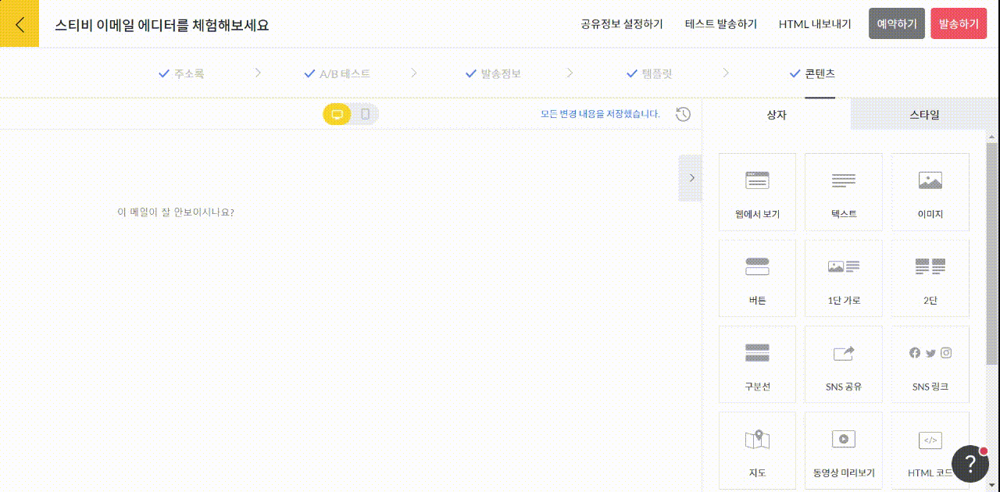

# 2단

## 이 글에서는

에디터에서 2단 상자를 추가하는 방법을 설명합니다.

***

### 2단 상자 추가하기

화면 오른쪽 편집 상자 화면에서 \[2단] 상자를 왼쪽 화면에 끌어당깁니다. 이미지와 텍스트를 함께 입력할 수 있는 상자가 2단으로 생성됩니다. 화면 중앙의 스와이프\[↔] 버튼을 눌러 위치를 바꿀 수도 있습니다.

<figure><figcaption></figcaption></figure>

개별 상자를 사용하는 방법은 [이미지](image.md), [텍스트](text.md) 상자 도움말을 참고해 주세요.
