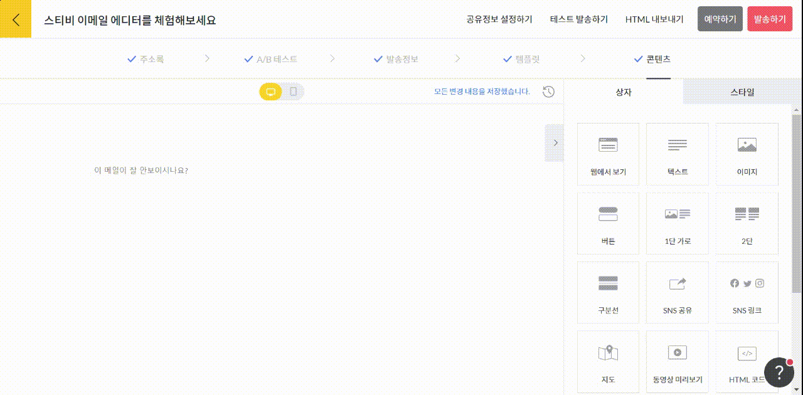

# 2단

## 이 글에서는

에디터에서 2단 상자를 추가하고 구성하는 방법을 설명합니다.

***

### 2단 상자 추가하기

오른쪽 화면에서 \[2단] 상자를 왼쪽 화면으로 끌어 당깁니다. 이미지와 텍스트를 함께 입력할 수 있는 상자가 2단으로 생성됩니다.

### 위치 변경 및 구성 요소 조합하기

화면 중앙의 스와이프\[↔] 버튼을 눌러 상자의 위치를 변경할 수 있으며, 화면 오른쪽 \[구성 요소]에서 원치 않는 상자를 제거할 수도 있습니다.

\[2단] 상자를 클릭하면 나타나는 오른쪽 \[구성 요소] 화면에서 원하는 구성 요소만 선택해 조합할 수 있습니다.

* 예를 들어, 버튼만 선택하면 버튼 두 개를 나란히 배치할 수 있고,
* 이미지+텍스트, 텍스트+버튼 등 다양한 조합으로 활용할 수 있습니다.

**\*주의:** 모바일 환경에서는 자동으로 1단으로 변경되어 표시됩니다.

<figure><figcaption></figcaption></figure>

개별 상자를 사용하는 방법은 [이미지](image.md), [텍스트](text.md) 상자 도움말을 참고해 주세요.
