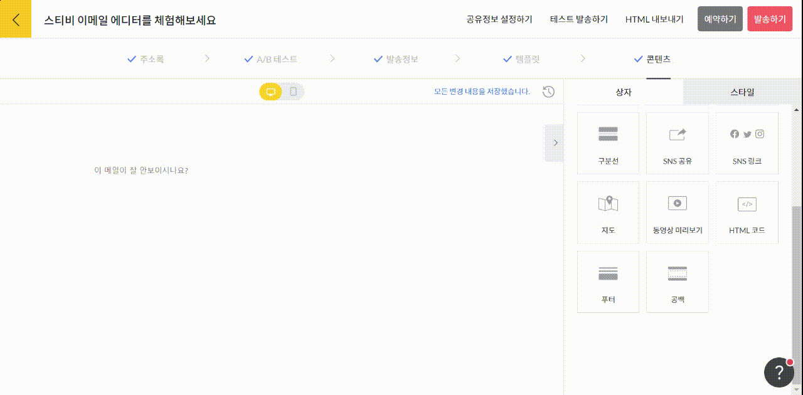

# 동영상 미리보기

## 이 글에서는

이메일의 기술적인 특성상 동영상을 임베드할 수는 없습니다. 동영상 임베드를 위해 사용하는 코드가 대부분의 이메일 수신 서비스에서 지원하지 않기 때문입니다. 스티비 에디터의 동영상 미리보기 편집상자를 추가하면, 유튜브 영상 URL만 입력하면 썸네일 이미지를 자동으로 불러옵니다. 이 방법에 관해 살펴봅니다.

***

### 동영상 미리보기 상자 추가하기

화면 오른쪽 편집 상자 화면에서 동영상 미리보기 상자를 왼쪽 화면에 끌어당긴 뒤, 유튜브 영상 링크를 입력해 주세요. 자동으로 썸네일을 불러오며, 썸네일을 누르면 유튜브로 이동해 동영상을 시청할 수 있습니다.

<figure><figcaption></figcaption></figure>

&#x20;만약, 유튜브가 아닌 다른 동영상 프로그램을 이용하고 있으신 경우 썸네일 이미지를 넣고 동영상을 재생할 수 있는 외부 페이지로 링크를 걸어 주시면 됩니다.
