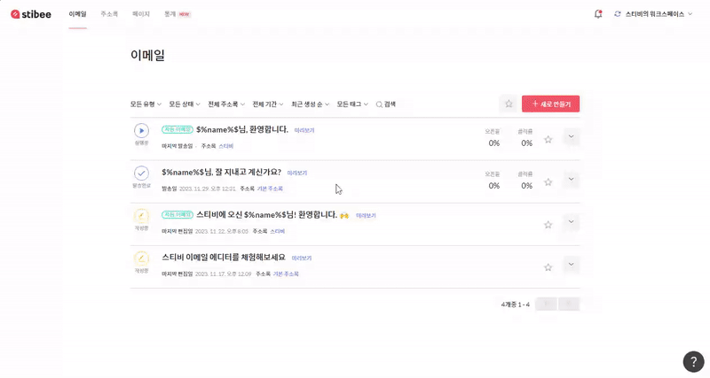
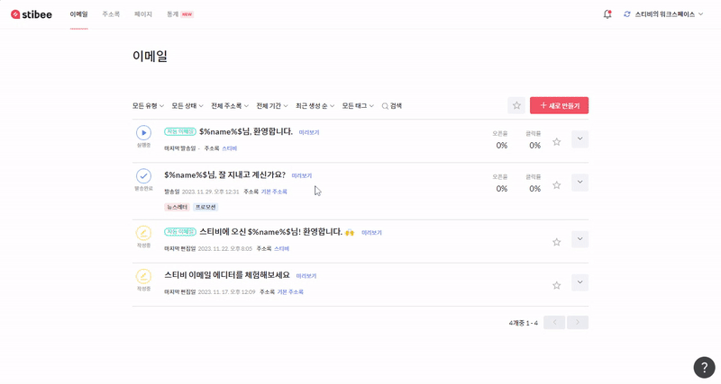
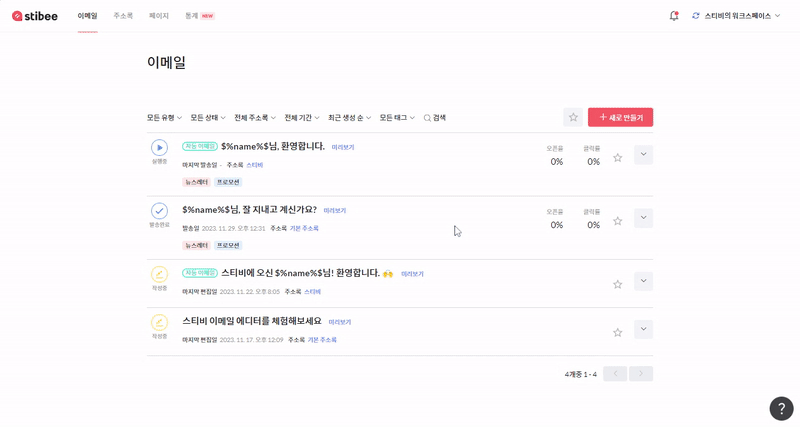
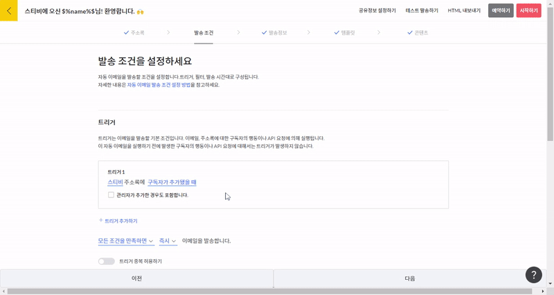
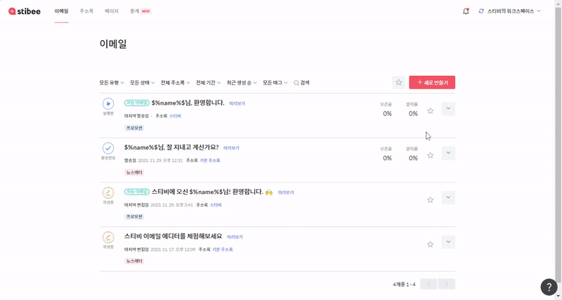

---
layout:
  title:
    visible: true
  description:
    visible: false
  tableOfContents:
    visible: true
  outline:
    visible: true
  pagination:
    visible: true
---

# \[태그]로 이메일 분류하기

## 이 글에서는 

태그는 이메일에 추가적인 정보를 달아 이메일을 관리하는 기능입니다. 이메일을 관리하기 위한 정보를 태그로 설정하여, 이메일 제목과 구분되는 관리용 이름으로 사용하거나 자동 이메일 시나리오를 구분하고 순서를 표시할 수 있습니다. 태그를 만들고 활용하는 방법에 관하여 알아봅니다.

_\* 이메일 목록 또는 이메일 대시보드에서 태그를 만들거나 관리할 수 있습니다._

***

### 태그 만들기 

\[이메일 목록 오른쪽 더보기 메뉴(ᐯ) → 태그 설정하기 → 새 태그 만들기]를 클릭합니다. 또는 이메일 제목을 누르면 나타나는 이메일 대시보드에서 '태그 설정하기'를 눌러 새로운 태그를 만들 수 있습니다.

_\* 태그의 이름은 최대 15자까지 입력할 수 있으며 하나의 워크스페이스에 최대 100개의 태그를 등록할 수 있으니 참고해 주세요._

<figure><figcaption></figcaption></figure>

<figure><figcaption></figcaption></figure>

### 태그 설정하기 

태그를 설정하고자 하는 이메일의 오른쪽 '더보기 메뉴(ᐯ)'를 누르고, 태그 설정하기를 클릭해 원하는 태그를 설정합니다. 또는 이메일 대시보드에서 이메일 정보 옆의 '태그 설정하기'를 눌러 태그를 설정합니다.

_\* 이메일 하나에 최대 5개의 태그를 설정할 수 있습니다._

<figure><figcaption></figcaption></figure>

태그를 여러개 사용하는 경우 원하는 태그를 검색하여 설정할 수도 있습니다. \[이메일 → 태그 설정하기]에서 원하는 태그의 이름을 입력해 조회할 수 있습니다.

<figure><figcaption></figcaption></figure>

### 태그로 이메일 조회하기 

이메일 목록에서 태그를 선택하여 선택한 태그가 설정된 이메일을 조회할 수 있습니다. 이메일 목록에서 목록 상단의 태그 필터 메뉴를 클릭합니다. 기본값은 모든 태그입니다. 원하는 태그를 선택하고 적용하기를 클릭합니다. 태그 없음을 선택하면 태그가 설정되지 않은 이메일을 조회할 수 있습니다.

<figure><figcaption></figcaption></figure>

자동 이메일에서 이메일 관련 트리거(발송 성공, 오픈, 클릭 등)를 설정하기 위해 대상 이메일을 선택하는 화면에서도, 태그를 선택하여 그 태그가 설정된 이메일을 조회할 수 있습니다.

<figure><figcaption></figcaption></figure>

### 태그 수정, 삭제하기 

태그를 설정할 때 태그에 마우스를 올리면 태그 이름 옆에 표시되는 수정, 삭제 버튼이 표시됩니다. 이 버튼을 클릭하면 태그 이름을 수정하거나 태그를 삭제할 수 있습니다.

태그를 삭제해도 이메일에 설정된 태그가 사라질 뿐 이메일이 그 태그가 설정되어 있던 이메일이 삭제되지는 않습니다.

<figure><figcaption></figcaption></figure>

태그 기능을 사용하면 \[통계]에서 원하는 이메일을 조합해 기간별로 통계를 조회할 수 있습니다. 자세한 내용은 [통계](broken-reference) 도움말에서 확인해 보세요.
