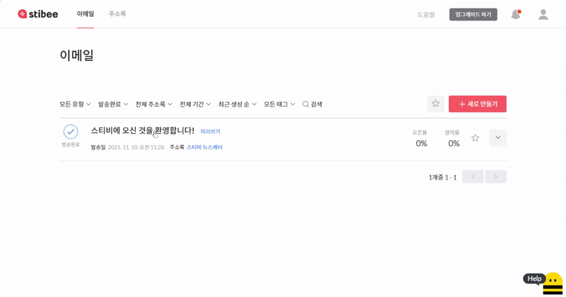
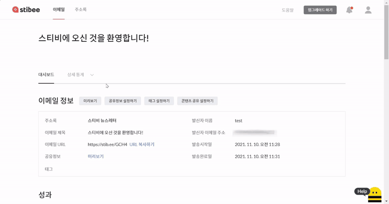
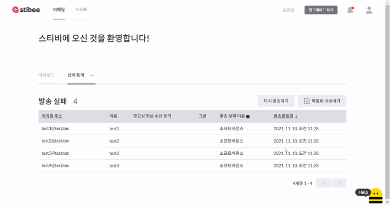
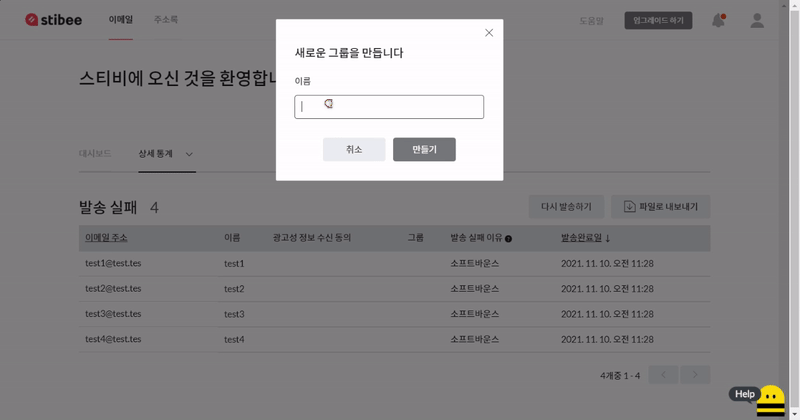

---
layout:
  title:
    visible: true
  description:
    visible: false
  tableOfContents:
    visible: true
  outline:
    visible: true
  pagination:
    visible: true
---

# 이메일 다시 보내기

## 이 글에서는

이미 발송한 이메일을 다시 발송하는 방법에 대해서 알아봅니다.

***

## 다시 보내기

같은 이메일을 다른 구독자에게 보내야 하는 경우에는 이미 발송을 완료한 이메일을 \[복사]해서 다시 보내면 됩니다. \[이메일 → 다시 보내고 싶은 이메일 제목 → 더보기(v) → 복사하기]를 클릭하면 같은 이메일이 복사됩니다. 복사한 이메일을 주소록에 있는 다른 구독자에게 보내면 됩니다.

복사한 이메일을 클릭해 \[주소록] 단계에서 이메일을 보내고 싶은 구독자가 추가된 주소록이나 그룹 또는 세그먼트를 선택해 보낼 수 있습니다.

## 발송 결과에 따라 다시 보내기 

\[이메일 대시보드 → 상세 통계]에서 발송 결과 (발송 성공, 발송 실패, 오픈, 오픈 안함 등)에 따라서 이메일을 다시 발송할 수 있습니다. 이 기능을 사용하면 다음과 같은 경우에 쉽게 이메일을 다시 발송할 수 있습니다. 단, 수신거부한 구독자에게 이메일을 다시 발송하는 것은 불가능합니다.

* 발송이 실패한 구독자에게 다시 발송하기
* 링크를 클릭하지 않은 구독자에게 다시 발송하기
* 오픈을 하지 않는 구독자에게 다시 발송하기

아래 예시는 이 기능을 가장 많이 활용할 수 있는 상황인 '발송이 실패한 구독자에게 이메일을 다시 발송' 해야하는 경우를 기준으로 한 설명입니다. 예시와 같은 방법으로 발송 성공, 오픈, 오픈 안함 등의 발송 결과에 따라서도 다시 발송이 가능합니다.

### 발송 실패 구독자에게 다시 발송하기

이메일 목록에서 다시 발송하고 싶은 이메일을 클릭합니다.&#x20;

<figure><figcaption></figcaption></figure>

\
이메일 대시보드의 '상세통계'에서 \[발송 실패]를 클릭합니다.

<figure><figcaption></figcaption></figure>

\
발송 실패 상세 통계 페이지에서 \[다시 발송하기]를 클릭합니다.

<figure><figcaption></figcaption></figure>

\[다시 발송하기]를 클릭하면 ‘발송 실패’ 명단에 있는 모든 구독자를 새로운 그룹으로 추가하기 위한 그룹 생성 화면이 표시됩니다.  여기에서 ‘발송실패’ 구독자들이 등록될 새로운 주소록 그룹의 이름을 입력하고 \[만들기] 버튼을 클릭합니다.

<figure><figcaption></figcaption></figure>

\
\[만들기] 버튼을 클릭하면 ‘발송 실패’ 명단의 구독자들이 모두 새롭게 생성한 그룹으로 할당되고 발송한 이메일이 ‘복사’ 됩니다. 이후 자동으로 복사된 이메일의 이메일 편집 단계 중 ‘주소록’ 선택 단계로 이동합니다. 주소록 단계에서는 앞서 새롭게 생성한 그룹이 기본적으로 선택이 되어 있는 상태로 표시됩니다. 이후 이메일 발송은 일반적인 이메일 편집, 발송 절차와 똑같이 진행하면 됩니다.

<figure><figcaption></figcaption></figure>
