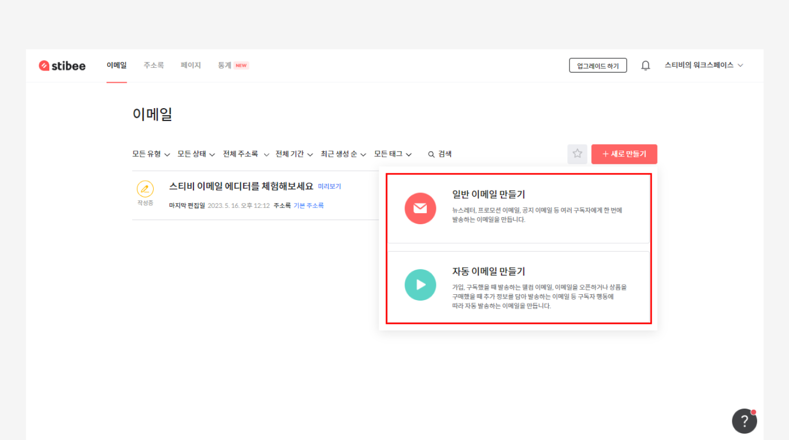
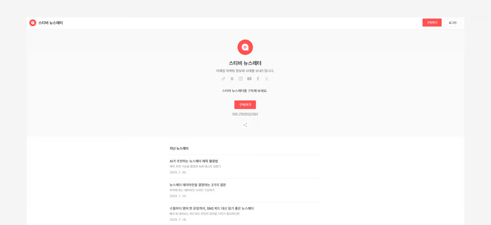
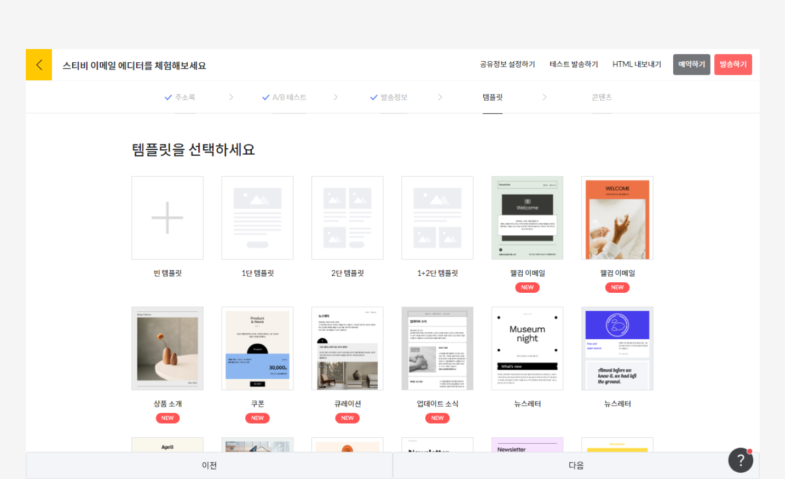
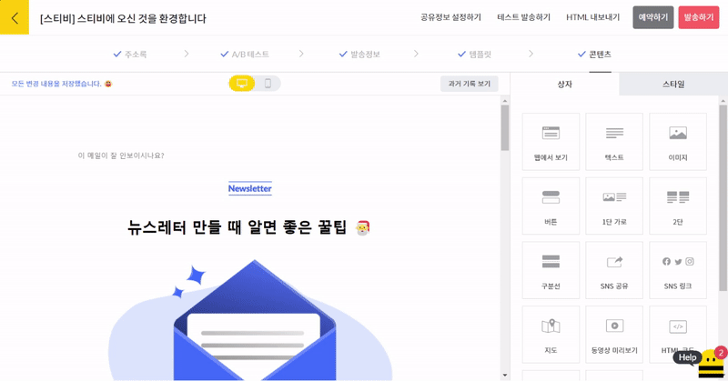
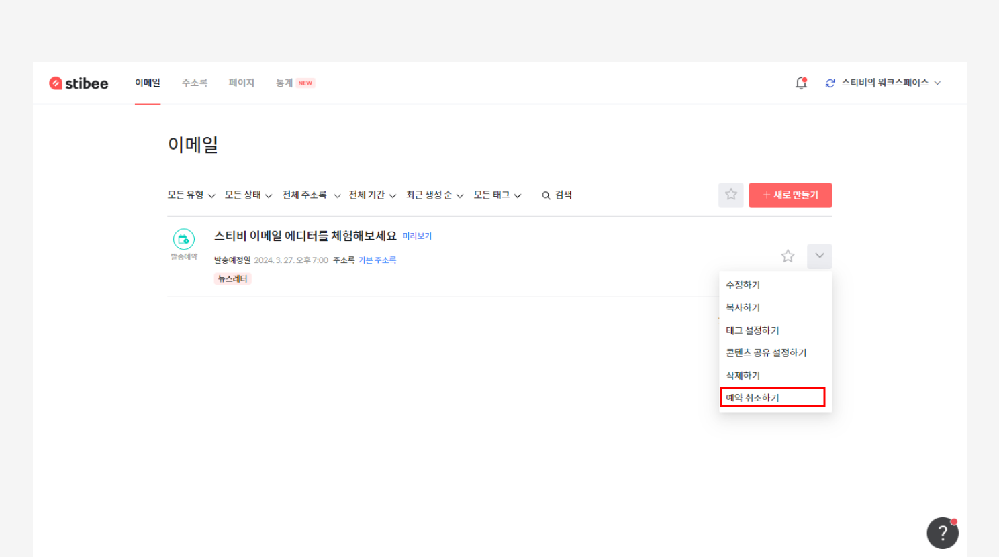

---
layout:
  title:
    visible: true
  description:
    visible: false
  tableOfContents:
    visible: true
  outline:
    visible: true
  pagination:
    visible: true
---

# 첫 이메일 보내기

## 이 글에서는

이메일을 보내기 위한 기본 준비가 끝났다면 첫번째 이메일을 보내볼 차례입니다. 이 문서에서는 두 종류의 이메일 중 \[일반 이메일]을 사용해 이메일을 보내는 기본적인 방법에 대해 알아봅니다.

## 이메일 만들기

화면 왼쪽 위에 있는 메인 메뉴 중 \[이메일 > 새로 만들기 > 일반 이메일]을 클릭해 새로운 이메일을 만듭니다. 처음 회원 가입을 했을 때 자동으로 만들어진 샘플 이메일인' 스티비 이메일 에디터를 체험해보세요' 를 목록에서 클릭해 편집을 진행해도 됩니다.

<figure><figcaption></figcaption></figure>

## 이메일 편집 단계 이해하기

이메일을 새롭게 만들거나 샘플 이메일을 클릭하면 이메일 편집 화면으로 이동합니다. 에디터는 \[주소록, A/B 테스트, 발송정보, 템플릿, 콘텐츠]의  5단계로 구성되어 있습니다. 각 단계별로 필요한 정보를 입력하거나 이메일 발송을 위한 설정을 진행한 뒤 이메일을 보내면 됩니다. 각 단계별 자세한 내용은 다음을 참고해보세요.

### 주소록

이메일을 보낼 주소록을 선택하는 단계입니다. [그룹](../list/undefined-3/undefined-1.md)이나 [세그먼트](../list/undefined-3/undefined-2.md)를 사용해 전체 구독자 중 일부에게만 이메일을 보낼 수도 있습니다.

<figure><figcaption></figcaption></figure>

### A/B 테스트

발송 성과 개선을 위해 기준에 따라 A/B 테스트를 진행하고 싶은 경우 이 단계에서 설정합니다. 테스트를 진행하지 않고 싶은 경우에는 \[아니오]를 선택하고 다음으로 넘어갑니다. A/B 테스트에 대해 더 자세한 내용이 궁금한 경우에는 아래 링크를 참고하세요.

[a-b.md](../email/a-b.md "mention")

<figure><figcaption></figcaption></figure>

### 발송정보

\[발송정보]에서는 보낼 이메일의 제목과 보내는 사람 정보(발신자 이메일 주소, 발신자 이름)를 설정합니다. 처음에 가입한 워크스페이스 소유자로 사용하는 이메일 주소 외에도 다른 이메일 주소를 발신자로 추가해서 사용하는 것이 가능합니다. 발신자를 추가하는 방법이 궁금하다면 [여기](../email/undefined-4/undefined.md)를 클릭해 자세한 내용을 확인해보세요.

<figure><figcaption></figcaption></figure>

'미리보기 텍스트'는 이메일의 목록에서 표시되는 이메일 일부 내용을 편집할 수 있는 기능입니다. 구독자의 받은편지함에는 이메일의 제목과 함께 본문의 일부 내용이 표시되는 경우가 있습니다. 이메일을 새로 만들거나 수정할 때 발송정보의 미리보기 텍스트에 내용을 입력하면 본문 내용과 상관없이 원하는 내용을 미리보기 텍스트로 표시할 수 있습니다. 아무 것도 입력하지 않으면 콘텐츠의 가장 첫 단락 내용이 자동으로 표시됩니다.&#x20;

미리보기 텍스트를 활용하는 방법이 궁금하다면 [제목만큼 중요한 미리보기 텍스트 활용하기](https://blog.stibee.com/150624-68fa20cb9978)를 참고하세요.

<figure><figcaption></figcaption></figure>

정보를 모두 설정했다면, \[다음 → 템플릿]단계로 이동하세요.

### 템플릿

이메일을 편집할 때 디자인 템플릿을 사용할지, 처음부터 완전히 직접 편집할지 여부를 선택합니다.

1. 스티비에서 제공하는 디자인 템플릿을 선택하고 템플릿의 내용을 편집하여 사용할 수 있습니다.
2. \[빈 템플릿, 1단 템플릿, 2단 템플릿, 1+2단 템플릿]을 선택하여 처음부터 완전히 편집할 수 있습니다.

**\* 주의!** 이메일 편집 중 템플릿을 변경하는 경우, 앞서 작업한 내용이 모두 사라지니 주의하세요.

<figure><figcaption></figcaption></figure>

원하는 템플릿을 선택한 뒤 \[다음 → 콘텐츠] 단계로 이동하세요.

### 콘텐츠

\[콘텐츠] 단계에서는 에디터를 사용해 이메일을 편집할 수 있습니다. 오른쪽 편집 상자에서 원하는 상자를 클릭 후 드래그하여 왼쪽 편집 화면에 추가할 수 있습니다. 스티비에서는 텍스트, 이미지, 버튼 상자 등을 제공하고 있습니다.&#x20;

콘텐츠 편집 방법에 대한 더 자세한 내용은 아래 도움말을 참고해주세요.

[undefined-1](../email/undefined-1/ "mention")

<figure><figcaption></figcaption></figure>

## 이메일 보내기

### 테스트 발송하기

콘텐츠 편집을 마무리했다면 이메일을 발송하기 전, \[테스트 발송하기]를 사용해 이메일 제목이나 콘텐츠가 의도한 대로 표현되는지, 링크 연결은 잘 되는지 등을 확인할 수 있습니다. 편집 화면 오른쪽 위에 있는 \[테스트 발송하기]를 클릭하여 테스트 메일을 받을 이메일 주소를 입력한 뒤, \[테스트 발송하기]를 클릭하면 입력한 이메일 주소로 테스트 메일이 발송됩니다.

_\*테스트 이메일은 발송 횟수 제한이 없습니다. 실제 발송 전에 충분히 테스트해보세요._

<figure><figcaption></figcaption></figure>

### 예약 발송하기

\[예약하기]는 원하는 날짜와 시간을 설정하여 이메일 발송을 예약하는 기능입니다.&#x20;

<figure><figcaption></figcaption></figure>

예약된 이메일이 아직 발송되지 않았다면 언제든 예약을 취소하고 수정할 수 있습니다.&#x20;

1. 화면 가장 위에 있는 메인 메뉴에서 \[이메일]을 클릭해 이메일 목록으로 이동합니다.
2. \[예약 중] 상태의 이메일을 찾습니다.
3. 오른쪽에 있는 \[더보기(∨) → 예약 취소하기]를 클릭해 예약을 취소할 수 있습니다.

<figure><figcaption></figcaption></figure>

### 발송하기

\[발송하기]를 사용하면 만든 이메일을 즉시 발송할 수 있습니다. 화면 오른쪽 위에 있는 \[발송하기]를 클릭하면 마지막으로 만든 이메일의 정보를 확인할 수 있는 창으로 이동합니다. 여기서 주소록을 제대로 선택했는지, 이메일 제목을 제대로 입력했는지 등을 마지막으로 확인할 수 있습니다. 발행 설정 기능을 활용하면 발송과 동시에 이메일을 웹 환경에 바로 발행하도록 설정할 수 있습니다.

\*발송된 이메일은 이메일의 특성상 내용 수정, 발송 취소, 회수가 불가능합니다. 마지막까지 전체 내용을 잘 입력했는지 꼼꼼히 확인해 주세요.

<figure><figcaption></figcaption></figure>

이메일을 발송했다면 [이메일 대시보드](../email/undefined-5/undefined-1.md)에서 발송 통계를 확인할 수 있습니다. 만약에 발송한 이메일을 받아보지 못했다면 여기를 참고해보세요.&#x20;

