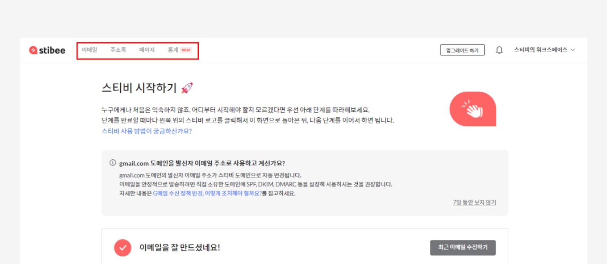
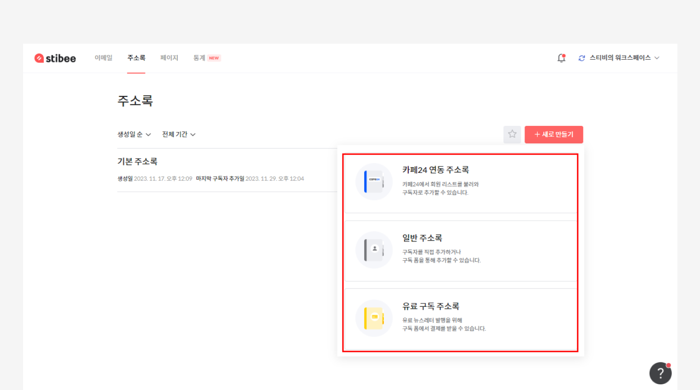
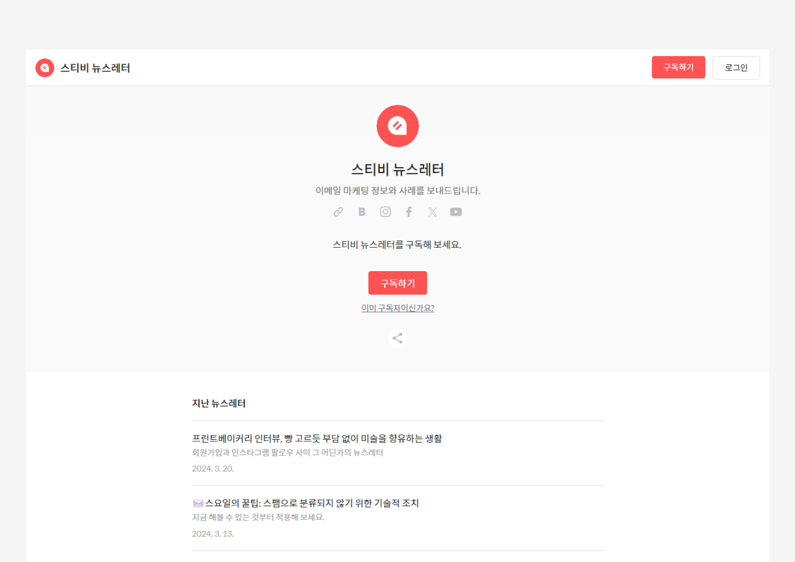
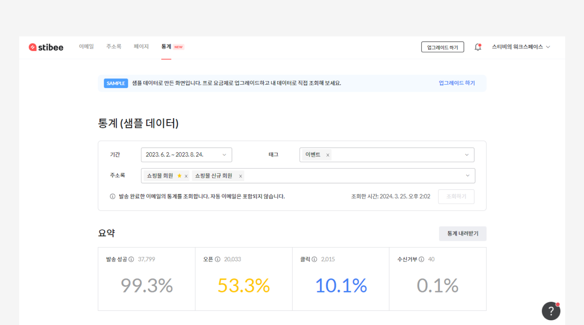

---
layout:
  title:
    visible: true
  description:
    visible: false
  tableOfContents:
    visible: true
  outline:
    visible: true
  pagination:
    visible: true
---

# 개요

## 이 글에서는

서비스를 활용하기 위해 기본이 되는 개념에 대해서 알아보고 '스티비 시작하기'에서 어떤 내용을 배울 수 있는지 알아봅니다.

***

## 스티비 이해하기

회원가입을 마치고 로그인을 하면 메인 대시보드 화면이 표시됩니다. 대시보드 화면 위에 보면 4가지 메뉴 버튼을 확인할 수 있습니다. 이 4가지 메뉴는 스티비에서 제공하는 주요 기능의 이름입니다. 어떤 작업을 하고 싶은지에 따라 여기서 필요한 메뉴를 선택해서 작업을 진행하면 됩니다.&#x20;

<figure><figcaption></figcaption></figure>

### 이메일

\[이메일]에서는 뉴스레터, 마케팅 이메일, 트랜잭셔널 이메일 등 이메일 내용을 편집하고 발송할 수 있습니다. 이메일은 크게 두 가지 종류로 나뉩니다.&#x20;

* [일반 이메일](broken-reference): 한 번에 많은 사람에게 보내는 성격의 이메일은 \[일반 이메일]로 만들어서 보내면 됩니다. 예를 들어 뉴스레터, 광고, 업데이트 소식 등 한번에 대량으로 발송하는 이메일들은 '일반 이메일'입니다.
* [자동 이메일](../email/automation/): 특정 조건을 만족할 때마다 자동으로 설정된 이메일을 보내고 싶다면 \[자동 이메일]로 만들어서보내면 됩니다. 예를 들어 구독자가 새롭게 주소록에 추가될 때마다 나가는 웰컴 이메일, 구독자가 이메일의 특정 링크를 클릭한 경우 자동으로 미리 설정된 이메일을 보내고 싶을 때는 '자동 이메일'을 사용해 만들면 됩니다.

<figure><figcaption></figcaption></figure>

### 주소록

\[주소록]은 이메일을 받아볼 수신자를 추가하고 관리할 수 있는 기능입니다. 스티비에서는 이메일을 수신하는 사람을 '구독자'로 표현하고 있고 필요에 따라 구독자를 주소록에 추가해서 보낼 수 있고 구독 신청을 받을 수 있습니다. 주소록은 크게 세 가지 종류로 나뉩니다.

* [일반 주소록](broken-reference): 구독자를 추가하고 관리할 수 있는 일반적인 기능을 제공하는 주소록입니다.&#x20;
* [유료 주소록](broken-reference): 유료 뉴스레터를 운영할 때 유료 구독자를 관리할 수 있는 기능을 제공하는 주소록입니다.
* [연동 주소록](broken-reference): 카페24, NHN커머스, 식스샵 등 솔루션을 통해 만든 온라인 홈페이지가 있는 경우 사용할 수 있는 주소록입니다. 자동으로 연동된 온라인 홈페이지의 회원 정보를 불러옵니다.\
  _\* 연동 주소록은 스티비와 연동한 외부 솔루션이 있는 경우에만 목록에 표시됩니다._

<figure><figcaption></figcaption></figure>

### 페이지

\[페이지]는 내가 만든 이메일을 웹에 게시하여 홍보하고 구독자를 모을 수 있는 홈페이지를 만들 수 있는 기능입니다. 페이지를 사용하면 만든 이메일을 간단하게 웹 상에 게시하고 게시한 콘텐츠를 활용해 구독자를 모아볼 수 있습니다.&#x20;

<figure><figcaption>
https://syoletter.stibee.com
</figcaption></figure>

### 통계

\[통계]는 여러 이메일의 통계를 한 번에 조회하거나 기간별로 조회하고 싶을 때 사용하는 기능입니다. 각각 이메일 단위의 통계는 [이메일 대시보드](../email/analytics/email-statistics-dashboard.md)에서 확인이 가능하지만 여러 이메일의 성과를 한 번에 비교하거나 기간 별로 여러 이메일의 성과를 보고 싶을 때 통계 기능을 사용할 수 있습니다. 통계 기능은 '프로' [요금제](broken-reference)부터 사용 할 수 있습니다.

<figure><figcaption></figcaption></figure>

## 섹션 살펴보기

'스티비 시작하기'에서는 스티비로 이메일을 보내기 위한 기본적인 내용부터 이메일을 문제 없이 보내기 위해 첫 발송 전에  미리 준비해야 하는 설정을 안내하고 있습니다. 준비된 단계별로 하나씩 살펴보는 것도 좋지만 원하는 내용이 있을 경우 아래 섹션 링크를 클릭해 바로 넘어가서 확인해 보세요.


[preparing-for-start](preparing-for-start/)



[send-first-email.md](send-first-email.md)



[welcome-email.md](welcome-email.md)



[undefined-4.md](undefined-4.md)

