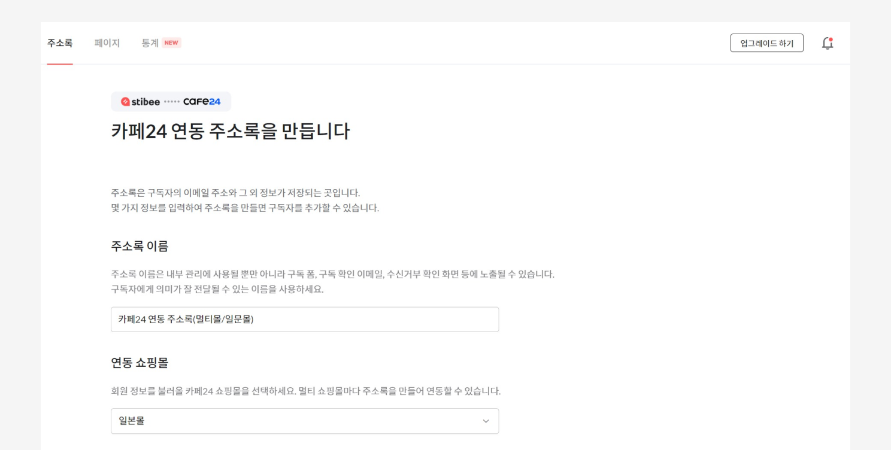

---
layout:
  title:
    visible: true
  description:
    visible: false
  tableOfContents:
    visible: true
  outline:
    visible: true
  pagination:
    visible: true
---

# 연동하기

## 이 글에서는 

카페24 쇼핑몰 회원을 스티비 주소록에 추가하는 방법에 관해 살펴봅니다. 실시간 연동을 통해 카페24 회원 정보를 스티비에서 손쉽게 확인하고, 자동화된 이메일 마케팅을 진행할 수 있습니다.&#x20;

기본적인 이메일 생성과 발송에 대한 자세한 내용은 [첫 이메일 보내기](../../getting-started/send-first-email.md) 도움말을 참고해 주세요. 다른 사용자의 스티비 활용법이 궁금하다면 [고객 사례 갤러리](https://gallery.stibee.com/)와 [블로그](https://blog.stibee.com/)를 함께 확인해 보시는 것도 추천합니다.

***

## 워크스페이스 연동하기 

카페24 연동 주소록을 이용하고 싶다면 카페24에서 스티비 앱을 설치하여 연동을 진행해야 합니다. 연동을 진행하면 카페24 회원 정보와 스티비 연동 주소록이 실시간으로 연동됩니다. 앱을 삭제하거나, 연동 주소록을 삭제하지 않는 이상 연동은 해제되지 않습니다.

카페24에서 스티비 앱을 설치해 연동을 진행하면 기본쇼핑몰인 '한국어 쇼핑몰'이 자동으로 연동됩니다. 기본 쇼핑몰 외에 멀티쇼핑몰을 운영하고 있고, 각 멀티쇼핑몰을 스티비에 연동하고 싶다면 새로운 카페24 연동 주소록을 만들어서 연동하면 됩니다.&#x20;

아래 도움말을 참고해 연동을 진행해 주세요.

<figure><figcaption></figcaption></figure>

### 스티비 처음 사용하는 경우 

스티비를 처음 사용한다면 카페24 연동과 함께 스티비 회원가입이 필요합니다.&#x20;

1. [카페24 앱스토어](https://store.cafe24.com/kr/apps/1652)의 스티비 앱 설치 화면에서 스티비 앱 설치하기를 진행해 주세요.
2. 카페24 연동 시작하기 화면에서 스티비 회원가입을 진행해 주세요.
3.  스티비와 카페24 연동이 처음이라면 '웰컴 이메일'을 바로 만들어볼 수 있는 화면이 표시됩니다. \[웰컴 이메일 만들기]를 클릭해 이메일을 만들어보세요.&#x20;

    _웰컴 이메일에 대한 자세한 내용이 궁금하다면 '_[_카페24 회원에게 웰컴 이메일 보내기_](../../tip/cafe24/welcome-email-cafe24-members.md)_' 도움말을 참고해 보세요._
4. 카페24 회원 정보 불러오기가 완료되면 \[주소록]에서 '카페24 연동 주소록'을 확인할 수 있습니다.

<figure><figcaption></figcaption></figure> <figure><figcaption></figcaption></figure>

스티비를 처음 사용한다면 여러 가지 궁금한 점이 생길 수 있어요. [첫 이메일 보내기](../../getting-started/send-first-email.md) 도움말에서 기본 사용법을 확인해 보세요.

### 스티비를 이미 사용하고 있는 경우 

기존에 사용하던 워크스페이스와 카페24 회원 정보를 연동할 수 있습니다.&#x20;

1. 스티비 홈페이지에 로그인한 뒤, \[워크스페이스 이름 → 워크스페이스 설정 → 외부 서비스 연동]에서 스티비와 카페24를 연동해 주세요. 또는 [카페24 앱스토어의 스티비 앱 설치 화면](https://store.cafe24.com/kr/apps/1652)에서 스티비와 카페24를 연동할 수 있습니다. 카페24 앱스토어에서 스티비 앱을 설치합니다.&#x20;
2.  스티비 홈페이지에 로그인한 뒤, 연동할 워크스페이스를 선택해 주세요. 이 단계에서 워크스페이스를 새로 만들 수도 있습니다.

    **\* 주의:** 로그인한 이메일 주소가 '소유자', '관리자'로 등록된 워크스페이스만 연동할 수 있습니다.
3.  스티비와 카페24 연동이 처음이라면 '웰컴 이메일'을 바로 만들어볼 수 있는 화면이 표시됩니다. \[웰컴 이메일 만들기]를 클릭해 이메일을 만들어보세요.&#x20;

    _웰컴 이메일에 대한 자세한 내용이 궁금하다면 '_[_카페24 회원에게 웰컴 이메일 보내기_](../../tip/cafe24/welcome-email-cafe24-members.md)_' 도움말을 참고해 보세요._
4. 카페24 회원 정보 불러오기가 완료되면 \[주소록]에서 '카페24 연동 주소록'을 확인할 수 있습니다.

<figure><figcaption></figcaption></figure> <figure><figcaption></figcaption></figure>

### 멀티쇼핑몰을 연동하고 싶은 경우 

<figure><figcaption></figcaption></figure>

카페24 연동 주소록을 추가로 만들고, 각 멀티쇼핑몰을 추가로 생성한 주소록에 연동하면 됩니다.&#x20;

1. 스티비 홈페이지에 접속한 뒤, \[주소록 → 새로 만들기 → 카페24 연동 주소록]을 클릭합니다.
2. 주소록 이름을 입력하고, 연동할 멀티쇼핑몰을 선택합니다.
3.  스티비와 카페24 연동이 처음이라면 '웰컴 이메일'을 바로 만들어볼 수 있는 화면이 표시됩니다. \[웰컴 이메일 만들기]를 클릭해 이메일을 만들어보세요.&#x20;

    _웰컴 이메일에 대한 자세한 내용이 궁금하다면 '_[_카페24 회원에게 웰컴 이메일 보내기_](../../tip/cafe24/welcome-email-cafe24-members.md)_' 도움말을 참고해 보세요._
4. 연동된 멀티쇼핑몰 주소록을 확인할 수 있습니다. 멀티쇼핑몰의 회원 정보도 실시간으로 연동됩니다.

<figure><figcaption></figcaption></figure> <figure><figcaption></figcaption></figure>

## 구독자 추가하기 

카페24와 스티비를 연동하면 카페24 연동 주소록이 생성되고, 카페24 쇼핑몰 회원 정보와 스티비 주소록이 실시간 연동됩니다. 만약, 카페24 연동 주소록에 쇼핑몰 회원이 아닌 외부에서 수집한 구독자 정보를 추가하고 싶다면 [주소록](broken-reference)에서 직접 추가하면 됩니다. 또는 [구독 폼](../../list/gather-subscribers/form.md)을 활용해 구독자를 새롭게 모집할 수도 있습니다.


카페24 회원은 스티비 주소록에서 삭제할 수 없습니다. 관리자가 직접 추가한 구독자, 파일이나 구독 폼을 통해 추가된 구독자만 스티비 주소록에서 삭제할 수 있습니다.


### 관리자가 직접 추가하기 

외부에서 수집한 구독자 정보를 카페24 연동 주소록에 직접 추가할 수 있습니다. \[주소록 → 추가하기 → '직접 추가하기' 또는 '파일로 추가하기']를 클릭해 진행할 수 있습니다. 자세한 방법은 [구독자 추가하기](../../list/adding-managing-subscriber/add.md) 도움말을 참고해 주세요.

### 구독 신청 받아서 추가하기 

구독 신청을 받을 수 있는 입력 폼을 스티비에서는 \[구독 폼]이라고 표현합니다. 주소록과 연결된 \[구독 폼]을 통해 구독자를 모을 수 있습니다. \[주소록 → 구독 화면 → 구독 폼]에서 관련 기능을 확인하실 수 있습니다. 자세한 방법은 [구독 폼](../../list/gather-subscribers/form.md) 도움말을 참고해 주세요.

## 카페24 회원 혜택 

카페24 연동 기능을 사용하는 경우 '요금제 할인 혜택'을 제공하고 있습니다. 요금제 구성 및 과금 기준에 대한 자세한 내용과 과금의 기준은 [요금제 종류](../../pricing/understanding/type.md) 도움말을 참고해 주세요.

### 스탠다드 요금제 

카페24 회원의 스탠다드 요금제는 월 7,900원부터 시작합니다. 스탠다드 요금제의 자세한 기능은 [여기](../../pricing/understanding/type.md#h_54b391955e)서 확인할 수 있습니다.

* 0-500명: 월 7,900원 (연 85,000원)
* 501-1,000명: 월 14,000원 (연 150,000원)
* 1,001-2,500명: 월 21,000원 (연 220,000원)
* 2,501-5,000명: 월 29,000원 (연 310,000원)
* 5,001-10,000명: 월 48,000원 (연 510,000원)
* 10,001-25,000명: 월 89,000원 (연 960,000원)
* 25,001-50,000명: 월 190,000원 (연 2,050,000원)
* 50,001-100,000명: 월 350,000원 (연 3,780,000원)
* 100,001-150,000 이상: 별도 문의

(부가세 포함)

### 프로 요금제 

카페24 회원의 프로 요금제는 월 28,000원부터 시작합니다. 프로 요금제의 자세한 기능은 [여기](../../pricing/understanding/type.md#h_01h9mm24t1nf8tp4vh7bdhv62y)서 확인할 수 있습니다.

* 0-500명: 월 28,000원 (연 300,000원)
* 501-1,000명: 월 34,000원 (연 360,000원)
* 1,001-2,500명: 월 51,000원 (연 550,000원)
* 2,501-5,000명: 월 69,000원 (연 740,000원)
* 5,001-10,000명: 월 98,000원 (연 1,050,000원)
* 10,001-25,000명: 월 149,000원 (연 1,600,000원)
* 25,001-50,000명: 월 270,000원 (연 2,910,000원)
* 50,001-100,000명 이상: 510,000원 (연 5,500,000원)
* 100,001-150,000 이상: 별도 문의

(부가세 포함)

### 엔터프라이즈 요금제 

채널톡 상담 또는 이메일([support@stibee.com](mailto:support@stibee.com))을 통해 문의해 주세요.
