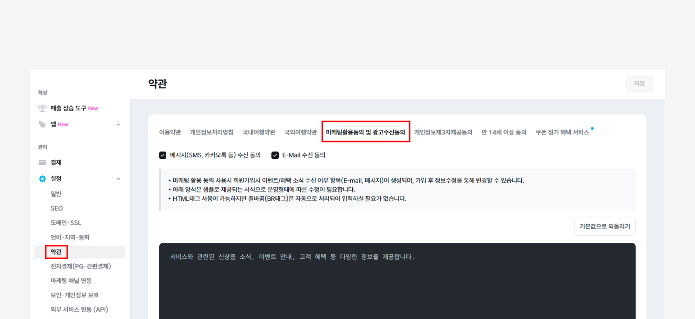

# 연동하기

## 이 글에서는

아임웹과 스티비를 연동하는 방법에 관해 알아봅니다. 아임웹에서 스티비 앱을 설치하고, 스티비에서 연동할 사이트와 주소록을 설정하면 회원 정보가 실시간으로 연동됩니다.

***

## 연동 전 확인하기

아임웹과 스티비를 연동하기 전에 아래 내용을 확인해 주세요.

* 아임웹 기본 사이트(국문)와 스티비 워크스페이스는 1:1로 연동합니다. 아임웹 기본 사이트 여러 개를 스티비 워크스페이스 1개에 연동하거나, 아임웹 기본 사이트 1개를 스티비 워크스페이스 여러 개에 연동할 수 없습니다.
* 아임웹 계정에 기본 사이트가 여러 개 있다면 각 기본 사이트를 각각 스티비 워크스페이스 1개와 연동할 수 있습니다.
*   아임웹에서 기본 사이트 생성 후 언어별 사이트를 추가한 경우, 언어별 사이트는 각각 별도의 사이트로 간주합니다. 언어별 사이트마다 스티비 주소록 1개와 연동할 수 있으며, 해당 주소록은 기본 사이트와 연결된 스티비 워크스페이스 안에 생성되어야 합니다.

    _\* 아임웹 연동 주소록은 워크스페이스당 최대 7개까지 만들 수 있습니다._


**\*주의:** 연동 전에 아임웹 사이트 관리자 페이지에서 \[설정 → 약관 → 마케팅활용동의 및 광고수신동의, 개인정보제3자제공동의] 항목이 선택되어 있어야 합니다. 선택되어 있지 않으면 최초 연동 이후에 스티비에서 아임웹 회원의 구독자 상태를 업데이트할 수 없습니다.


<figure><figcaption></figcaption></figure>

## 워크스페이스 연동하기

아임웹 연동 주소록을 사용하려면 아임웹에서 [스티비 앱을 설치하여](https://imweb.me/appstore/app?app=ga20260617a661d10f47a1f\&utm_source=help.stibee.com\&utm_medium=referral\&utm_campaign=imweb_integration) 연동을 진행해야 합니다. 연동을 진행하면 아임웹 회원 정보와 스티비 연동 주소록이 실시간으로 연동됩니다. 앱을 삭제하거나 연동 주소록을 삭제하지 않는 이상 연동은 해제되지 않습니다.

아임웹에서 스티비 앱을 설치해 연동을 진행하면 선택한 사이트의 회원 정보가 자동으로 연동됩니다. 언어별 사이트를 운영하고 있고 각 사이트를 스티비에 연동하고 싶다면 새로운 아임웹 연동 주소록을 만들어서 연동하면 됩니다.

아래 도움말을 참고해 연동을 진행해 주세요.

<figure><figcaption></figcaption></figure>

### 스티비를 처음 사용하는 경우

스티비를 처음 사용한다면 아임웹 연동과 함께 스티비 회원가입이 필요합니다.

1. [아임웹 앱스토어](https://imweb.me/appstore/app?app=ga20260617a661d10f47a1f\&utm_source=help.stibee.com\&utm_medium=referral\&utm_campaign=imweb_integration)에서 '스티비'를 검색합니다.
2. \[앱 관리하기]를 클릭합니다.
3. 앱 설치를 위한 권한 동의 화면이 표시되면 내용을 확인한 뒤 \[동의]를 클릭합니다.
4. 스티비 연동 시작 화면에서 스티비 회원가입을 진행합니다.
5. 아임웹 회원 정보 불러오기가 완료되면 \[주소록]에서 '아임웹 연동 주소록'을 확인할 수 있습니다.

<figure><figcaption></figcaption></figure>

<figure><figcaption></figcaption></figure>

스티비를 처음 사용한다면 여러 가지 궁금한 점이 생길 수 있어요. 아래도움말에서 기본 사용법을 확인해 보세요.


[send-first-email.md](../../getting-started/send-first-email.md)


### 스티비를 이미 사용하고 있는 경우


이전에 아임웹과 연동한 적이 있다면 기존 연동 주소록을 다시 사용할 수 있습니다. 연동하는 시점을 기준으로 현재 회원 정보가 연동 주소록에 업데이트됩니다.


기존에 사용하던 워크스페이스와 아임웹 쇼핑몰을 연동할 수 있습니다.

1. [아임웹 앱스토어](https://imweb.me/appstore/app?app=ga20260617a661d10f47a1f\&utm_source=help.stibee.com\&utm_medium=referral\&utm_campaign=imweb_integration)에서 '스티비'를 검색합니다. 또는 스티비에 로그인한 뒤 \[워크스페이스 이름 → 워크스페이스 설정 → 외부 서비스 연동]에서 아임웹 연동을 진행할 수 있습니다.
2.  연동할 워크스페이스를 선택합니다. 이 단계에서 워크스페이스를 새로 만들 수도 있습니다.

    _\* 로그인한 계정이 '소유자', '관리자'로 등록된 워크스페이스만 연동할 수 있습니다._
3. 아임웹 회원 정보 불러오기가 완료되면 \[주소록]에서 '아임웹 연동 주소록'을 확인할 수 있습니다.

<figure><figcaption></figcaption></figure>

<figure><figcaption></figcaption></figure>

### 언어별 사이트를 연동하고 싶은 경우


워크스페이스당 생성할 수 있는 아임웹 연동 주소록은 최대 7개입니다. 기본 사이트와 연동된 주소록도 이 개수에 포함됩니다.


아임웹에서 기본 사이트 외에 언어별 사이트를 운영하고 있다면 각 사이트를 별도의 아임웹 연동 주소록에 연동할 수 있습니다. 언어별 사이트는 기본 사이트와 연결된 스티비 워크스페이스 안에서만 연동할 수 있습니다.

1. 스티비 홈페이지에 접속한 뒤, \[주소록 → 새로 만들기 → 아임웹 연동 주소록]을 클릭합니다.
2. 주소록 이름을 입력하고 연동할 언어별 사이트를 선택합니다.
3. 연동된 언어별 사이트 주소록을 확인할 수 있습니다. 언어별 사이트의 회원 정보도 실시간으로 연동됩니다.

<figure><figcaption></figcaption></figure>

<figure><figcaption></figcaption></figure>

## 구독자 추가하기

아임웹과 스티비를 연동하면 아임웹 연동 주소록이 생성되고, 아임웹 사이트의 회원 정보와 스티비 주소록이 실시간으로 연동됩니다. 아임웹 연동 주소록에 쇼핑몰 회원이 아닌 외부에서 수집한 구독자 정보를 추가하고 싶다면 주소록에서 직접 추가하면 됩니다. 또는 구독 폼을 활용해 구독자를 새롭게 모집할 수도 있습니다.


아임웹 회원은 스티비 주소록에서 완전삭제할 수 없습니다. 관리자가 직접 추가한 구독자, 파일이나 구독 폼을 통해 추가된 구독자만 스티비 주소록에서 삭제할 수 있습니다.


### 관리자가 직접 추가하기

외부에서 수집한 구독자 정보를 아임웹 연동 주소록에 직접 추가할 수 있습니다. \[주소록 → 추가하기 → '직접 추가하기' 또는 '파일로 추가하기']를 클릭해 진행할 수 있습니다. 자세한 방법은 [구독자 추가하기](../../list/adding-managing-subscriber/add.md) 도움말을 참고해 주세요.

### 구독 신청 받아서 추가하기

구독 신청을 받을 수 있는 입력 폼을 스티비에서는 '구독 폼'이라고 합니다. 주소록과 연결된 \[구독 폼]을 통해 구독자를 모을 수 있습니다. \[주소록 → 구독 화면 → 구독 폼]에서 관련 기능을 확인할 수 있습니다. 자세한 방법은 [구독 폼](../../list/gather-subscribers/form.md) 도움말을 참고해 주세요.
