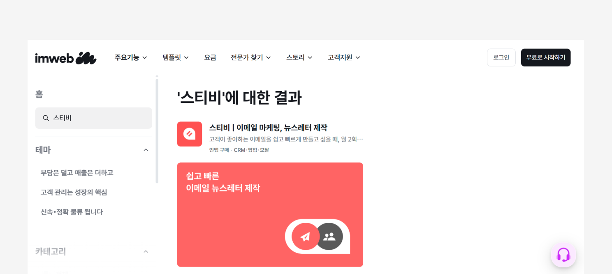

# 아임웹

## 이 글에서는

아임웹과 스티비를 연동하고, 이 연동을 해제하는 방법에 관해 알아봅니다.

***

아임웹에서 스티비 앱을 설치하면 아임웹 연동 주소록이 생성되며, 아임웹 사이트의 회원 정보를 스티비 연동 주소록에 실시간으로 연동합니다.


연동을 시작하기 전에 아임웹 사이트 관리자 페이지에서 \[설정 → 약관 → 마케팅 활용동의 및 광고 수신동의, 개인정보제3자제공동의] 항목이 선택되어 있는지확인해 주세요


* 아임웹 계정의 기본 사이트(국문)와 스티비 워크스페이스는 1:1로 연동되며, 아임웹 사이트와 스티비 주소록은 1:1로 연동됩니다.
  * 아임웹 연동 주소록은 워크스페이스당 최대 7개까지 만들 수 있습니다.
* 아임웹 회원 중 이메일 수신에 동의한 회원은 연동 주소록에 '구독 중' 상태로 추가됩니다. 이메일 수신에 동의하지 않은 회원은 '수신거부' 상태로 추가됩니다.
  * 수신거부 상태인 구독자는 구독자 수 계산에서 제외되며, 과금 기준에도 포함되지 않습니다.
  * 이메일 수신에 동의하던 회원이 이메일에서 수신 거부하면, 아임웹 회원 정보의 이메일 수신 동의 상태에도 수신 거부가 반영됩니다.
  * 휴면 회원과 쇼핑몰에서 탈퇴한 회원은 완전 삭제됩니다.
* 아임웹 연동 주소록에서 아임웹 회원인 구독자를 직접 삭제할 수 없습니다. 연동 주소록과 연결된 구독 폼을 통해 직접 구독 신청한 구독자나 관리자가 직접 추가한 구독자만 삭제할 수 있습니다.

<figure><figcaption></figcaption></figure>

#### 구독자 상태 이해하기

아임웹 연동 주소록에서 구독자 상태는 아래 기준에 따라 처리됩니다.

* 이메일 수신에 동의한 회원은 '구독 중' 상태로 추가됩니다.
* 이메일 수신에 동의하지 않은 회원은 '수신거부' 상태로 추가됩니다.
* 이메일에서 수신거부한 구독자는 '수신거부' 상태로 변경되며, 아임웹의 이메일 수신 동의도 '거부'로 변경됩니다.
* 스티비에서 자동 삭제된 구독자는 아임웹의 이메일 수신 동의가 '거부'로 변경됩니다.
* 휴면 회원과 쇼핑몰에서 탈퇴한 회원은 '완전삭제' 상태로 처리됩니다.


완전삭제된 회원이 동일한 이메일 주소로 다시 가입하면 새로운 구독자로 추가됩니다. 단, 동일한 이메일 주소의 구독자가 주소록에 이미 존재하는 경우에는 새로운 구독자를 생성하지 않고 기존 구독자의 회원 정보를 업데이트합니다. \{% endhint %\}


아래 도움말을 참고해 아임웹과 스티비를 연동해 보세요. 언제든지 연동을 해제할 수도 있습니다.


[how-to-integration.md](../cafe24/how-to-integration.md)



[features.md](../cafe24/features.md)



[disconnect.md](../cafe24/disconnect.md)

