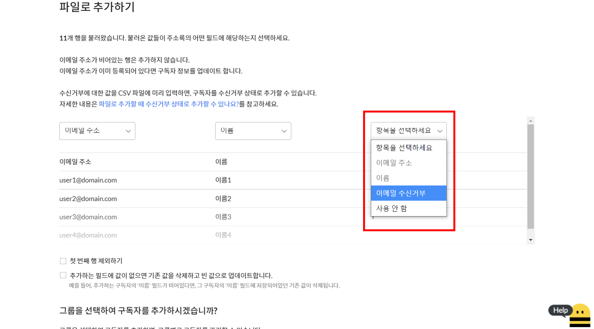

---
layout:
  title:
    visible: true
  description:
    visible: false
  tableOfContents:
    visible: true
  outline:
    visible: true
  pagination:
    visible: true
---

# 구독자 추가하기

## 이 글에서는 

스티비로 이메일을 보내기 위해서는 \[주소록]에 구독자를 추가해야 합니다. 주소록에 구독자를 한 명씩 추가하는 방법과 파일(CSV)을 이용해 한 번에 추가하는 방법, DB 연동을 통해 구독자를 자동으로 추가하는 방법에 대해서 알아봅니다.

***

## 구독자를 한 명씩 직접 추가하기 

구독자를 직접 추가하는 방법은 '주소록 목록에서 추가하는 방법'과 '주소록의 구독자 목록에서 추가하는 방법' 두 가지가 있습니다.

### 주소록 목록에서 추가하기 

1. 화면 가장 윗 부분에 있는 \[주소록] 메뉴를 클릭하여 주소록 목록으로 이동합니다.
2. 주소록 목록에서 구독자를 추가하고 싶은 주소록의 오른쪽에 있는 \[추가하기(∨)]를 클릭합니다.
3. \[직접 추가하기]를 클릭합니다.

.png>)

### 구독자 목록에서 추가하기 

1. 구독자를 추가하고 싶은 \[주소록]을 클릭하여 \[구독자 목록] 화면으로 이동합니다.
2. \[구독자 목록]의 오른쪽 위에 있는 빨간색 \[+ 추가하기]버튼을 클릭합니다.
3. \[직접 추가하기] 버튼을 클릭합니다.

.png>)

### 추가할 구독자 정보 입력하기 

\[직접 추가하기]를 클릭하면 구독자 정보 입력 창으로 이동합니다. 여기서 추가하고 싶은 구독자 정보를 입력합니다. 이메일을 발송해야 하기 때문에 구독자의 '이메일 주소는 필수값'입니다. 이메일 주소 외에 입력해야 하는 값이 있다면 입력합니다. 광고성 정보 수신 동의 여부도 구분해야 한다면 \[동의함] 또는 \[동의하지 않음]을 선택해서 추가합니다.

한 명 이상의 구독자를 등록하고 싶은 경우에는 구독자 정보 입력 폼 아래에 있는 \[+ 추가하기]버튼을 클릭하면 구독자 정보를 입력할 수 있는 입력 폼이 추가됩니다.

\[추가하는 필드에 값이 없으면 기존 값을 삭제하고 빈 값으로 업데이트합니다.] 옵션은 이미 주소록에 등록된 구독자 정보를 추가하는 경우, 데이터를 어떻게 처리할지 여부를 정의할 수 있는 옵션입니다. 구독자의 정보가 중복되는 정보인지 여부는 이메일 주소를 기준으로 판단합니다. 이 옵션을 체크하는 경우 나중에 추가되는 구독자 정보의 특정 필드 값이(예: 이름) 비어있는 경우 기존에 저장된 값은 사라지고 빈 값으로 업데이트됩니다.

예를 들어, '이메일 주소: [dooly@stibee.com](mailto:dooly@stibee.com) / 이름: 둘리'로 입력하고 \[추가하는 필드에 값이 없으면 기존 값을 삭제하고 빈 값으로 업데이트합니다.]옵션을 체크합니다. 이후에 같은 이메일 주소([dooly@stibee.com](mailto:dooly@stibee.com))를 가진 구독자의 '이름'을 비어있는 상태로 추가하면, 이메일 주소만 남고 이름은 빈 값으로 업데이트됩니다.

.png>)

\[그룹을 선택하여 구독자를 추가하시겠습니까?]를 \[예]로 선택하면 구독자를 추가할 때 특정 그룹으로 추가되도록 설정할 수 있습니다. \[그룹] 기능을 사용하면 구독자를 목적에 따라 분류하여 이메일을 발송할 수 있고 그룹 단위로 구독자를 관리할 수 있습니다.

.png>)

구독자 정보가 입력이 완료됐다면 \[추가하기] 버튼을 클릭합니다. 구독자 추가까지는 추가하는 양에 따라 시간이 조금 걸릴 수 있습니다. 구독자를 추가하는 도중 화면을 떠나도 완료될 때까지 자동으로 진행됩니다.

&#x20;

## 구독자를 한 번에 대량으로 추가하기 

한 번에 많은 구독자 정보를 추가하고 싶은 경우 '파일로 추가하기'를 사용하면 됩니다. 구독자 명단을 CSV 파일로 만들어 간단하게 구독자 정보를 등록할 수 있습니다. 파일로 구독자를 추가하는 방법은 '주소록 목록에서 추가하는 방법'과 '주소록의 구독자 목록에서 추가하는 방법' 두 가지가 있습니다.

### 주소록 목록에서 추가하기 

1. 화면 가장 윗 부분에 있는 \[주소록] 메뉴를 클릭하여 주소록 목록으로 이동합니다.
2. 주소록 목록에서 구독자를 추가하고 싶은 주소록의 오른쪽에 있는 \[추가하기(∨)]를 클릭합니다. &#x20;
3. \[파일로 추가하기]를 클릭합니다.

<figure><figcaption></figcaption></figure>

### 구독자 목록에서 이동하기 

1. 구독자를 추가하고 싶은 \[주소록]을 클릭하여 \[구독자 목록] 화면으로 이동합니다.
2. \[구독자 목록]의 오른쪽 위에 있는 빨간색 \[+ 추가하기]버튼을 클릭합니다.
3. 표시되는 \[직접 추가하기]와 \[파일로 추가하기] 중 \[파일로 추가하기]를 클릭합니다.

.png>)

#### &#x20; 

### 추가할 구독자 정보 입력하기 

\[파일로 추가하기]화면으로 이동했다면, 먼저 추가하고 싶은 '구독자 목록 파일'을 업로드해야 합니다. 파일을 어떻게 만들어야 할지 모르겠다면 [샘플 파일](https://stibee.com/download/%EC%8A%A4%ED%8B%B0%EB%B9%84\_%EC%A3%BC%EC%86%8C%EB%A1%9D\_%EC%83%98%ED%94%8C.csv)을 내려받아 사용하세요. (만약 파일 업로드가 되지 않는다면 [여기](../../tip/overview/subscriber-upload-issues.md)를 참고하세요.)

1. \[파일로 추가하기]화면에서 \[파일 선택]버튼을 클릭합니다.
2. 추가하고 싶은 구독자 목록(CSV)을 업로드합니다.
3. \[다음]을 클릭합니다.
4. 구독자 정보를 \[주소록]의 어떤 \[사용자 정의 필드]로 연결할지를 설정합니다. 파일에 있는 필드 중 사용하지 않는 필드는 '사용 안 함'을 선택합니다. \
   \* 반드시 모든 필드가 선택되어야 다음 단계로 진행할 수 있습니다.
5. \[그룹을 선택하여 구독자를 추가하시겠습니까?]에서 그룹 추가 여부를 선택합니다.&#x20;
6. \[추가하기]를 클릭합니다.

.png>)

파일로 구독자 정보를 추가할 때 이메일 주소 외에 이름, 핸드폰 번호 등 다른 정보가 있다면 파일에 있는 어떤 행이 각각 '이름' 또는 '핸드폰 번호'의 정보에 해당하는지 선택해야 합니다. 만약 파일에는 다른 정보가 있지만 이 단계(아래 사진)에서 선택해야 하는 필드가 없다면 [사용자 정의 필드](understanding-subscriber-info.md#undefined)에서 추가하고 싶은 정보를 추가한 뒤에 다시 시도해주세요.

.png>)

\
정보가 잘 입력됐다면 \[추가하기]를 클릭했을 때 구독자 추가가 진행됩니다. 추가하는 구독자의 양에 따라 업로드 완료 시간은 차이가 있습니다. 구독자를 추가하는 도중 화면을 떠나도 계속해서 완료될 때까지 자동으로 진행됩니다.

.png>)

### 구독자 추가 결과 확인하기

구독자 추가가 완료되면 추가 결과 화면이 표시됩니다. 결과는 추가 유형별로 총 4개로 분류되며 각 분류의 파랗게 표시되는 숫자를 클릭하면 구체적으로 어떤 구독자가 어떤 유형으로 분류됐는지 명단을 확인할 수 있습니다.&#x20;

* 상태 외 정보 업데이트: 추가한 구독자 중 이미 주소록에 존재하는 구독자가 존재하여 이메일 주소 외의 다른 정보를 업데이트 했습니다. 예를 들어, 이메일 주소가 같은데 이름 필드의 값이 다르면, 이름 필드의 값이 마지막에 등록한 파일을 기준으로 구독자 정보가 업데이트 됩니다.
* 이메일 주소 없음: 업로드한 구독자 파일에 특정 구독자의 이메일 주소 정보가 존재하지 않습니다. 원본 파일을 확인해보세요.
* 이메일 주소 형식 오류: 구독자의 이메일 주소가 입력됐지만 형식을 올바르게 갖추지 못한 정보가 입력됐습니다. 이메일 주소 형식은 _example@stibee.com_과 같은 형식으로 구성되어야 합니다. 원본 파일에 이메일 주소 형식이 올바르게 기입됐는지 여부를 확인해보세요.
* 이메일 주소 중복 요청: 추가한 구독자 중에 같은 이메일 주소를 가진 구독자가 여러 명 있어, 한 명만 추가가 됐습니다. 가장 처음에 요청한 이메일 주소를 기준으로 구독자 정보가 업데이트됩니다.

<figure><figcaption></figcaption></figure>

구독자를 파일로 추가한 결과 별로 구독자 목록을 조회하고 다운로드 받을 수 있습니다. 어떤 구독자가 왜 등록이 되지 않았는지 자세하게 확인해 정보를 수정하고 다시 추가를 시도할 수 있습니다.

.png>)

### 파일로 추가할 때 수신거부 상태로 추가하기 

CSV 파일에서 수신거부 여부를 표시할 열을 추가합니다. 수신거부 상태로 추가할 구독자는 이 열에 **Y**를 입력합니다. 수신거부 항목으로 선택된 열에 **Y**가 입력되어있으면, 그 구독자는 수신거부 상태로 추가됩니다. 만약 이미 등록된 구독자라면, 수신거부 상태로 변경됩니다.

<figure><figcaption></figcaption></figure>

\
구독자 정보가 주소록의 어떤 항목에 해당하는지 선택할 때, 수신거부에 대한 값을 입력한 열을 **수신거부** 항목으로 선택합니다.&#x20;

<figure><figcaption></figcaption></figure>

### 파일로 추가할 때 광고성 정보 수신 동의 설정하기

구독자를 '파일로 추가하기' 기능을 사용해 신규로 추가하는 경우 광고성 정보 수신 동의 여부를 선택해서 추가할 수 있습니다. 파일로 추가하기 기능을 통해 광고성 정보 수신 동의 여부를 선택하기 위해서는 광고성 정보 수신 동의한 구독자는 파일에 미리 '광고성 정보 수신 동의' 열을 만들어 'Y'를 입력해야 합니다. \[주소록 → 추가하기 → 파일로 추가하기]를 클릭해 파일을 업로드합니다.

<figure><figcaption></figcaption></figure>

구독자 파일 업로드 후 필드 선택 단계에서 광고성 정보 수신 동의 여부가 체크되어 있는 열에 '광고성 정보 수신 동의' 필드를 선택합니다. Y가 입력된 구독자는 광고성 정보 수신 동의 여부가 '동의'로 표시됩니다. N 혹은 빈칸으로 입력된 구독자는 광고성 정보 수신 동의 여부가 '동의하지 않음(빈칸)'으로 표시됩니다.

<figure><figcaption></figcaption></figure>

## DB 연동으로 자동 추가하기 

[주소록 API](../../api-webhook/list-api.md)를 사용하면 가지고 있는 DB와 스티비 주소록을 연동해서 사용할 수 있습니다. DB와 스티비 주소록이 연동되면 DB에 새로운 고객 정보가 등록되거나 고객 정보가 변경되는 경우 스티비 주소록에 구독자로 추가하거나 수정된 정보가 자동으로 반영되도록 설정할 수 있습니다. \
\
반대로 스티비 주소록에서 구독자 정보가 변경되는 경우 가지고 있는 DB에 자동으로 반영되도록 하는 것도 가능합니다. \[[주소록 웹훅](../../api-webhook/list-webhook.md)]이라는 기능을 사용해 추가로 연동할 수 있습니다.\
\
주소록 API와 웹훅을 모두 사용하면 DB와 주소록을 완전히 동기화하여 사용할 수 있습니다.

## 구독 받기

가지고 있는 DB가 없다면 처음부터 구독 신청을 받아 구독자를 추가하는 방법도 있습니다. 스티비에서는 주소록마다 연결된 구독 신청 페이지를 제공합니다. 주소록마다 연결된 구독 신청 페이지를 사용하는 방법도 있고 구독 신청 폼과 아카이빙 기능이 결합된 확장된 기능인 \[페이지]를 활용해 받는 방법도 있습니다. 자세한 내용은 아래 도움말을 참고해보세요.

[구독 폼 이해하기](../gather-subscribers/form.md#h\_01ggcbmn0c7yk62feh8bwj7xg6)

[페이지로 구독 받기](../../page/subscribe/)

