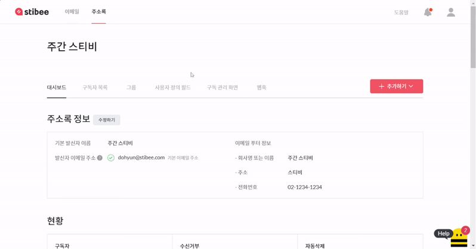
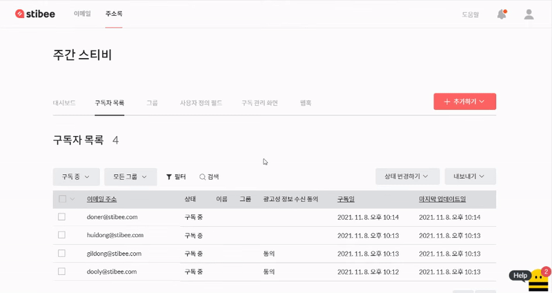

---
layout:
  title:
    visible: true
  description:
    visible: false
  tableOfContents:
    visible: true
  outline:
    visible: true
  pagination:
    visible: true
---

# 구독자 정보 이해하기

## 이 글에서는 

사용자 정의 필드를 사용하면 이메일 주소 외에 이름, 연락처 등 구독자의 다른 정보를 추가할 수 있습니다. 사용자 정의 필드를 만들고 수정하거나 삭제하는 방법을 알아봅니다.

***

## 사용자 정의 필드 이해하기 

이메일 주소 외에 다른 구독자 정보(예: 이름, 연락처, 회사명 등)도 주소록에 함께 등록해서 관리하고 싶다면 \[사용자 정의 필드] 기능을 사용하면 됩니다. 이메일 주소 외에 추가 정보도 활용할 수 있다면 구독자에게 개인화된 메일을 보낼 수 있어 효과적으로 소통하는 데 도움이 됩니다.&#x20;

예를 들어 구독자의 '연령대'를 추가하고 싶다면, \[사용자 정의 필드 → 필드 추가하기]를 통해 \[연령대] 필드를 추가해서 사용하면 됩니다.

<figure><figcaption></figcaption></figure>

주소록에서 생성할 수 있는 필드 개수는 사용하는 요금제에 따라 달라집니다.

* 스타터, 스탠다드 요금제는 사용자 정의 필드를 최대 30개까지 생성할 수 있습니다.
* 프로 요금제에서는 최대 50개까지 생성할 수 있습니다.
* 엔터프라이즈 요금제에서는 제한 없이 생성할 수 있습니다.

## 사용자 정의 필드 사용하기

사용자 정의 필드와 \[[세그먼트](../classify-subscribers/how-to-use-segment.md)] 기능을 함께 사용하면 구독자를 목적에 맞게 분류할 수 있습니다. 이를 토대로 더욱 개인화된 메일을 발송할 수도 있습니다.

### 사용자 정의 필드 새로 추가하기 

구독자의 새로운 정보를 등록하려면 먼저 새로운 사용자 정의 필드를 추가해야 합니다.

1. \[주소록]에서 \[사용자 정의 필드]를 추가하고 싶은 주소록의 제목을 클릭합니다.
2. 주소록 메뉴에서 \[사용자 정의 필드]를 클릭합니다.
3. 현재 주소록에 생성된 사용자 정의 필드 목록이 표시됩니다. 목록 아래에 있는 \[+ 필드 추가하기]를 클릭합니다.
4. 설정 창에서 값을 입력하고 \[저장하기]를 클릭합니다.


'사용자 정의 필드 파라미터'를 사용하면 특정 URL을 통해 유입된 구독자의 사용자 정보에 자동으로 특정 값을 입력하도록 설정할 수 있습니다.

예를 들어 구독 폼을 인스타그램, 블로그 등 여러 채널을 통해 홍보한다고 했을 때 채널별로 URL을 다르게 설정하면,

* 인스타그램을 통해 유입된 구독자의 사용자 정의 필드에 '인스타그램'을 기록합니다.
* 블로그를 통해 유입된 구독자의 사용자 정의 필드에 '블로그'를 기록합니다.

자세한 내용은 [automated-categorization.md](../gather-subscribers/automated-categorization.md "mention") 도움말을 참고해 주세요.


### 사용자 정의 필드 설정 이해하기 

\[+필드 추가하기]를 클릭하면 상세 설정 정보를 입력하는 새로운 창이 표시됩니다.

* 필드 이름: 사용자 정의 필드를 구분하기 위한 이름입니다. 구독자 정보가 표시되는 화면에서 사용합니다. 예를 들어, 필드 이름을 '연령대'로 등록한 경우, 주소록에서도 '연령대'로 필드 이름이 표시됩니다.
* 유형: [구독 폼](../gather-subscribers/form.md#undefined)에서 통일된 양식으로 구독자 정보를 모으고 싶을 때 사용합니다. 텍스트, 숫자, 드롭다운, 라디오 버튼, 날짜, 날짜와 시간 양식을 제공합니다. 수집하고 싶은 정보의 형태에 따라 자유롭게 설정할 수 있습니다.
* 키: 이메일 제목이나 본문에서 [메일머지](../../email/edit/personalized-merge.md)(구독자별 개인화된 정보)를 불러오기 위한 키(key) 값입니다.
* 필수 입력: [구독 폼](../gather-subscribers/form.md)에서 이 사용자 정의 필드를 필수로 입력해야 하는지 여부를 선택합니다. \[필수 입력]을 체크하는 경우, 구독자는 여기에 해당하는 정보를 반드시 기재해야만 구독 신청을 진행할 수 있습니다. 필수로 입력받고 싶은 정보인 경우 박스를 체크하면 됩니다.
* 메일머지 설정하기 기본값: 메일머지 기능을 사용해서 구독자별 개인화된 정보를 불러올 때, 저장된 정보가 없는 구독자에게 표시될 기본값을 설정합니다. 예를 들어, \[이름] 필드에 정보가 등록되지 않은 구독자가 있다면, 이 구독자에게는 \[고객]으로 표시되도록 기본값을 설정할 수 있습니다.

### 사용자 정의 필드 유형 이해하기 

사용자 정의 필드는 텍스트, 숫자, 드롭다운, 라디오 버튼, 날짜, 날짜와 시간 이렇게 여섯 가지 유형을 지원합니다. 숫자 유형을 제외한 나머지는 구독 폼에서만 동작합니다. 라디오 버튼이나 드롭다운 유형을 선택해서 사용자 정의 필드를 추가해도 주소록에는 텍스트 형태로 저장됩니다.

#### 텍스트

가장 기본적인 사용자 정의 필드 유형입니다. 대부분의 정보는 '텍스트' 유형을 선택해서 사용하면 됩니다. 예를 들면 이름, 단체 또는 회사명 등의 정보를 텍스트 형식으로 받아 사용할 수 있습니다.

.gif>)

#### 숫자


'숫자' 유형으로 생성한 사용자 정의 필드는 다른 유형으로 변경할 수 없습니다.


숫자 형식의 데이터만 입력할 수 있도록 설정할 수 있습니다. 숫자가 아닌 다른 정보를 입력하면 오류 메시지가 출력되며 정보가 입력되지 않습니다. 적립금, 누적 구매 금액, 나이 등 숫자 유형의 데이터를 주소록에 입력할 때 활용하면 좋습니다.

.gif>)

#### 드롭다운(단일 선택)

드롭다운 형태로 설정하면 여러 선택지 중 하나를 구독자가 선택할 수 있습니다. 연령대, 구독 경로, 예/아니요 등 정해진 선택지가 존재하는 정보를 받을 때 사용하면 효과적입니다. 중복 선택은 지원하지 않습니다.

.png>)

#### 라디오 버튼(단일 선택)

드롭다운과 비슷 유형입니다. 다만, '드롭다운'은 선택지를 클릭해야만 확인할 수 있다면, 라디오 버튼은 처음부터 모든 선택지를 표시합니다. '기타' 의견을 추가로 받고 싶다면 라디오 버튼 유형을 사용해 보세요. 취미, 관심사 등의 정보를 받을 때 사용하면 효과적입니다. 중복 선택은 지원하지 않습니다.

.png>)

#### 날짜, 날짜와 시간


'날짜, 날짜와 시간' 유형으로 생성한 사용자 정의 필드는 다른 유형으로 변경할 수 없습니다. 마찬가지로 다른 유형으로 생성한 필드는 '숫자', '날짜, 날짜와 시간' 유형으로 변경할 수 없습니다.


입력하는 정보의 형식을 '날짜' 형식으로 지정할 수 있습니다. 2024년 11월 12일과 같이 연, 월, 일(YYYY.MM.DD)만 표시되도록 설정하거나, 2024년 11월 12일 오전 10:30과 같이 시간까지 표시하도록 설정할 수도 있습니다.

**\*주의:** 날짜 형식으로 지정된 필드에는 정의된 형식에 맞게 정보가 입력되어야 합니다. 구독자를 파일로 추가할 때 형식에 맞지 않는다면 오류가 발생할 수 있습니다. 자세한 내용은 [#undefined-1](../questions.md#undefined-1 "mention") 도움말을 참고해 주세요.

.png>)

### 사용자 정의 필드 수정, 삭제하기 

추가한 사용자 정의 필드는 언제든지 수정 또는 삭제할 수 있습니다.

1. \[주소록 → 사용자 정의 필드]로 이동합니다.
2. \[사용자 정의 필드] 목록의 오른쪽에 있는 \[수정, 삭제] 버튼을 클릭해 정보를 수정하거나 삭제합니다.

목록에 있는 버튼 중 왼쪽에 있는 \[수정하기(연필 모양)]는 사용자 정의 필드의 설정을 수정할 수 있는 버튼입니다. 버튼을 클릭하면 사용자 정의 필드 정보 설정 화면으로 이동합니다. 오른쪽에 있는 \[삭제하기(휴지통 모양)]를 클릭하면 사용자 정의 필드가 삭제됩니다. 사용자 정의 필드를 삭제하면 이에 해당하는 구독자 정보도 함께 사라지며, 복구할 수 없으니 유의해 주세요.


'숫자', '날짜, 날짜와 시간' 유형으로 생성한 사용자 정의 필드는 다른 유형으로 변경할 수 없습니다. 마찬가지로 다른 유형으로 생성한 필드는 '숫자', '날짜, 날짜와 시간' 유형으로 변경할 수 없습니다.


<figure><figcaption></figcaption></figure>

## 기본 필드 이해하기

기본 필드란, 사용자가 설정하지 않아도 기본적으로 주소록에 추가되는 정보를 의미합니다. \[사용자 정의 필드] 아래에서 \[기본 필드]에서 확인할 수 있습니다. 혹은 이메일 편집 화면에서 \[URL 툴바]의 \[{ }] 모양의 버튼을 눌러 기본 필드를 메일머지 형태로 활용할 수도 있습니다.

광고성 정보 수신 동의 여부, 구독일, 이메일의 공유용 URL, 수신거부 URL, 아카이브 URL, 페이지 URL, 구독 폼 URL, 구독 정보 변경 화면 URL, 최근 발송한 이메일의 공유용 URL 등이 기본 필드에 포함됩니다.

여기에 추가되는 정보는 사용자가 따로 편집하거나 수정할 수 없습니다. 기본 필드도 사용자 정의 필드와 같이 \[[메일머지](../../email/edit/personalized-merge.md)]로 이메일 본문이나 제목에 활용할 수 있습니다.

* 광고성 정보 수신 동의: 광고성 정보 수신 동의 필드는 구독자별로 광고성 정보 수신 동의 여부를 관리할 수 있는 기능입니다. 광고성 정보에 해당하는 이메일을 발송해야 하는 경우, 광고성 정보 수신에 동의한 구독자에게만 보내야 합니다.
* 구독일: 구독자가 주소록에 등록된 시점을 의미합니다.

<figure><figcaption></figcaption></figure>

### 사용할 수 있는 기본 필드 목록 

주소록에 표시되는 기본 필드 외에도 이메일에서 활용할 수 있는 메일머지 기본 필드를 추가로 제공하고 있습니다. 메일머지 기본 필드를 활용하면 좀 더 풍부한 개인화 이메일을 만들 수 있습니다.


기본적으로 메일머지 기능은 유료 요금제에서 사용할 수 있으나, 기본 필드는 스타터 요금제에서도 사용할 수 있습니다.


#### 구독자 정보

* $%email%$ : 이메일을 수신한 구독자 이메일 주소
* $%subscribed\_date%$: 이메일을 수신한 구독자의 구독 일시

#### 주소록 정보 

* $%list\_name%$: 이메일을 발송한 주소록의 이름
* $%list\_id%$: 이메일을 발송한 주소록 ID
* $%subscribers\_count%$: 이메일을 발송한 주소록에 구독 중 상태로 등록된 구독자 수

#### 이메일 정보 

* $%email\_id%$: 이메일 ID
* $%subject%$: 이메일 제목
* $%sent\_time%$: 이메일 발송 시간
* $%sender\_email%$: 이메일 발신자 주소

#### URL 정보 

* $%unsubscribe%$: 수신거부 URL
* $%permalink%$: 공유용 URL
* $%page%$: 페이지 URL
* $%subscribe%$: 이메일을 발송한 주소록에 연결된 구독폼 URL
* $%archives%$: 이메일을 발송한 주소록에 연결된 아카이브 URL
* $%preferences%$: 구독자가 직접 구독 정보를 변경할 수 있는 페이지 URL
* $%permalink\_latest%$: 이메일을 발송한 주소록에 가장 최근에 발송된 이메일의 공유용 URL

설명하는 사례 외에도 더 많은 \[기본 필드]를 제공하고 있습니다. 리스트는 주기적으로 업데이트할 예정입니다. _(마지막 업데이트일: 2024년 11월 11일)_

### 사용자 정의 필드 활용 예시 

사용자 정의 필드를 생성하면 주소록에 구독자를 추가할 때 필드별로 새로운 구독자 정보를 입력할 수 있습니다. 만약 \[구독 폼]을 사용하고 있다면 사용자 정의 필드에서 추가한 필드 정보를 구독 폼에서 입력 받는 것도 가능합니다.&#x20;

<스티비 뉴스레터>에서는 구독 폼에 이메일 주소는 물론, 구독 경로를 '라디오 버튼' 형식으로 받고 있습니다.  <이메일 마케팅 리포트 2023> 신청 페이지에서는 사용자 정의 필드를 사용해 이메일 주소 외에 '회사 또는 단체'의 이름과 '소개서 신청 여부' 정보를 추가로 받고 있습니다.&#x20;

[스티비 뉴스레터 구독 폼 확인하기 →](https://page.stibee.com/subscriptions/3)

[이메일 마케팅 리포트 2023 신청 페이지 확인하기 →](https://report.stibee.com/2023/)

.png>)

**\*주의:** 사용자가 직접 설정한 '사용자 정의 필드'의 키(Key) 값과 스티비에서 기본적으로 제공하는 '기본 필드'의 키(Key) 값이 중복되는 경우에는 사용자 정의 필드의 우선순위가 높게 적용됩니다.&#x20;

## 광고성 정보 수신 동의 이해하기 

스티비에서는 \[광고성 정보 수신 동의] 필드를 기본 필드로 제공하고 있습니다. '광고성 정보'에 해당하는 경우 구독자 중 광고성 정보 수신에 동의한 구독자에게만 이메일을 보내야 합니다. 광고성 정보 수신 동의 필드는 이런 경우 사용할 수 있는 관리 목적으로 사용하는 필드입니다.&#x20;

이 필드의 조건을 기준으로 구독자를 분류하면, 광고성 정보 수신에 동의한 구독자에게만 광고성 이메일을 보낼 수 있습니다.

### 필수, 선택 동의 여부 설정하기 

사용자 정의 필드에서 '광고성 정보 수신 동의'를 필수로 받을지 선택으로 받을지 설정할 수 있습니다.&#x20;

1. 주소록에서 \[사용자 정의 필드]를 클릭합니다.
2. 화면 아래쪽에 \[기본 필드]로 이동한 뒤, \[광고성 정보 수신 동의] 필드를 찾습니다.
3. \[수정하기(연필 모양)]을 눌러 '필수 입력' 여부 설정합니다.
4. \[저장하기]를 누르면 설정한 내용이 반영됩니다.

모든 구독자가 구독 신청할 때 반드시 광고성 정보 수신에 동의하기를 원한다면 '필수 입력' 박스를 체크합니다. 광고성 정보 수신에 동의하지 않더라도 구독자가 구독 신청할 수 있도록 하고 싶다면 '필수 입력' 박스를 체크 해제합니다.

<figure><figcaption></figcaption></figure>

### 구독자별 광고성 정보 수신 동의 여부 확인하기 

1. \[주소록 → 구독자 목록]으로 이동합니다.
2. \[광고성 정보 수신 동의] 필드 정보를 확인합니다.

필드의 정보가 '동의'인 구독자는 광고성 정보 수신에 동의한 구독자입니다. 필드에 아무런 정보가 없는 구독자는 광고성 정보 수신에 동의하지 않은 구독자입니다. 구독자의 광고성 정보 수신 동의 여부를 변경하고 싶다면 [#undefined-4](modify-subscriber-info.md#undefined-4 "mention") 도움말을 참고해 주세요.

<figure><figcaption></figcaption></figure>

### 광고성 정보 수신에 동의한 구독자만 조회하기 

1. \[주소록 → 구독자 목록]으로 이동합니다.
2. \[필터]를 누른 뒤, \[조건: 광고성 정보 수신 동의 → 동의]를 선택합니다.
3. \[조회하기]를 누르면 광고성 정보 수신에 동의한 구독자만 표시됩니다.
4. 원한다면 \[모든 페이지 선택 → 상태 변경하기 → 그룹 설정하기]를 눌러 \[그룹]으로 분류할 수도 있습니다.

\[[세그먼트](../classify-subscribers/how-to-use-segment.md)] 기능을 사용하면 광고성 정보 수신에 동의한 구독자만 자동으로 분류할 수 있습니다.

<figure><figcaption></figcaption></figure>

광고성 정보 수신 동의 여부를 관리자가 수정하는 것도 가능합니다. 관련하여 자세한 내용은 [#undefined-5](modify-subscriber-info.md#undefined-5 "mention") 도움말을 참고해 주세요.
