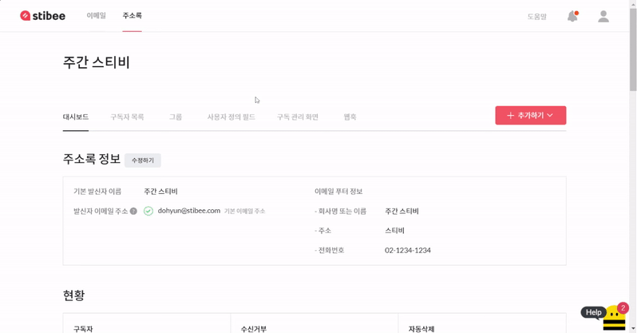
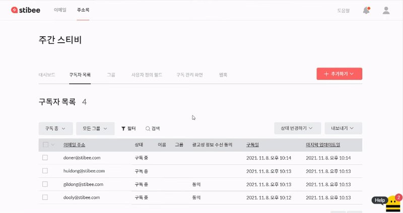

---
layout:
  width: default
  title:
    visible: true
  description:
    visible: false
  tableOfContents:
    visible: true
  outline:
    visible: true
  pagination:
    visible: true
  metadata:
    visible: true
  tags:
    visible: true
  actions:
    visible: true
---

# 구독자 정보 이해하기

## 이 글에서는 

주소록에서 관리하는 구독자 정보가 어떻게 구성되는지 알아보고, 이메일 주소 외에 이름, 연락처 같은 정보를 추가할 수 있는 \[사용자 정의 필드]를 만들고 관리하는 방법을 안내합니다.

***

## 구독자 정보 이해하기 

구독자 정보는 주소록에 저장된 구독자에 대한 모든 정보입니다. 구독자 정보는 다음 세 가지로 구성됩니다.

* 이메일 주소: 구독자를 구분하는 기본 정보입니다. 모든 구독자에게 반드시 있어야 합니다. (예. hello@stibee.com)
* 기본 필드: 따로 설정하지 않아도 자동으로 기록하는 정보입니다. (예. 구독일, 광고성 정보 수신 동의)
* 사용자 정의 필드: 사용자가 직접 추가하는 정보입니다. (예. 이름, 연락처, 회사명, 연령대 등)

이메일 주소만으로도 이메일을 보낼 수 있지만, 사용자 정의 필드로 추가 정보를 수집하면 [메일머지](https://help.stibee.com/email/edit/personalized-merge)로 개인화된 이메일을 보내거나 [세그먼트](https://help.stibee.com/list/classify-subscribers/how-to-use-segment)로 구독자를 분류할 수 있습니다.

## 사용자 정의 필드 이해하기 

사용자 정의 필드는 이메일 주소 외에 이름, 연락처, 회사명 등 구독자의 추가 정보를 주소록에 등록해서 관리하는 기능입니다. 예를 들어, 구독자의 '연령대'를 관리하고 싶다면, \[사용자 정의 필드 → 필드 추가하기]로 \[연령대] 필드를 추가하면 됩니다.

주소록에서 생성할 수 있는 필드 개수는 사용하는 요금제에 따라 달라집니다.

* 스타터, 스탠다드 요금제: 최대 30개
* 프로 요금제: 최대 50개
* 엔터프라이즈 요금제: 제한 없음

<figure><figcaption></figcaption></figure>

### 사용자 정의 필드 추가하기

구독자의 새로운 정보를 등록하려면 먼저 사용자 정의 필드를 추가해야 합니다.

1. \[주소록]에서 사용자 정의 필드를 추가하고 싶은 주소록의 이름을 클릭합니다.
2. 주소록 메뉴에서 \[사용자 정의 필드]를 클릭합니다.
3. 현재 주소록에 생성된 사용자 정의 필드 목록이 표시됩니다. 목록 아래에 있는 \[+ 필드 추가하기]를 클릭합니다.
4. 설정 창에서 값을 입력하고 \[저장하기]를 클릭합니다.


'사용자 정의 필드 파라미터'를 사용하면 특정 URL을 통해 유입된 구독자의 사용자 정의 필드에 자동으로 특정 값을 입력할 수 있습니다.&#x20;

예를 들어, 구독 폼을 인스타그램, 블로그 등 여러 채널에 홍보할 때 채널별로 URL을 다르게 설정하면,&#x20;

* 인스타그램으로 유입된 구독자에게는 '인스타그램'
* 블로그로 유입된 구독자에게는 '블로그'를 기록합니다.&#x20;

자세한 내용은 [구독자를 자동으로 분류하기](https://help.stibee.com/list/gather-subscribers/automated-categorization) 도움말을 참고해 주세요.


### 사용자 정의 필드 설정 이해하기

\[+ 필드 추가하기]를 클릭하면 상세 화면이 표시됩니다. 각 설정 항목은 다음과 같습니다.

* 필드 이름: 사용자 정의 필드를 구분하기 위한 이름입니다. 구독자 목록에서도 동일하게 표시됩니다. 예를 들어 필드 이름을 '연령대'로 등록하면 주소록에도 '연령대'로 표시됩니다.
* 유형: 구독 폼에서 통일된 양식으로 구독자 정보를 모으고 싶을 때 사용합니다. 텍스트, 숫자, 드롭다운, 라디오 버튼, 날짜, 날짜와 시간 중에서 선택할 수 있습니다.
* 키: 이메일 제목이나 본문에서 메일머지(구독자별 개인화된 정보)를 불러오기 위한 키(key) 값입니다. 영문자로 입력합니다.
* 필수 입력: 구독 폼에서 이 필드를 필수로 입력해야 하는지 선택합니다. \[필수 입력]을 체크하면 구독자는 이 정보를 반드시 입력해야 구독 신청할 수 있습니다.
* 메일머지 기본값: 메일머지로 구독자별 정보를 불러올 때, 저장된 정보가 없는 구독자에게 표시할 기본값입니다. 예를 들어 \[이름] 필드에 정보가 없는 구독자에게는 '고객'으로 표시되도록 설정할 수 있습니다.

**\*주의:** 사용자 정의 필드의 키(key) 값이 스티비에서 기본으로 제공하는 기본 필드의 키값과 중복되면, 사용자 정의 필드가 우선 적용됩니다.

### 사용자 정의 필드 유형 이해하기

사용자 정의 필드 유형은 구독자 정보를 입력받는 양식을 정하는 설정입니다. 텍스트, 숫자, 드롭다운, 라디오 버튼, 날짜, 날짜와 시간 여섯 가지 유형을 지원합니다.

| 유형            | 적합한 정보                    | 다른 유형으로 변경 가능 여부                   |
| ------------- | ------------------------- | ---------------------------------- |
| 텍스트           | 이름, 회사명 등 대부분의 정보         | 가능 (숫자, 날짜, 날짜와 시간 유형으로는 변경할 수 없음) |
| 숫자            | 적립금, 누적 구매 금액, 나이         | 변경할 수 없음                           |
| 드롭다운(단일 선택)   | 연령대, 구독 경로 등 선택지가 정해진 정보  | 가능 (숫자, 날짜, 날짜와 시간 유형으로는 변경할 수 없음) |
| 라디오 버튼(단일 선택) | 취미, 관심사 등 선택지를 한눈에 보여줄 정보 | 가능 (숫자, 날짜, 날짜와 시간 유형으로는 변경할 수 없음) |
| 날짜            | 생일, 가입일 등 날짜 형식 정보        | 변경할 수 없음                           |
| 날짜와 시간        | 예약 일시 등 시간까지 필요한 정보       | 변경할 수 없음                           |

숫자 유형을 제외한 나머지 유형은 구독 폼에서만 동작합니다. 라디오 버튼이나 드롭다운 유형으로 입력받아도 주소록에는 텍스트 형태로 저장됩니다.

#### 텍스트

텍스트는 가장 기본적인 사용자 정의 필드 유형입니다. 대부분의 정보는 텍스트 유형으로 사용하면 됩니다. 이름, 단체 또는 회사명 등의 정보를 받을 때 적합합니다.

.gif>)

#### 숫자


'숫자' 유형으로 생성한 사용자 정의 필드는 다른 유형으로 변경할 수 없습니다.


숫자는 숫자 형식의 데이터만 입력할 수 있는 유형입니다. 숫자가 아닌 값을 입력하면 안내 메시지가 표시되고 정보가 저장되지 않습니다. 적립금, 누적 구매 금액, 나이 등을 관리할 때 적합합니다.

.gif>)

#### 드롭다운(단일 선택)

드롭다운은 여러 선택지 중 하나를 구독자가 선택하는 유형입니다. 연령대, 구독 경로, 예/아니요 등 정해진 선택지가 있는 정보를 받을 때 적합합니다. 중복 선택은 지원하지 않습니다.

.png>)

#### 라디오 버튼(단일 선택)

라디오 버튼은 드롭다운과 비슷한 유형입니다. 드롭다운은 클릭해야 선택지가 표시되지만, 라디오 버튼은 처음부터 모든 선택지를 표시합니다. '기타' 의견을 추가로 받고 싶다면 라디오 버튼 유형을 사용해 보세요. 취미, 관심사 등의 정보를 받을 때 적합합니다. 중복 선택은 지원하지 않습니다.

.png>)

#### 날짜, 날짜와 시간

날짜, 날짜와 시간은 입력하는 정보를 날짜 형식으로 지정하는 유형입니다. 2026년 5월 27일과 같이 연, 월, 일(YYYY.MM.DD)만 표시하거나, 2026년 5월 27일 오전 10:30과 같이 시간까지 표시하도록 설정할 수 있습니다.

**\*주의:** 날짜 형식으로 지정된 필드에는 정의된 형식에 맞게 정보가 입력되어야 합니다. 구독자를 파일로 추가할 때 형식에 맞지 않는다면 오류가 발생할 수 있습니다. 자세한 내용은 [구독자 정보 형식 확인하기](https://help.stibee.com/trouble-shooting/subscriber-upload-issues#h_01hehqt3qngp7fbhy4zfm55196) 도움말을 참고해 주세요.

.png>)

### 사용자 정의 필드 수정, 삭제하기 

추가한 사용자 정의 필드는 언제든지 수정하거나 삭제할 수 있습니다.

1. \[주소록 → 사용자 정의 필드]로 이동합니다.
2. 사용자 정의 필드 목록 오른쪽에 있는 \[수정하기(연필 모양)] 또는 \[삭제하기(휴지통 모양)]를 클릭합니다.

\[수정하기(연필 모양)]를 클릭하면 사용자 정의 필드 설정 화면으로 이동합니다. 단, 위 표에서 안내한 것처럼 숫자, 날짜, 날짜와 시간 유형은 다른 유형으로 변경할 수 없고, 다른 유형도 숫자, 날짜, 날짜와 시간 유형으로 변경할 수 없습니다.

**\*주의:** 사용자 정의 필드를 삭제하면 해당 필드에 저장된 구독자 정보도 함께 삭제되며, 복구할 수 없습니다.

<figure><figcaption></figcaption></figure>

### 사용자 정의 필드 활용 예시

사용자 정의 필드를 생성하면 주소록에 구독자를 추가할 때 필드별로 구독자 정보를 입력할 수 있습니다. 구독 폼을 사용하고 있다면, 추가한 필드 정보를 구독 폼에서 입력받는 것도 가능합니다.

<스티비 뉴스레터>에서는 구독 폼에서 이메일 주소와 함께 구독 경로를 라디오 버튼 형식으로 받고 있습니다. <이메일 마케팅 리포트> 신청 페이지에서는 사용자 정의 필드로 '회사 또는 단체' 이름과 '소개서 신청 여부' 정보를 추가로 받고 있습니다.

[스티비 뉴스레터 구독 폼 확인하기 →](https://page.stibee.com/subscriptions/3)

[스티비 2025 이메일 마케팅 리포트 →](https://blog.stibee.com/stibee-2025-email-marketing-report/)

.png>)

## 기본 필드 이해하기 

기본 필드는 따로 설정하지 않아도 주소록에 자동으로 추가되는 구독자 정보입니다. \[사용자 정의 필드] 화면 아래쪽 \[기본 필드] 영역에서 확인할 수 있습니다. 기본 필드는 사용자가 편집하거나 삭제할 수 없습니다.

주소록에 표시되는 대표적인 기본 필드는 다음과 같습니다.

* 광고성 정보 수신 동의: 구독자별 광고성 정보 수신 동의 여부입니다. 광고성 정보에 해당하는 이메일은 수신에 동의한 구독자에게만 보내야 합니다.
* 구독일: 구독자가 주소록에 등록된 시점입니다.

기본 필드도 사용자 정의 필드처럼 메일머지로 이메일 제목이나 본문에 활용할 수 있습니다. 이메일 편집 화면에서 \[URL 툴바]의 \[{ }] 버튼을 누르면 기본 필드를 메일머지 형태로 불러올 수 있습니다.

<figure><figcaption></figcaption></figure>

### 메일머지로 사용할 수 있는 기본 필드 목록

주소록에 표시되는 기본 필드 외에도, 이메일에서 활용할 수 있는 메일머지 기본 필드를 추가로 제공합니다.


메일머지 기능은 유료 요금제에서 사용할 수 있지만, 기본 필드는 스타터 요금제에서도 사용할 수 있습니다.


#### 구독자 정보

* $%email%$ : 이메일을 수신한 구독자 이메일 주소
* $%subscribed\_date%$: 이메일을 수신한 구독자의 구독 일시

#### 주소록 정보 

* $%list\_name%$: 이메일을 발송한 주소록의 이름
* $%list\_id%$: 이메일을 발송한 주소록 ID
* $%subscribers\_count%$: 이메일을 발송한 주소록에 구독 중 상태로 등록된 구독자 수

#### 이메일 정보 

* $%email\_id%$: 이메일 ID
* $%subject%$: 이메일 제목
* $%sent\_time%$: 이메일 발송 시간
* $%sender\_email%$: 이메일 발신자 주소

#### URL 정보 

* $%unsubscribe%$: 수신거부 URL
* $%permalink%$: 공유용 URL
* $%page%$: 페이지 URL
* $%subscribe%$: 이메일을 발송한 주소록에 연결된 구독폼 URL
* $%archives%$: 이메일을 발송한 주소록에 연결된 아카이브 URL
* $%preferences%$: 구독자가 직접 구독 정보를 변경할 수 있는 페이지 URL
* $%permalink\_latest%$: 이메일을 발송한 주소록에 가장 최근에 발송된 이메일의 공유용 URL

_\* 위 사례 외에도 더 많은 기본 필드를 제공하고 있으며, 목록은 주기적으로 업데이트할 예정입니다._

## 광고성 정보 수신 동의 이해하기 

광고성 정보 수신 동의는 구독자별로 광고성 정보 수신에 동의했는지 관리하는 기본 필드입니다. 광고성 정보에 해당하는 이메일은 수신에 동의한 구독자에게만 보내야 합니다. 이 필드를 기준으로 구독자를 분류하면, 광고성 정보 수신에 동의한 구독자에게만 광고성 이메일을 보낼 수 있습니다.

### 광고성 정보 수신 동의를 필수 또는 선택으로 설정하기

구독 신청 시 광고성 정보 수신 동의를 필수로 받을지, 선택으로 받을지 설정할 수 있습니다.

1. 주소록에서 \[사용자 정의 필드]를 클릭합니다.
2. 화면 아래쪽 \[기본 필드] 영역에서 \[광고성 정보 수신 동의] 필드를 찾습니다.
3. \[수정하기(연필 모양)]를 눌러 '필수 입력' 여부를 설정합니다.
4. \[저장하기]를 누르면 설정이 반영됩니다.

모든 구독자가 구독 신청할 때 반드시 광고성 정보 수신에 동의하도록 하려면 '필수 입력' 박스를 체크합니다. 동의하지 않아도 구독 신청할 수 있도록 하려면 체크를 해제합니다.

<figure><figcaption></figcaption></figure>

### 구독자별 광고성 정보 수신 동의 여부 확인하기

1. \[주소록 → 구독자 목록]으로 이동합니다.
2. \[광고성 정보 수신 동의] 필드 정보를 확인합니다.

필드 정보가 '동의'인 구독자는 광고성 정보 수신에 동의한 구독자입니다. 필드에 정보가 없는 구독자는 동의하지 않은 구독자입니다. 동의 여부를 변경하고 싶다면 [광고성 정보 수신 동의 여부 변경하기](https://help.stibee.com/list/adding-managing-subscriber/modify-subscriber-info#change-ad-consent) 도움말을 참고해 주세요.

<figure><figcaption></figcaption></figure>

### 광고성 정보 수신에 동의한 구독자만 조회하기

1. \[주소록 → 구독자 목록]으로 이동합니다.
2. \[필터]를 누른 뒤, \[조건: 광고성 정보 수신 동의 → 동의]를 선택합니다.
3. \[조회하기]를 누르면 광고성 정보 수신에 동의한 구독자만 표시됩니다.
4. 원한다면 \[모든 페이지 선택 → 상태 변경하기 → 그룹 설정하기]를 눌러 \[그룹]으로 분류할 수도 있습니다.

\[세그먼트] 기능을 사용하면 광고성 정보 수신에 동의한 구독자만 자동으로 분류할 수 있습니다. 관리자가 동의 여부를 직접 수정하는 방법은 [관리자가 변경하기](https://help.stibee.com/list/adding-managing-subscriber/modify-subscriber-info#admin-change-ad-consent) 도움말을 참고해 주세요.

<figure><figcaption></figcaption></figure>
