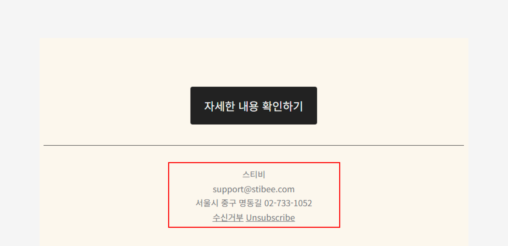

---
layout:
  width: default
  title:
    visible: true
  description:
    visible: false
  tableOfContents:
    visible: true
  outline:
    visible: true
  pagination:
    visible: true
  metadata:
    visible: true
  tags:
    visible: true
  actions:
    visible: true
---

# 주소록 만들기

## 이 글에서는

이 글에서는 구독자를 추가하고 관리할 수 있는 일반 주소록을 만드는 방법을 설명합니다.

***

주소록은 구독자의 이메일 주소와 정보가 저장되는 곳입니다. 이메일을 보내려면 먼저 수신자를 주소록에 구독자로 추가해야 합니다. 추가한 구독자는 [세그먼트](https://help.stibee.com/list/classify-subscribers/how-to-use-segment)나 [그룹](https://help.stibee.com/list/classify-subscribers/how-to-use-groups)으로 분류해 목적에 맞는 이메일을 보낼 수 있습니다.

## 주소록 만들기

1. 화면 왼쪽의 \[주소록]을 클릭합니다.
2. \[새로 만들기 → 일반 주소록]을 클릭합니다.
3. 주소록 생성 화면에서 아래 항목을 입력한 뒤 \[저장하기]를 클릭합니다.

<figure><figcaption></figcaption></figure>

### 주소록 정보 

#### 주소록 이름 

주소록을 구분하는 이름입니다. [구독 폼](https://help.stibee.com/list/gather-subscribers/form)이나 [수신거부 페이지](https://help.stibee.com/email/edit/unsubscribe)를 통해 구독자에게 표시될 수 있으니 적절한 이름으로  설정하는 것을 권장합니다.

#### 기본 발신자 이름

이메일을 만들 때 '발신자 이름'에 자동으로 불러오는 기본값입니다.

#### 기본 발신자 이메일 주소

이메일을 만들 때 '발신자 이메일 주소'에 자동으로 불러오는 기본값입니다. 가입할 때 사용한 주소 외에 다른 주소를 발신자 이메일로 추가하거나 변경하려면 [발신자 이메일 주소 추가하기](https://help.stibee.com/email/managing-sender/add#undefined-2)를 참고하세요.

<figure><figcaption></figcaption></figure>

### 이메일 푸터 정보

이메일 본문 하단에 표시할 회사명(또는 이름), 주소, 전화번호를 입력합니다. 이메일 에디터 화면에서 \[푸터] 상자를 추가하면 여기서 입력한 정보와 기본 발신자 이메일 주소가 자동으로 채워집니다. 수신거부 링크는 별도 설정 없이 자동으로 추가됩니다.

**\*주의**: 정보통신망법에 따라 '광고성 정보'를 보내는 경우 반드시 발신자 정보를 이메일 안에 포함해야 합니다.

<figure><figcaption></figcaption></figure>

<figure><figcaption></figcaption></figure>

### 자동삭제 기능 사용 여부 설정하기 

이메일을 영구적으로 수신할 수 없는 구독자는 하드바운스로 분류됩니다. 이때, 자동삭제 기능이 켜져 있으면 해당 구독자의 구독 상태가 '자동삭제'로 변경됩니다. 자동 삭제 상태의 구독자는 주소록에서 제거되는 것이 아니라 이후 발송 대상에서만 제외되며, \[구독 상태 필터 → 자동삭제]를 통해 대상을 확인할 수 있습니다.

자동삭제 기능 사용을 원치 않는 경우, \[자동삭제 기능을 사용하시겠습니까? → 아니요]를 선택해 주세요.

발송 실패에 대한 자세한 내용은 [발송 실패 통계 확인하기](https://help.stibee.com/email/analytics/email-detailed-statistics#bounce) 도움말을 참고해 주세요.

<figure><figcaption></figcaption></figure>

### 수신거부 구독자 발송 대상 포함 여부 설정하기

이메일 성격에 따라 수신거부 구독자에게도 발송해야 하는 경우가 있습니다. \[수신거부 구독자를 발송 대상에 포함할 수 있게 하시겠습니까? → 예]를 선택하면 수신거부 상태인 구독자도 발송 대상에 포함할 수 있습니다.

**\*주의:** \[예]를 선택하면 수신거부 상태인 구독자도 전체 구독자 수에 포함됩니다. 사용하는 구간에 따라 추가 요금이 발생할 수 있습니다.

자세한 내용은 아래 도움말을 참고해 보세요.


[send-email-unsubscribed-subscriber.md](../../email/send/send-email-unsubscribed-subscriber.md)


<figure><figcaption></figcaption></figure>

모든 항목을 입력하고 \[저장하기]를 클릭하면 새 주소록이 만들어집니다.
