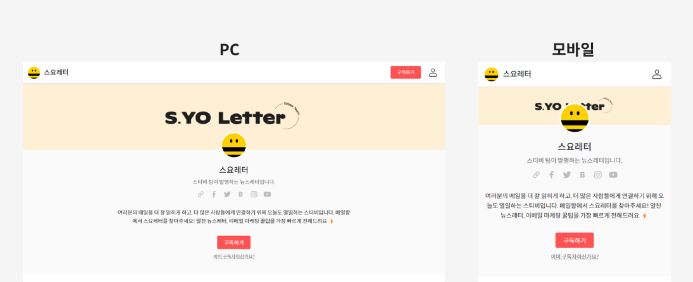
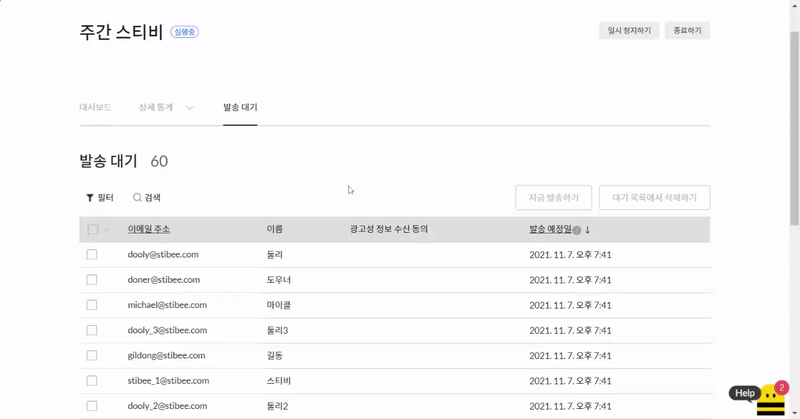

# 페이지 구성 살펴보기

## 이 글에서는

페이지를 구성하는 메뉴를 살펴봅니다.

***

## 페이지 화면 이해하기

페이지는 크게 '메인 화면'과 '콘텐츠 화면' 두 가지로 구성됩니다. 사용자가 확인하는 환경이 PC인지 모바일인지 여부에 따라 자동으로 페이지 디자인은 반응형으로 변경됩니다.&#x20;

<figure><figcaption></figcaption></figure>

## 메인 화면 

구독자가 페이지에 접속했을 때, 가장 먼저 확인할 수 있는 화면입니다.\

### 상단 메뉴바 

페이지 상단에는 프로필 사진, 뉴스레터 이름, 구독하기, 로그인 메뉴가 표시되며 화면 상단에 고정되어 있습니다.

'프로필 사진'과 '구독하기 버튼'은 페이지의 \[디자인]에서 변경할 수 있습니다. '뉴스레터 이름'은 페이지의 \[기본 설정]에서 수정할 수 있습니다.

<figure><figcaption></figcaption></figure>

구독자는 구독 신청한 이메일 주소를 입력해 페이지에 로그인 할 수 있습니다. 구독자가 로그인을 하지 않은 상태라면 \[로그인] 버튼을 클릭하여 로그인을 할 수 있는 창으로 이동할 수 있습니다. 이미 로그인 된 상태로 \[로그인] 버튼을 클릭하면 구독자의 구독 정보를 설정할 수 있는 창으로 이동할 수 있습니다.

<figure><figcaption></figcaption></figure>

### 헤더 

헤더 이미지와 프로필 사진, 뉴스레터 이름, 짧은 소개글, 구독하기 링크, SNS 링크, 긴소개글 등이 표시됩니다. 내 뉴스레터가 어떤 뉴스레터인지, 이 페이지에서는 어떤 내용을 확인할 수 있는지 구독자에게 소개할 수 있는 아주 중요한 부분입니다. SNS 링크는 \[기본 설정]에서 수정할 수 있고, 어떤 채널을 선택하는지에 따라 로고의 모양이 달라집니다.

<figure><figcaption></figcaption></figure>

구독자가 로그인을 하지 않은 경우에는 \[구독하기] 버튼이 표시되고 아래에 있는 '이미 구독자이신가요?' 텍스트를 클릭해 페이지에 로그인 할 수 있습니다. 구독자가 이미 로그인을 한 상황이라면 \[구독하기] 버튼은 표시되지 않습니다.&#x20;

<figure><figcaption></figcaption></figure>

### 지난 뉴스레터 

지금까지 발송한 뉴스레터 목록이 표시됩니다. 뉴스레터 목록은 발송일시를 기준으로 자동으로 정렬됩니다.

<figure><figcaption></figcaption></figure>

&#x20;

'유료 구독자용으로 발행'된 뉴스레터에만 목록에 '자물쇠' 모양의 아이콘이 표시되고 이 콘텐츠는 유료 구독자만 확인할 수 있습니다. (유료 구독자 여부는 '로그인' 기능을 통해 판단합니다.)

<figure><figcaption></figcaption></figure>

유료 구독자용으로 발행된 뉴스레터에만 목록에 '자물쇠' 모양의 아이콘이 표시됩니다. 이 콘텐츠는 유료 구독자만 확인할 수 있습니다. (유료 구독자 여부는 '로그인' 기능을 통해 판단합니다.)&#x20;

<figure><figcaption></figcaption></figure>

&#x20;

## 콘텐츠 화면 

구독자가 개별 이메일을 클릭했을 때 확인할 수 있는 화면입니다.

### 뉴스레터 본문 

발행한 뉴스레터 내용이 표시되는 공간입니다. 이메일의 제목과 발송 일시가 화면 윗부분에 표시됩니다. 만약, 메일머지 기능을 사용해서 이메일을 작성했다면 \[사용자 정의 필드]의 '기본 값'이 자동으로 표시됩니다.

<figure><figcaption></figcaption></figure>

### 구독 폼

검색, 외부 링크 등을 통해 페이지 콘텐츠로 유입된 방문자에게 구독을 적극적으로 유도할 수 있는 \[구독 폼] 화면이 표시됩니다.

<figure><figcaption></figcaption></figure>

### 네비게이션 메뉴 

뉴스레터 목록을 기준으로 '이전 뉴스레터' 또는 '다음 뉴스레터'를 클릭해 다른 뉴스레터로 넘어갈 수 있습니다.

<figure><figcaption></figcaption></figure>

### 푸터 

뉴스레터 이름과 짧은 소개 그리고 SNS 채널 링크가 표시됩니다.

<figure><figcaption></figcaption></figure>
