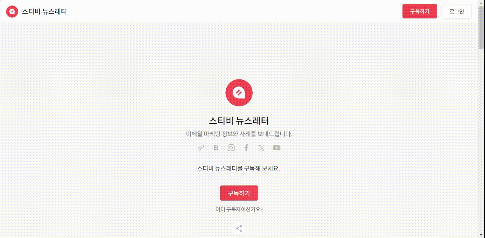

# 페이지 로그인하기

## 이 글에서는

페이지에 연결된 주소록에 등록된 구독자들은 자신의 이메일 주소를 입력해 페이지에 로그인할 수 있습니다. 페이지에 로그인하면 구독자가 자신의 구독 정보를 직접 수정할 수 있습니다. '유료 구독자'는 '유료 콘텐츠'를 확인할 수 있습니다.&#x20;

***

## 로그인하기

로그인은 화면 우측 상단의 \[로그인] 버튼을 클릭하거나 메인 화면의 \[구독하기] 버튼 아래에 있는 '이미 구독자이신가요?'를 클릭해서 진행할 수 있습니다. 구독자 로그인은 이메일 인증 방식으로 진행할 수 있습니다.

<figure><figcaption></figcaption></figure>

### 구독자 이메일 주소 입력하기 

메인화면에서 '이미 구독자이신가요?' 또는 \[로그인] 버튼을 클릭해 로그인 창으로 이동합니다. 이동한 화면의 입력창에 구독자 이메일 주소를 입력하면 로그인을 위한 인증 메일이 입력한 주소로 발송됩니다.\
\
'아직 구독하지 않으셨나요?' 버튼을 클릭하면 구독할 수 있는 화면으로 연결됩니다.

<figure><figcaption></figcaption></figure>

### 이메일 인증하기 

발송된 인증 이메일에서 '네, 이메일 주소가 맞습니다.' 버튼을 눌러 인증 절차를 마무리하면 로그인이 이루어집니다. 만약에 구독자에게 로그인을 위한 인증 메일이 수신되지 않았다는 연락을 받은 경우 '스팸함'이나 '프로모션', '업데이트' 탭 등으로 이메일이 분류된 것은 아닌지 확인하도록 안내해 주세요.\
\
만약에 다른 메일함에도 인증 메일이 없다면 1:1 상담 채팅(로그인 후 화면 오른쪽 아래 검정색 ? 버튼 클릭)을 통해 문의해주세요. 문의할 때 페이지의 URL, 구독자 이메일 주소를 함께 회신해주시면 더욱 빠른 확인이 가능합니다.

<figure><figcaption></figcaption></figure>

## 구독 정보 설정하기 

페이지에 로그인 한 뒤 화면 우측 상단의 \[로그인] 버튼을 클릭하면 '구독 정보 설정' 버튼이 추가된 것을 확인할 수 있습니다. '구독 설정하기' 버튼을 클릭하면 구독자가 직접 구독 정보를 수정할 수 있는 화면으로 이동합니다.

<figure><figcaption></figcaption></figure>

