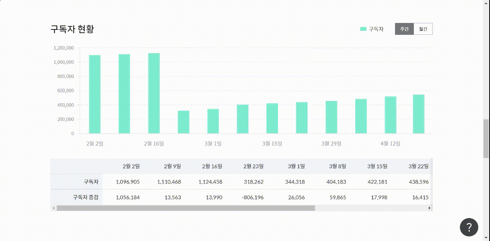

# 통계 확인하기

💬 이 내용은 **프로, 엔터프라이즈 요금제**에 해당하는 도움말입니다.

## 이 글에서는

설정한 조건에 따라 나타난 기간별 통계 데이터 지표를 확인하고 이해하는 방법에 관해 알아봅니다.

***

## 통계 대시보드 이해하기

\[통계]를 누르면 나타나는 대시보드에서 기간별 구독자 활동 내역(발송 성공, 오픈, 클릭, 수신거부)에 관한 요약 통계와 구독자 증감 현황, 그리고 이메일 발송 목록을 시각화한 도표 자료로 확인할 수 있습니다.

### 요약

#### 발송 성공과 발송 성공률

발송 성공은 이메일이 구독자에게 잘 발송됐다는 의미입니다. 발송 성공률은 전체 발송 대상이 된 구독자 중 이메일 발송을 성공한 비율입니다.&#x20;

_이메일을 발송하다 보면 이메일을 발송하다 보면 여러 가지 이유로 발송이 실패할 수 있습니다. 발송 실패에 대한 자세한 내용은_ [email-detailed-statistics.md](../email/analytics/email-detailed-statistics.md "mention")_를 참고해 주세요._

#### 오픈과 오픈율

오픈은 구독자가 수신함에 있는 이메일을 열어 보았다는 의미입니다. 오픈율은 발송 성공한 구독자 중 이메일을 열어본 구독자의 비율입니다. 이메일을 여러 번 열어보더라도 자동으로 중복은 제거하고, 1회만 기록합니다.

#### 클릭과 클릭률

클릭은 구독자가 이메일에 있는 링크를 클릭하는 걸 의미합니다. 클릭률은 발송 성공한 구독자 중 이메일에 있는 링크를 클릭한 구독자의 비율입니다. 이메일에 있는 링크를 여러 번 클릭하더라도 자동으로 중복은 제거하고 1회만 기록합니다.

#### 수신거부와 수신거부율

수신거부는 구독자가 이메일 수신을 거부했다는 걸 의미합니다. 수신거부율은 발송에 성공한 구독자 중 수신거부한 구독자의 비율입니다. 수신 거부한 구독자는 주소록에 구독 상태가 수신거부로 분류되며, 구독자 목록에서 확인할 수 있습니다._수신거부 기능에 대한 자세한 내용은_ [manage-unsubscribe.md](../list/adding-managing-subscriber/manage-unsubscribe.md "mention")_를 참고해 주세요._

### 구독자 현황  

구독자의 증감 현황을 그래프와 표 형태로 한눈에 파악할 수 있습니다. 가파르게 증가하거나 감소한 구간이 있다면 해당 기간에 발생한 이벤트가 있었는지 추적해 보세요.

<figure><figcaption></figcaption></figure>

### 이메일 목록 

설정한 조건(기간, 주소록, 태그)에 포함된 모든 이메일의 성과 지표를 한 번에 확인할 수 있으며, 전체 이메일의 성과를 비교/분석하는 데 유용하게 활용할 수 있습니다. 화면 오른쪽 \[목록 내려받기] 버튼을 클릭하면 CSV 파일로 저장할 수 있습니다.

<figure><figcaption></figcaption></figure>

## 조회 기준 변경하기

대시보드는 기본적으로 '주간' 기준으로 표시합니다. 만약, '월간' 기준으로 대시보드를 확인하고 싶다면 화면 오른쪽 \[토글]을 이용해 변경하면 됩니다.

<figure><figcaption></figcaption></figure>
