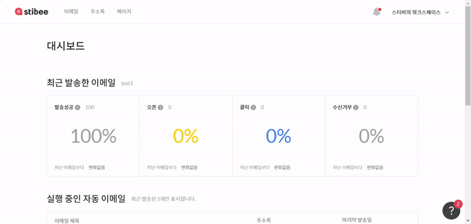

---
layout:
  title:
    visible: true
  description:
    visible: false
  tableOfContents:
    visible: true
  outline:
    visible: true
  pagination:
    visible: true
---

# 워크스페이스 만들기

## 이 글에서는 

워크스페이스를 만들고 사용하는 기본적인 방법에 관해 알아봅니다.

***

## 첫 번째 워크스페이스 만들기

첫 번째 워크스페이스는 회원가입 과정에서 만들 수 있습니다.

1. 회원가입 화면에서 로그인 정보를 입력합니다.
2. 연락처와 이메일 주소를 인증합니다.
3. 사용할 워크스페이스의 이름을 입력합니다.
4. 스티비 사용 목적을 선택하고 \[시작하기]를 클릭합니다.
5. 새로운 워크스페이스가 생성됩니다.

<figure><figcaption></figcaption></figure>

## 새로운 워크스페이스 만들기

새로운 워크스페이스도 손쉽게 생성할 수 있습니다.

1. 화면 오른쪽 위에 있는 \[워크스페이스 이름]을 누릅니다.
2. \[워크스페이스 전환 → + 워크스페이스 만들기]를 클릭합니다.
3. 첫 번째 워크스페이스를 만들 때처럼 정보를 입력하고 \[시작하기]를 클릭합니다.
4. 새로운 워크스페이스가 생성됐습니다.

<figure><figcaption></figcaption></figure>

## 워크스페이스 전환하기 

워크스페이스를 여러 개 사용하는 경우 다른 워크스페이스로 전환할 수 있습니다.

화면 오른쪽 위에 있는 \[워크스페이스 이름 → 워크스페이스 전환]에서 전환하고 싶은 '워크스페이스 이름'을 클릭하면 워크스페이스가 전환됩니다.

<figure><figcaption></figcaption></figure>

## 워크스페이스 설정 수정하기 

워크스페이스를 만들 때 입력한 정보는 언제든지 수정할 수 있습니다.&#x20;

1. 화면 오른쪽 위에 있는 \[워크스페이스 이름 → 워크스페이스 설정]을 클릭합니다.
2. 워크스페이스 설정 화면으로 이동합니다.&#x20;

워크스페이스 설정 화면에서는 워크스페이스의 기본적인 정보와 사용하는 목적을 수정할 수 있습니다.

* 워크스페이스 이름: 워크스페이스 이름을 변경할 수 있습니다.
* 스티비를 어떤 목적으로 사용하시나요?: 회사/개인 사용 목적에 따라서 선택할 수 있습니다.
* 어떤 업종에서 근무하고 계신가요?: 사용 목적을 \[회사]로 선택했을 때 표시되며, 현재 근무 중인 회사의 업종을 선택할 수 있습니다.
* 스티비를 사용하는 목적을 더 구체적으로 알려주세요: 스티비를 어떤 목적으로 사용하는지 구체적인 사용 목적을 선택할 수 있습니다. (복수 선택할 수 있어요.)

워크스페이스 설정 화면의 \[이메일 콘텐츠 공유 설정 기본값]에서 내가 제작한 이메일의 콘텐츠 공유 범위 기본값을 설정할 수도 있습니다.

* 이메일 콘텐츠를 외부에 공유할 수 있는 URL을 생성합니다: 이메일을 발송하면 이메일을 외부에 공유할 수 있는 [이메일 URL](../../email/share/configuration.md)이 생성됩니다. 이 생성 여부를 선택할 수 있는 항목입니다. 만약 이 옵션을 해제하면 이메일을 발송했을 때 생성되는 이메일 공유용 URL 기능을 사용할 수 없고, 이메일 콘텐츠가 검색엔진에 노출되거나 스티비 웹사이트나 뉴스레터에 소개되지 않습니다.
* _\*_[_이메일 공유용 URL_](../../email/share/configuration.md)_이란 웹 페이지에서 이메일 내용을 확인할 수 있는 기능을 말합니다._
* 이메일 콘텐츠를 검색엔진에 노출합니다: 이메일 콘텐츠가 검색엔진(예: 네이버, 구글 등)에 노출될 수 있도록 설정하는 항목입니다. 이메일을 발송하고 이메일 공유용 URL을 공개된 외부 웹페이지에 공유하면 검색엔진의 크롤링 정책에 따라 시간이 흐르면 이메일 URL 페이지가 검색엔진에 노출됩니다.
* 스티비 웹사이트, 뉴스레터에 소개되거나 추천되는 것을 허용합니다: 이 옵션을 체크하면 스티비 팀에서 제작한 뉴스레터를 [스티비 뉴스레터](https://newsletter.stibee.com/)나 [고객 사례 갤러리](https://gallery.stibee.com/)에서 소개할 수 있습니다.&#x20;

설정을 완료한 경우 화면 아래쪽에 있는 \[저장하기]를 클릭해 정보를 저장합니다.

<figure><figcaption></figcaption></figure>
