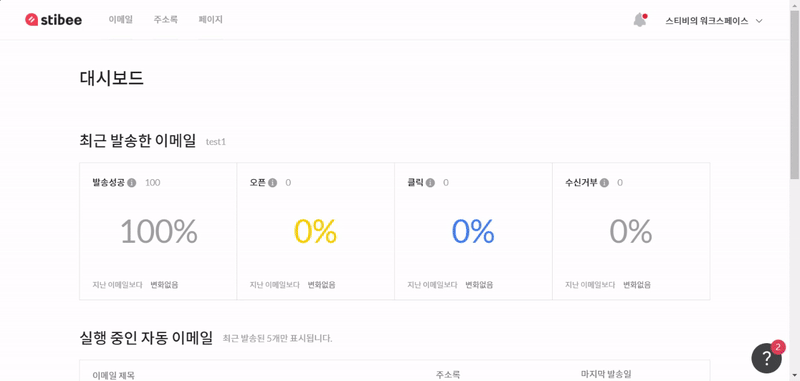

---
layout:
  width: default
  title:
    visible: true
  description:
    visible: false
  tableOfContents:
    visible: true
  outline:
    visible: true
  pagination:
    visible: true
  metadata:
    visible: true
  tags:
    visible: true
  actions:
    visible: true
---

# 워크스페이스 만들기, 전환하기

## 이 글에서는 

워크스페이스를 만드는 방법과 다른 워크스페이스로 전환하는 방법을 알아봅니다.

***

## 첫 번째 워크스페이스 만들기

첫 번째 워크스페이스는 회원가입 과정에서 만들 수 있습니다.

1. 회원가입 화면에서 로그인 정보를 입력합니다.
2. 연락처와 이메일 주소를 인증합니다.
3. 사용할 워크스페이스의 이름을 입력합니다.
4. 스티비 사용 목적을 선택하고 \[시작하기]를 클릭합니다.
5. 새로운 워크스페이스가 생성됩니다.

<figure><figcaption></figcaption></figure>

## 새로운 워크스페이스 만들기

새로운 워크스페이스도 손쉽게 만들 수 있습니다.

1. 화면 오른쪽 위에 있는 \[워크스페이스 이름]을 누릅니다.
2. \[워크스페이스 전환 → 워크스페이스 만들기]를 클릭합니다.
3. 첫 번째 워크스페이스를 만들 때처럼 정보를 입력하고 \[시작하기]를 클릭합니다.
4. 새로운 워크스페이스가 생성됐습니다.

<figure><figcaption></figcaption></figure>

## 워크스페이스 전환하기 

워크스페이스를 여러 개 사용하는 경우 다른 워크스페이스로 전환할 수 있습니다.

화면 오른쪽 위에 있는 \[워크스페이스 이름 → 워크스페이스 전환]에서 전환하고 싶은 \[워크스페이스 이름]을 클릭하면 워크스페이스가 전환됩니다.

<figure><figcaption></figcaption></figure>

워크스페이스를 만들 때 입력한 정보는 언제든지 수정할 수 있습니다. 자세한 내용은 아래 도움말을을 참고해 주세요.


[modify.md](modify.md)

